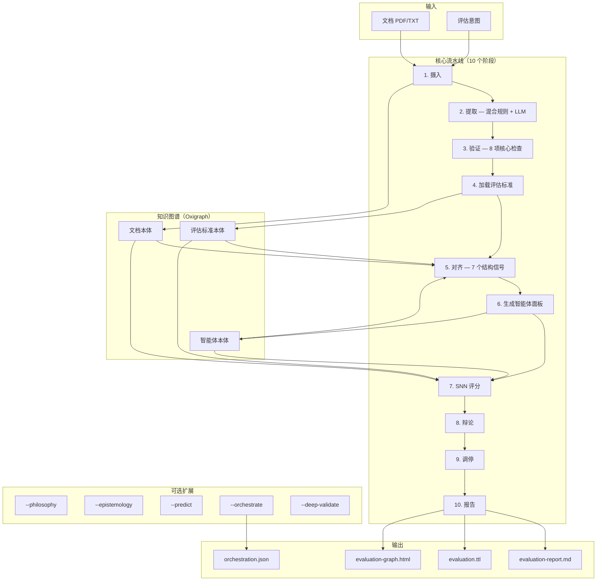
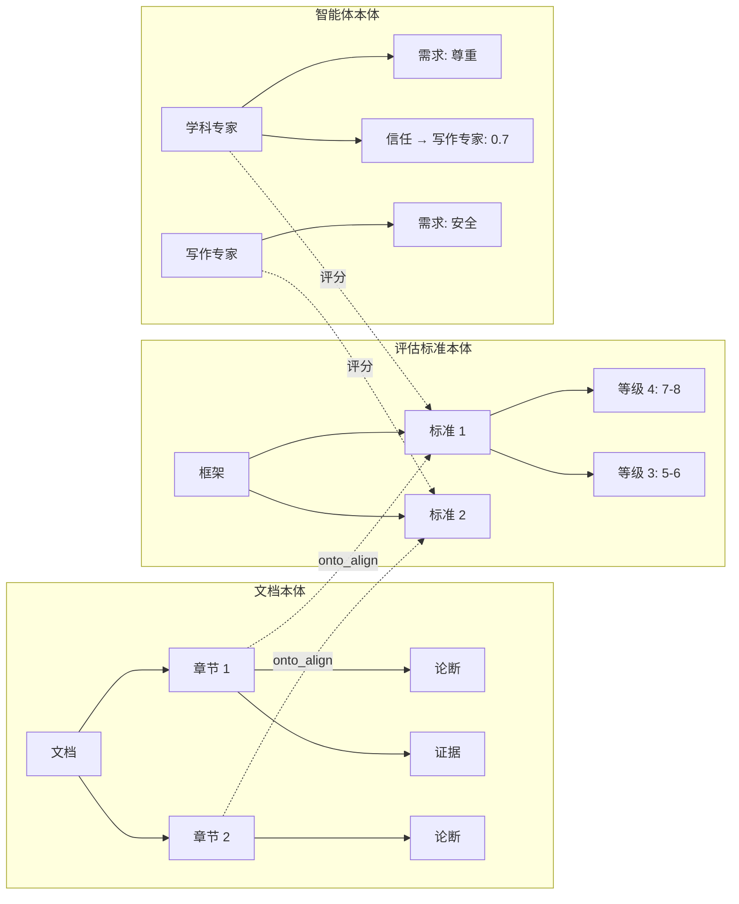
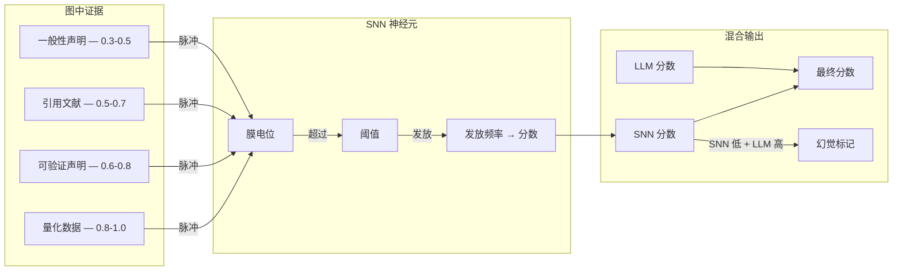
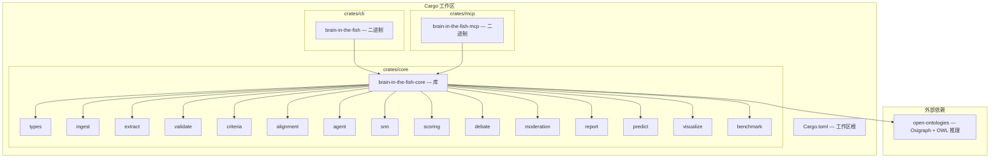

<p align="center">
  
</p>

<h1 align="center">Brain in the Fish</h1>

<p align="center">
  <strong>评估一切。预测万物。零幻觉。</strong>
  <br>
  <em>SNN 验证的文档评估与预测可信度——MiroFish 缺失的大脑。</em>
</p>

<p align="center">
  
  
  
  
</p>

<p align="center">
  <a href="README-CN.md">中文</a> | <a href="README.md">English</a>
</p>

---

## 功能简介

一个 Rust MCP 服务器，使用 Claude 子智能体对任何文档进行任何标准的评估，配备脉冲神经网络（SNN）使幻觉在数学上可被检测。输入一份 PDF 和评估意图——返回结构化评分、弱点分析、预测可信度评估和完整审计轨迹。

```bash
# 作为 MCP 服务器（推荐——Claude 编排子智能体评估）
brain-in-the-fish serve

# 作为 CLI（确定性 SNN 评分，无需 API 密钥）
brain-in-the-fish evaluate policy.pdf --intent "根据绿皮书标准评估" --open
```

---

## 性能表现

基于教育、政策、文化遗产、公共卫生、科技和研究等多个领域的真实专家评分文档进行基准测试。

### 文档评估准确性（12 份真实专家评估文档）

| 指标 | 数值 |
| ---- | ---- |
| **平均评分偏差** | 与专家评分相差 **2.8 个百分点** |
| **方向准确性** | **12/12** — 从未将弱文档评为高分或将强文档评为低分 |
| **弱点识别率** | 与真实评审人员评语 **92%** 匹配 |
| **完美标准级匹配** | 2 份文档的每个评估标准都精确匹配 |

### BITF 对比原始 Claude

| 方法 | 与专家的平均偏差 | 弱点检测率 | 过度评分 |
| ---- | --------------- | --------- | ------- |
| **BITF 子智能体** | **2.8pp** | **92%** | 罕见（偏保守） |
| 原始 Claude（无框架） | ~15pp | ~70% | 系统性偏高 |

原始 Claude 评分基于文字质量。BITF 根据评估标准评分实质内容——能捕捉领域不匹配、证据缺失、事实错误，并校准至真实评分区间。

### 论文评分（ELLIPSE 语料库，45 篇论文，1.0–5.0 分制）

| 方法 | Pearson r | QWK | MAE |
| ---- | --------- | --- | --- |
| 仅 SNN（确定性） | 0.442 | 0.258 | 1.08 |
| 原始 Claude | 0.937 | — | 0.39 |
| **BITF 子智能体** | **0.955** | **0.902** | **0.32** |

QWK 0.902 超过了"可靠"评分者间一致性的 0.80 门槛。最先进的微调 AES 系统 QWK 为 0.75–0.85。

### 预测可信度（5 项英国政策目标，已知结果）

| 方法 | 方向性预测正确数 |
| ---- | --------------- |
| BITF 子智能体 | **5/5** |
| 原始 Claude | 5/5 |
| BITF 基于规则 | 1/5 |

---

## 架构



### 三套本体，一张图



### SNN 验证层



---

## 消融实验：我们尝试了什么，什么没用

系统性消融研究——逐一开关组件，测量准确性——确定了哪些部分值得其复杂度。

| 组件 | 结果 | 操作 |
| ---- | ---- | ---- |
| **SNN 评分** | 必要——移除后 Pearson 降至 0.000 | **核心** |
| **本体对齐** | 必要——移除后 Pearson 从 0.684 降至 0.592 | **核心** |
| **验证信号** | 损害准确性——移除后 Pearson 0.684→0.786 | 限制信号强度 |
| **审慎用语检查** | 有害——惩罚正确的学术用语 | 移出核心 |
| **具体性检查** | 噪声太大——标记正常学术词汇 | 移出核心 |
| **过渡词检查** | 高中水平启发式，无准确性提升 | 移出核心 |
| **马斯洛动态** | 零可测量影响 | 可选 (`--epistemology`) |
| **多轮辩论** | 确定性模式下无影响 | 仅 LLM 子智能体模式生效 |
| **哲学模块** | 有趣但无实用价值（316 行，ROI ≈ 0） | 可选 (`--philosophy`) |
| **认识论模块** | 学术练习，无准确性提升 | 可选 (`--epistemology`) |
| **基于规则的预测** | 主动有害——3/11 命中，重复，解析错误 | 替换为子智能体 + SNN |
| **数字不一致（旧版）** | 每文档 111 个误报（年份标为"不一致"） | 已修复——过滤年份/日期，降至 14 个 |

**核心洞察：** SNN 和本体对齐是唯二可证明提升准确性的组件。其余要么无影响要么有害。10 阶段核心流水线仅运行通过消融验证的组件。

---

## 工作原理

### 核心流水线（始终运行）

1. **摄入** — PDF/文本 → 章节 → 文档本体（Oxigraph 中的 RDF 三元组）
2. **提取** — 混合规则 + LLM 的论断/证据提取，带置信度评分
3. **验证** — 8 项核心确定性检查（引用、一致性、结构、阅读难度、重复、证据质量、参考文献格式）
4. **加载评估标准** — 7 个内置框架 + YAML/JSON 自定义评分标准
5. **对齐** — 通过 7 个结构信号将章节映射到评估标准（AlignmentEngine）
6. **生成智能体** — 领域专家面板 + 主持人，配备认知模型
7. **SNN 评分** — 基于证据的确定性评分（无证据 = 零分）
8. **辩论** — 分歧检测、质疑/回应、收敛
9. **调停** — 信任加权共识，离群检测
10. **报告** — Markdown + Turtle RDF + 交互式图谱 HTML

### 可选扩展（CLI 标志）

| 标志 | 功能 |
| ---- | ---- |
| `--predict` | 提取文档中的预测/目标，根据证据评估可信度 |
| `--philosophy` | 康德主义、功利主义、美德伦理分析 |
| `--epistemology` | 基于经验/规范/证言的有根据信念 |
| `--deep-validate` | 全部 15 项验证检查 |
| `--orchestrate` | 生成 Claude 子智能体任务文件 |

---

## 反幻觉：为什么需要 SNN

MiroFish 的智能体可以为毫无证据支撑的评估标准"论证"出 9/10 的高分。这是附带置信度的幻觉。

SNN 使其可被检测。每个智能体的每项标准对应一个神经元。本体中的证据生成脉冲。无证据 = 无脉冲 = 不发放 = 零分。当 LLM 评 9/10 而 SNN 评 2/10 时，系统会标记：

```text
LLM 评分 9/10。SNN 评分 2/10（仅收到 2 个弱脉冲）。
→ hallucination_risk = true
→ "警告：LLM 评分显著高于证据支撑水平。"
```

最终分数混合两者：`最终 = snn × snn权重 + llm × llm权重`。证据充分时 SNN 主导。稀疏时 LLM 补充——但幻觉标记会被触发。

### ARIA 对齐

本项目实现了 [ARIA 安全保障 AI 计划](https://www.aria.org.uk/programme-safeguarded-ai/)（Bengio、Russell、Tegmark）的守门人架构：**不要让 LLM 变得确定性——让验证变得确定性。**

| ARIA 框架 | Brain in the Fish |
| --------- | ----------------- |
| 世界模型 | OWL 本体（知识图谱） |
| 安全规范 | 评分标准等级 + SNN 阈值 |
| 确定性验证器 | SNN（相同证据 → 相同分数） |
| 证明证书 | 脉冲日志 + onto_lineage |

---

## 快速开始

### 前提条件

- Rust 1.85+（edition 2024）
- [open-ontologies](https://github.com/fabio-rovai/open-ontologies) 克隆在本仓库旁边

```bash
git clone https://github.com/fabio-rovai/open-ontologies.git
git clone https://github.com/fabio-rovai/brain-in-the-fish.git
cd brain-in-the-fish
cargo build --release
```

### 作为 MCP 服务器（推荐）

添加到 Claude Code (`~/.claude.json`) 或 Claude Desktop：

```json
{
  "mcpServers": {
    "brain-in-the-fish": {
      "command": "/path/to/brain-in-the-fish-mcp",
      "args": []
    }
  }
}
```

然后向 Claude 提问：*"根据绿皮书标准评估这份政策文件"*

### 作为 CLI

```bash
# 确定性评估（无需 API 密钥）
brain-in-the-fish evaluate document.pdf --intent "批改这篇论文" --open

# 使用自定义评估标准
brain-in-the-fish evaluate policy.pdf --intent "评估" --criteria rubric.yaml

# 启用全部扩展
brain-in-the-fish evaluate report.pdf --intent "审计" --predict --deep-validate --orchestrate

# 基准测试
brain-in-the-fish benchmark --dataset data/ellipse-sample.json --ablation
```

### 输出

| 文件 | 描述 |
| ---- | ---- |
| `evaluation-report.md` | 评分卡、缺口分析、辩论记录、改进建议 |
| `evaluation.ttl` | Turtle RDF 导出，用于跨评估分析 |
| `evaluation-graph.html` | 交互式层次知识图谱 |
| `orchestration.json` | Claude 增强评分的子智能体任务 |

---

## 工作区结构



**约 20K 行 Rust 代码，25 个模块，编译为 2 个二进制文件（CLI + MCP 服务器）。**

---

## MCP 工具

| 工具 | 描述 |
| ---- | ---- |
| `eval_status` | 服务器状态、会话状态、三元组数量 |
| `eval_ingest` | 摄入文档并构建文档本体 |
| `eval_criteria` | 加载评估框架 |
| `eval_align` | 运行本体对齐（章节 ↔ 标准） |
| `eval_spawn` | 生成评估智能体面板 |
| `eval_score_prompt` | 获取指定智能体-标准对的评分提示 |
| `eval_record_score` | 记录子智能体的评分 |
| `eval_scoring_tasks` | 获取全部评分任务用于编排 |
| `eval_debate_status` | 分歧、收敛、漂移速度 |
| `eval_challenge_prompt` | 生成辩论质疑提示 |
| `eval_whatif` | 模拟文本更改，估算分数影响 |
| `eval_predict` | 提取预测并评估可信度 |
| `eval_report` | 生成最终评估报告 |

---

## 基于 open-ontologies 构建

Brain in the Fish 以库 crate 形式消费 [open-ontologies](https://github.com/fabio-rovai/open-ontologies)。使用的组件：

| 组件 | 用途 |
| ---- | ---- |
| `GraphStore` | 三元组存储 + SPARQL 查询 |
| `Reasoner` | OWL-RL 推理 |
| `AlignmentEngine` | 7 信号本体对齐 |
| `StateDb` | 持久化状态 |
| `LineageLog` | 完整审计轨迹 |
| `DriftDetector` | 收敛监控 |
| `Enforcer` | 质量门控 |
| `TextEmbedder` | 语义相似度（可选） |

全部作为进程内 Rust 函数调用，零网络开销。

---

## 测试

```bash
cargo test --workspace        # 260 个测试覆盖全部 crate
cargo clippy --workspace      # 零警告
cargo run --bin brain-in-the-fish -- benchmark  # 运行合成基准测试
```

## 贡献

请参阅 [CONTRIBUTING.md](CONTRIBUTING.md)。

## 致谢

- [MiroFish](https://github.com/666ghj/MiroFish) — 启发了智能体辩论架构的多智能体群体预测引擎
- [AgentSociety](https://github.com/tsinghua-fib-lab/AgentSociety) — 启发了马斯洛 + TPB 模型的认知智能体仿真
- [open-ontologies](https://github.com/fabio-rovai/open-ontologies) — 提供知识图谱骨架的 OWL 本体引擎
- [epistemic-deconstructor](https://github.com/NikolasMarkou/epistemic-deconstructor) — 贝叶斯追踪与证伪优先认识论
- [ARIA Safeguarded AI](https://www.aria.org.uk/programme-safeguarded-ai/) — 守门人架构验证

## 许可证

MIT
