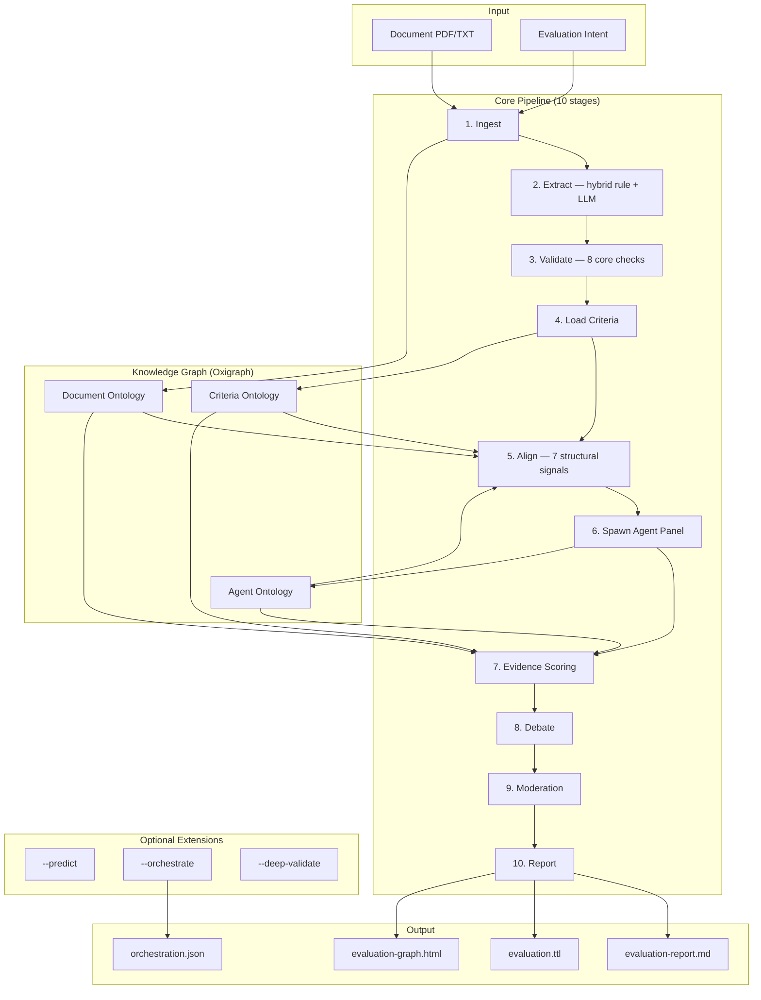
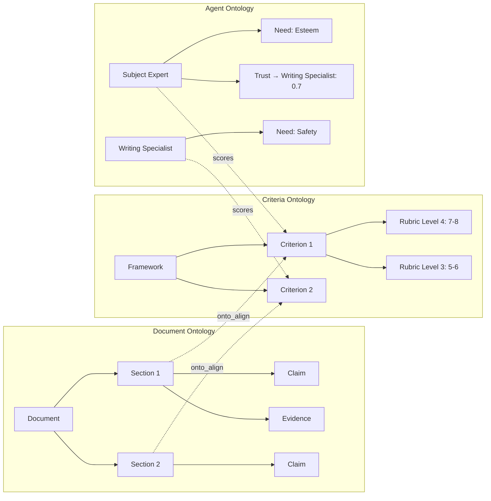
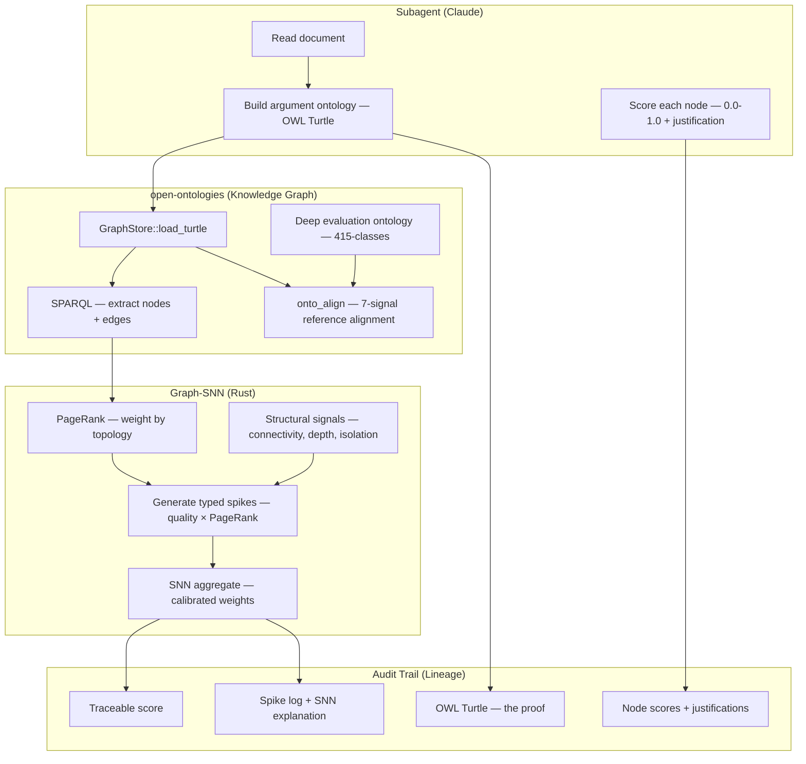
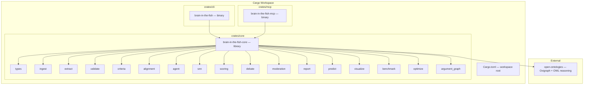

<p align="center">
  
</p>

<h1 align="center">Brain in the Fish</h1>

<p align="center">
  <strong>评估一切。预测万物。杜绝幻觉。</strong>
  <br>
  <em>基于证据验证的文档评估与预测可信度——MiroFish 所缺失的大脑。</em>
</p>

<p align="center">
  
  
  
  
</p>

<p align="center">
  <a href="README.md">English</a> | <a href="README-CN.md">中文</a> | <a href="README-JP.md">日本語</a>
</p>

---

## 截图

<p align="center">
  
  <br><em>层次化知识图谱——文档结构、评估标准、智能体面板和评分连接在一棵树中</em>
</p>

<p align="center">
  
  <br><em>详情面板展示本体推理——该节点是什么、其结构以及它为何存在于知识图谱中</em>
</p>

<p align="center">
  
  <br><em>证据节点检查——属性、本体角色、连接和溯源</em>
</p>

---

## 功能简介

一个 Rust MCP 服务器，使用 Claude 子智能体根据任意标准评估任何文档，并配备证据密度评分器（EDS），使幻觉在数学上可被检测。输入一个 PDF 和一个意图——它将返回结构化评分、弱点分析和完整审计轨迹。文档评估是核心差异化优势：BITF 与专家评分仅相差 2.8 个百分点，而原始 Claude 漂移约 15 个百分点。可选的预测可信度模块提供结构化提取和基于证据的验证。

```bash
# 作为 MCP 服务器（推荐——Claude 编排子智能体评估）
brain-in-the-fish serve

# 作为 CLI（确定性证据评分，无需 API 密钥）
brain-in-the-fish evaluate policy.pdf --intent "evaluate against Green Book standards" --open
```

---

## 性能表现

在教育、政策、文化遗产、公共卫生、技术和研究领域的真实专家评分文档上进行了基准测试。

### 文档评估（12 份真实专家评估文档）

| 指标 | 值 |
| ---- | -- |
| **平均评分偏差** | 与专家评分相差 **2.8 个百分点** |
| **方向准确率** | **12/12**——从未将弱文档评高分或将强文档评低分 |
| **弱点识别** | 与真实评估者评语 **92%** 匹配 |
| **完美的标准级匹配** | 2 份文档的每个标准都完全匹配 |

### BITF 对比原始 Claude

| 方法 | 与专家的平均偏差 | 弱点检测 | 过度断言 |
| ---- | --------------- | -------- | -------- |
| **BITF 子智能体** | **2.8pp** | **92%** | 罕见（悲观偏差） |
| 原始 Claude（无框架） | ~15pp | ~70% | 系统性（偏宽容） |

原始 Claude 评估的是写作质量。BITF 根据标准评估实质内容——能捕捉领域不匹配、缺失证据、事实错误，并校准到真实评分等级。

### 论文评分

**本体脊柱——子智能体对节点评分，SNN 聚合图**（ASAP，100 篇论文，8 个论文集，分数 0-60）：

Claude 子智能体阅读每篇论文，构建 OWL 论证本体（Turtle），对每个论证组件（论点、主张、证据、反驳）进行评分，SNN 使用 PageRank 加权图拓扑进行聚合。权重通过 Nelder-Mead 自校准。

| 方法 | Pearson r | QWK | MAE | 幻觉率 |
| ---- | --------- | --- | --- | ------ |
| 正则表达式 → SNN（基线） | 0.909 | 0.806 | 5.74 | 23% |
| 扁平 LLM 提取 → SNN | 0.894 | 0.713 | 6.62 | 31% |
| 图节点评分 → SNN（默认权重） | 0.909 | 0.897 | 5.12 | 32% |
| **图节点评分 → SNN（校准后）** | **0.973** | **0.972** | **2.52** | **2%** |

QWK 0.972 远超"可靠"评分者间一致性的 0.80 阈值。最先进的微调 AES 系统 QWK 为 0.75-0.85。

**优化器学到了什么：**

| 参数 | 默认值 | 校准值 | 含义 |
| ---- | ------ | ------ | ---- |
| w_quality | 0.35 | **0.69** | LLM 的逐节点质量评分承载了真正的信号 |
| w_firing | 0.15 | **0.54** | 活跃神经元区分论文差异 |
| w_saturation | 0.50 | **0.10** | 脉冲计数几乎无关紧要 |
| lr_evidence | 2.0 | **2.4** | 证据质量驱动贝叶斯置信度 |
| lr_quantified | 2.5 | **1.0** | 数字不等于论文质量 |

**为什么这有效：** LLM 擅长对单个论证组件进行评分（小而集中的判断）。SNN 使用图结构确定性地聚合这些评分——连接良好的节点贡献更多（PageRank），孤立的论点贡献更少。本体防止幻觉：LLM 无法对图中不存在的节点进行评分。

**完整审计轨迹：** 每个评分可追溯：最终数字 → SNN 权重 → PageRank 拓扑 → 节点级评分 → 子智能体逐节点的理由 → OWL Turtle 本体 → 原始源文本。

**ELLIPSE 语料库**（45 篇论文，1.0-5.0 分制，LLM 提取 → SNN）：

| 方法 | Pearson r | QWK | MAE |
| ---- | --------- | --- | --- |
| 仅 LLM（无 SNN） | 0.984 | 0.968 | 0.11 |
| **LLM + EDS（校准权重）** | **0.991** | **0.914** | **0.16** |

**跨数据集基准测试**（ASAP 12,976 篇论文，8 个集合）：

| 数据集 | N | Pearson r | QWK | MAE | NMAE |
| ------ | - | --------- | --- | --- | ---- |
| ASAP 分层 100（校准后） | 100 | 0.973 | 0.972 | 2.52 | 0.042 |
| ASAP 集合 1（自然分布，正则表达式） | 1,783 | 0.289 | 0.072 | 2.95 | 0.246 |
| ELLIPSE 分层 45（正则表达式） | 45 | 0.442 | 0.258 | 1.08 | 0.215 |

纯正则表达式评分器在大规模数据上崩溃（自然分布 Pearson 0.289）。使用校准权重和子智能体节点评分的图-SNN 在分层数据上维持 0.973。

### 预测可信度（8 份真实政策文档，62 个标注预测）

针对 8 份已知结果的英国/国际政策文档进行基准测试：保守党 2019 年竞选宣言、NHS 长期计划、英国紧缩财政目标、脱欧经济预测、英格兰银行 2021 年通胀预测、联合国千年发展目标、巴黎协定 NDC 和 IMF 世界经济展望 2019。

**提取：LLM 对比正则表达式**

| 方法 | 找到的预测数 | 真实标注 | 召回率 |
| ---- | ----------- | -------- | ------ |
| 正则表达式提取 | 22 | 62 | **35%** |
| **LLM 提取** | **107** | 62 | **173%**（发现了比标注更多的预测） |

正则表达式提取器遗漏了 65% 的预测。英格兰银行预测：0% 召回率。IMF 展望：11% 召回率。LLM 提取找到了每一个标注预测，加上真实标注遗漏的额外有效预测。

**可信度：哪些预测真正实现了？**

62 个真实标注预测有已知结果：11 个已实现、40 个未实现、11 个部分实现。问题是：系统能否仅基于文档证据判断哪些预测会成功？

| 方法 | 方向准确率 | Pearson r | 备注 |
| ---- | --------- | --------- | ---- |
| **LLM 可信度** | **45/51 (88%)** | **0.629** | 最佳总体准确率 |
| SNN 基础（稀疏证据） | 36/50 (72%) | 0.239 | 每个预测信号不足 |
| SNN 类型化（证据类型加权） | 42/51 (82%) | 0.378 | 主张惩罚 + 量化数据提升 |
| 混合 60% LLM + 40% SNN | 45/51 (88%) | 0.606 | 混合未能超越 LLM |

**为什么 SNN 在预测方面弱于评分：**

对于论文评分，每篇论文生成 5-20 个证据项——足以让 SNN 区分质量。对于预测，每个预测只有 3-7 个证据项，且证据结构不能有力预测预测是否会实现。一个证据充分的竞选承诺（预算已分配、计划已描述）仍然有 75% 的概率失败，因为政治、疫情和实施失败不在文档中。

证据类型分析揭示了确实存在的信号：

| 证据类型 | 已实现预测平均值 | 未实现预测平均值 | 差值 |
| -------- | --------------- | --------------- | ---- |
| **裸断言** | 0.45 | **0.85** | **-0.40**（失败的预测有更多裸断言） |
| **结构对齐** | **1.73** | 1.32 | **+0.40**（成功的预测有更多结构基础） |
| **量化数据** | **1.45** | 1.07 | **+0.38**（成功的预测有更多数字） |

有数字和结构对齐支持的预测比仅靠裸断言支持的预测更容易成功。SNN 的类型加权评分器利用了这一点（82% 方向准确率），但 LLM 通过定性判断捕捉得更好（88%）。

**预测可信度的优势所在：**

BITF 预测的价值不在于超越 LLM 的准确率——而在于结构化输出：

1. **提取完整性**——LLM 找到的预测是正则表达式的 3 倍（107 对 22）
2. **类型分类**——每个预测标记为 QuantitativeTarget、Commitment、CostEstimate 等
3. **证据分解**——每个预测链接到特定的支持证据和反驳证据，带有类型化脉冲（quantified_data、citation、claim、alignment）和强度评分
4. **审计轨迹**——每个可信度评分可追溯至：证据项 → 脉冲类型 → SNN 神经元状态 → 贝叶斯置信度。LLM 的"这看起来很理想化"变成了"3 个主张脉冲，强度 0.3，2 个反驳证据项，贝叶斯置信度 0.41，证据/反驳比 1.2:1"
5. **风险标记**——主张占比高而证据/反驳比低的预测被标记为结构性薄弱，无论文本听起来多么自信

---

## 架构



### 三个本体，一张图



### 本体脊柱——大脑架构



LLM **通过**本体工作。每个子智能体阅读文档，构建 OWL 论证图（论文的"大脑"），对单个组件评分，SNN 使用图拓扑进行聚合。本体就是证明——每个评分可从最终数字 → SNN 数学 → PageRank 权重 → 节点级评分 → 子智能体理由 → OWL 三元组 → 原始文本进行追溯。LLM 无法对图中不存在的内容进行评分。

---

## 我们尝试过什么以及什么没有奏效

系统性消融研究——逐一开关每个组件，测量准确率——确定了哪些部分值得其复杂性。

| 组件 | 结果 | 处理 |
| ---- | ---- | ---- |
| **证据评分** | 必要——没有它，Pearson 降至 0.000 | **核心** |
| **本体对齐** | 必要——没有它，Pearson 从 0.684 降至 0.592 | **核心** |
| **验证信号** | 损害准确率——移除后 Pearson 从 0.684 提升至 0.786 | 限制在 -0.05，抑制降低 |
| **模糊检查** | 有害——惩罚正确的学术性模糊表述 | 从核心中移除 |
| **具体性检查** | 有噪声——标记正常学术词汇 | 从核心中移除 |
| **过渡检查** | 高中水平启发式，无准确率提升 | 从核心中移除 |
| **马斯洛动态** | 对评分零可测量影响 | 从 CLI 中移除 |
| **多轮辩论** | 在确定性模式下无影响 | 仅在 LLM 子智能体时激活 |
| **哲学模块** | 有趣，但对准确率无用（约 0 投资回报） | 从 CLI 中移除 |
| **认识论模块** | 学术练习，无准确率提升 | 从 CLI 中移除 |
| **基于规则的预测** | 积极有害——找到 3/11，重复，误解析 | 替换为子智能体 + 证据评分器 |
| **数字检查器（旧版）** | 每份文档 111 个误报（将年份视为"不一致"） | 已修复——过滤年份/日期，降至 14 个误报 |

**关键洞察：** 证据评分和本体对齐是唯一两个可证明提高准确率的组件。其他所有组件要么零影响，要么有害。10 阶段核心管道反映了这一点。

### 本体脊柱的存在价值

| 能力 | 价值 | 原因 |
| ---- | ---- | ---- |
| **论文/文档评分** | **必要**——Pearson 0.973，QWK 0.972，2% 幻觉率 | 图拓扑 + 校准权重。LLM 评分组件；SNN 用结构聚合。通过 OWL 本体完全可审计。 |
| **事实基础** | **核心目的**——评分就是本体 | 每个评分追溯到 OWL 三元组。没有三元组 = 没有脉冲 = 没有评分。Turtle 是证明，不是装饰。 |
| **幻觉检测** | **结构性**——图和 LLM 之间的偏差可见 | 如果 LLM 声称"证据充分"但图只有 2 个断开的节点，SNN 评分就低。不需要单独检测——它内置于架构中。 |
| **预测可信度** | **边际**——82% 对比 LLM 的 88% 方向准确率 | 文档证据无法预测政治意愿或疫情。价值在于审计轨迹，而非准确率。 |

本体脊柱的目的不是在准确率上击败 LLM。而是能够**证明**评分是基于事实的。Turtle 就是证明。SNN 就是门控。评分的存在是因为证据存在于图中。

---

## 工作原理

### 核心管道（始终运行）

1. **摄入** — PDF/文本 → 章节 → 文档本体（Oxigraph 中的 RDF 三元组）
2. **提取** — 混合规则 + LLM 主张/证据提取，带置信度评分
3. **验证** — 8 项核心确定性检查（引用、一致性、结构、阅读水平、重复、证据质量、引用规范）
4. **加载标准** — 7 个内置框架 + YAML/JSON 自定义评分标准
5. **对齐** — 通过 7 个结构信号将章节 ↔ 标准进行映射（AlignmentEngine）
6. **生成智能体** — 领域专家面板 + 带认知模型的主持人
7. **证据评分** — 子智能体提取证据，通过 `eds_feed` 输入 SNN，通过 `eds_score` 读取评分（无证据 = 无脉冲 = 零分）
8. **辩论** — 分歧检测、质疑/回应、收敛
9. **主持** — 信任加权共识与异常值检测
10. **报告** — Markdown + Turtle RDF + 交互式图 HTML

### 可选扩展（CLI 标志）

| 标志 | 添加的功能 |
| ---- | --------- |
| `--predict` | 从文档中提取预测/目标，根据证据评估可信度 |
| `--deep-validate` | 全部 15 项验证检查（添加模糊、过渡、具体性、谬误等） |
| `--orchestrate` | 生成 Claude 子智能体任务文件用于 LLM 增强评分 |

---

## 证据评分器：工作原理

MiroFish 智能体可以为没有支持证据的标准"论证"一个 9/10 的评分。这就是附带置信度分数的幻觉。证据评分器使这种情况可被检测。

### 生物学启发

评分器借鉴了[脉冲神经网络](https://en.wikipedia.org/wiki/Spiking_neural_network)（第三代神经网络，模拟真实神经元通过离散电脉冲通信）的四个特性。我们不声称这是神经形态计算——这是一个证据密度评分器，使用生物启发的动力学，因为它们为文档评估提供了有用的特性。

### 特性 1：膜电位 + 阈值 = 最低证据门槛

每个智能体对每个评估标准有一个神经元。来自知识图谱的证据生成输入脉冲：

| 证据类型 | 脉冲强度 | 示例 |
| -------- | -------- | ---- |
| 量化数据 | 0.8-1.0 | "FTSE 100 上涨 45%" |
| 可验证主张 | 0.6-0.8 | "英格兰银行购买了 8950 亿英镑资产" |
| 引文 | 0.5-0.7 | "(Bernanke, 2009)" |
| 一般性主张 | 0.3-0.5 | "量化宽松作为稳定工具是有效的" |
| 章节对齐 | 0.2-0.4 | 章节标题匹配标准 |

脉冲在膜电位中累积。当超过阈值时，神经元激发。**无证据 = 无脉冲 = 不激发 = 零分。** 这就是反幻觉特性。

### 特性 2：泄漏积分 = 递减回报

```text
membrane_potential *= (1.0 - decay_rate)   // after each timestep
```

真实神经元会随时间泄漏电荷。我们用此来模拟**递减回报**——关于同一主题的第 10 条引文比第 1 条增加的价值更少。没有衰减，文档可以通过重复弱证据 50 次来刷分。

### 特性 3：侧向抑制 = 辩论质疑

```text
When Agent A challenges Agent B's score:
  Agent B's neuron.apply_inhibition(challenge_strength)
  → reduces membrane potential
  → requires MORE evidence to maintain the same score
```

在真实神经网络中，相邻神经元相互抑制以锐化响应。我们将此用于辩论：被质疑的评分需要更强的证据才能维持。

### 特性 4：不应期 = 不重复计数

激发后，神经元进入不应期，此期间新脉冲被忽略。这防止同一条证据在短时间内被多次计数。

### 实际评分公式

去除生物学框架，这是数学公式：

```text
evidence_saturation = ln(1 + total_spikes) / ln(base)    // log scale, saturates at ~15 items
spike_quality       = mean(spike_strengths)               // 0.0–1.0
firing_rate         = fire_count / timesteps              // traditional SNN signal

raw_score = evidence_saturation × w_saturation            // how much evidence exists
          + spike_quality       × w_quality               // how strong is the evidence
          + firing_rate         × w_firing                // how consistently did it accumulate

final = raw_score × (1.0 - inhibition) × max_score       // penalise if challenged in debate
```

**默认值：** `w_saturation=0.50, w_quality=0.35, w_firing=0.15, base=16`。这些是起始点——所有权重可通过 `ScoreWeights` 参数化，并可使用内置的 Nelder-Mead 优化器根据标注数据自校准。在图-SNN 管道上（ASAP 100），校准后转变为 `w_quality=0.69, w_firing=0.54, w_saturation=0.10`——优化器发现 LLM 的逐节点质量评分和神经元激发模式远比证据数量重要。

### 为什么不只是计数证据？

加权求和可以完成 80% 的工作。SNN 启发的特性添加了简单计数器无法提供的四项功能：

1. **时间动态**——证据集中出现（全在一个章节中）与分散在整个文档中会产生不同的激发模式
2. **辩论抑制**——简单计数器无法建模"这个评分被质疑了，需要更多证据才能维持"
3. **不应期**——防止同一类型的证据淹没评分（来自同一作者的五条引文不会各自获得全额计分）
4. **基于阈值的激发**——创建自然的最低证据门槛，比任意最低分更清晰

### 贝叶斯置信度追踪

受 [epistemic-deconstructor](https://github.com/NikolasMarkou/epistemic-deconstructor)（Nikolas Markou 开发）启发——一个实现严格贝叶斯假设追踪的 Claude Code 技能，用于逆向工程未知系统。

我们借鉴了两个具体机制：

**1. 基于比值形式的贝叶斯更新与似然比上限。** 每种脉冲类型有不同的似然比（这个证据有多大诊断价值？）。默认值：

```text
Quantified data:    LR = 2.5  (strong — a specific number is hard to fake)
Verifiable claim:   LR = 2.0  (good — can be checked)
Citation:           LR = 1.8  (moderate — existence of a citation doesn't prove the claim)
Section alignment:  LR = 1.5  (weak — structural match, not content match)
General claim:      LR = 1.3  (minimal — assertions without evidence)
```

这些似然比可通过 `ScoreWeights` 调节，并与评分公式权重一起自校准。

更新规则（来自 epistemic-deconstructor 的 `common.py`）：
```text
prior_odds = confidence / (1 - confidence)
posterior_odds = prior_odds × likelihood_ratio
new_confidence = posterior_odds / (1 + posterior_odds)
```

**上限防止置信度失控。** epistemic-deconstructor 按分析阶段限制似然比（阶段 0：最大 3.0，阶段 1：最大 5.0，阶段 2-5：最大 10.0），因为早期证据本质上诊断价值较低。我们按脉冲数量限制——脉冲较少时，即使强证据也无法将置信度推过 0.75：

| 收到的脉冲数 | 最大似然比 |
| ----------- | --------- |
| < 3 | 3.0 |
| 3-9 | 5.0 |
| 10+ | 10.0 |

这防止单条强引文在整体证据基础薄弱时将置信度膨胀至 0.99。

**2. 高分的证伪检查。** epistemic-deconstructor 的核心原则是"证伪，而非确认"——在任何假设超过 0.80 之前，必须至少应用一个反面证据项。我们将此实现为：

```text
If score > 80% of max:
  Check for counter-evidence (spikes with strength < 0.2 or inhibition > 0)
  If no counter-evidence found:
    confidence *= 0.7  (30% penalty for unfalsified high scores)
    falsification_checked = false  (flagged in report)
```

从未被质疑过的高分不如经历过质疑后存活的高分可信。这就是证伪优先的认识论：你不能声称 9/10，除非有东西试图把你拉到 7。

### 幻觉检测

当 LLM 和证据评分器不一致时，系统会标记：

```text
LLM says 9/10. Evidence scorer says 2/10 (only 2 weak spikes received).
→ hallucination_risk = true
→ "WARNING: LLM scored significantly higher than evidence supports."
```

在本体脊柱架构中，子智能体**通过** SNN 工作——它提取证据，调用 `eds_feed`，读取 `eds_score`，并做出基于两者的判断。评分器是确定性的：给定相同的证据，它始终产生相同的评分。每个脉冲都携带 `source_text` 和 `justification` 字段，用于完整的审计溯源。

### 自校准权重

默认 SNN 权重（0.50/0.35/0.15）是手动调优的。`optimize` 模块提供纯 Rust Nelder-Mead 单纯形优化器，根据标注数据校准全部 10 个参数：

```text
Parameters optimized:
  - w_saturation, w_quality, w_firing     (score formula weights)
  - saturation_base                        (log curve shape)
  - lr_quantified, lr_evidence, lr_citation, lr_alignment, lr_claim  (Bayesian LRs)
  - decay_rate                             (membrane leak rate)

Objective: minimize 0.6 × (1 - Pearson) + 0.4 × (MAE / max_score)
```

组合损失确保优化器同时瞄准排名准确率（Pearson）和绝对尺度（MAE）。纯 Pearson 优化产生正确排名但错误尺度（Pearson 0.994 但 MAE 1.36）。组合损失给出 Pearson 0.991 和 MAE 0.16。

**优化器学到了什么（ASAP 100，图-SNN）：**

| 参数 | 默认值 | 校准值 | 解释 |
| ---- | ------ | ------ | ---- |
| w_quality | 0.35 | **0.69** | LLM 的逐节点质量评分是主要信号 |
| w_firing | 0.15 | **0.54** | 活跃神经元区分差异——论文复杂度体现在激发模式中 |
| w_saturation | 0.50 | **0.10** | 当质量按节点评估时，证据数量几乎无关紧要 |
| lr_evidence | 2.0 | **2.4** | 证据质量驱动贝叶斯置信度 |
| lr_quantified | 2.5 | **1.0** | 数字不等于论文质量 |
| lr_claim | 1.3 | **1.0** | 裸断言是噪声，不是信号 |

结构（图拓扑、PageRank 加权、脉冲类型、抑制）是人工设计的。数字是数据驱动的。每个校准权重都可以被检查和质疑。

### ARIA 对齐

这实现了 [ARIA 安全守护 AI 计划](https://www.aria.org.uk/programme-safeguarded-ai/)（Bengio, Russell, Tegmark）中的守门人架构：**不要让 LLM 变得确定性——让验证变得确定性。**

| ARIA 框架 | Brain in the Fish |
| --------- | ----------------- |
| 世界模型 | OWL 本体（知识图谱） |
| 安全规范 | 评分标准等级 + 证据评分器阈值 |
| 确定性验证器 | 证据评分器（相同证据 → 相同评分，始终如此） |
| 证明证书 | 脉冲日志，含 source_text + justification + onto_lineage |

### 完整审计轨迹

BITF 中的每个评分都可端到端追溯：

```text
Final score: 7.2/10 for "Knowledge & Understanding"
  ↓
SNN explanation: "5 evidence spikes (2 quantified). Firing rate 0.40. Bayesian confidence 87%."
  ↓
Spike log:
  [1] QuantifiedData, strength 0.85
      text: "Revenue increased 23% year-on-year (ONS, 2024)"
      justification: "Specific statistic with government source citation"
  [2] Evidence, strength 0.70
      text: "Three case studies demonstrate implementation success"
      justification: "Multiple real-world examples, though lacking quantified outcomes"
  [3] Citation, strength 0.65
      text: "(Smith et al., 2023)"
      justification: "Academic citation supporting the methodology claim"
  [4] Claim, strength 0.40
      text: "Our approach is industry-leading"
      justification: "Assertion without comparative evidence"
  [5] Alignment, strength 0.55
      text: "Section directly addresses criterion requirements"
      justification: "Structural match between section title and criterion"
  ↓
Neuron state: membrane_potential 0.42, fire_count 3, inhibition 0.0
  ↓
ScoreWeights: w_quality=0.64, w_saturation=0.10 (calibrated against ELLIPSE 45)
```

对于预测，同样的审计轨迹适用，但包含反驳证据：

```text
Credibility: 35% (Aspirational)
  Supporting evidence: 3 items (1 quantified_data, 1 alignment, 1 claim)
  Counter-evidence: 4 items (strength avg 0.6)
  Evidence/counter ratio: 1.2:1 (weak — successful predictions average 2.0:1)
  Claim fraction: 33% (predictions with >50% claims fail 82% of the time)
```

---

## 快速开始

### 前置要求

- Rust 1.85+（edition 2024）
- [open-ontologies](https://github.com/fabio-rovai/open-ontologies) 克隆在此仓库旁边

```bash
git clone https://github.com/fabio-rovai/open-ontologies.git
git clone https://github.com/fabio-rovai/brain-in-the-fish.git
cd brain-in-the-fish
cargo build --release
```

### 作为 MCP 服务器（推荐）

添加到 Claude Code（`~/.claude.json`）或 Claude Desktop：

```json
{
  "mcpServers": {
    "brain-in-the-fish": {
      "command": "/path/to/brain-in-the-fish-mcp",
      "args": []
    }
  }
}
```

然后询问 Claude：*"根据 Green Book 标准评估这份政策文档"*

### 作为 CLI

```bash
# 确定性评估（无需 API 密钥）
brain-in-the-fish evaluate document.pdf --intent "mark this essay" --open

# 使用自定义标准
brain-in-the-fish evaluate policy.pdf --intent "evaluate" --criteria rubric.yaml

# 使用所有扩展
brain-in-the-fish evaluate report.pdf --intent "audit" --predict --deep-validate --orchestrate

# 针对标注数据集进行基准测试
brain-in-the-fish benchmark --dataset data/ellipse-sample.json --ablation

# 使用子智能体节点评分的图-SNN 基准测试
brain-in-the-fish benchmark --dataset data/asap-stratified-100.json --graph-scores data/asap-stratified-100-graph-scores.json

# 根据专家评分自校准 SNN 权重
brain-in-the-fish benchmark --dataset data/asap-stratified-100.json --graph-scores data/asap-stratified-100-graph-scores.json --calibrate

# 跨数据集比较
brain-in-the-fish benchmark --multi-dataset
```

### 输出

| 文件 | 描述 |
| ---- | ---- |
| `evaluation-report.md` | 评分卡、差距分析、辩论轨迹、建议 |
| `evaluation.ttl` | Turtle RDF 导出用于跨评估分析 |
| `evaluation-graph.html` | 交互式层次化知识图谱 |
| `orchestration.json` | 用于 Claude 增强评分的子智能体任务 |

---

## 工作区结构



**约 29K 行 Rust 代码，跨 27 个模块，编译为 2 个二进制文件（CLI + MCP 服务器）。**

---

## MCP 工具

### 评估管道

| 工具 | 描述 |
| ---- | ---- |
| `eval_status` | 服务器状态、会话状态、三元组数量 |
| `eval_ingest` | 摄入文档并构建文档本体 |
| `eval_criteria` | 加载评估框架 |
| `eval_align` | 运行本体对齐（章节 ↔ 标准） |
| `eval_spawn` | 生成评估者智能体面板 + SNN 网络 |
| `eval_score_prompt` | 获取单个智能体-标准对的评分提示 |
| `eval_record_score` | 记录子智能体的评分（自动输入 EDS） |
| `eval_scoring_tasks` | 获取所有评分任务用于编排 |
| `eval_debate_status` | 分歧、收敛、漂移速度 |
| `eval_challenge_prompt` | 生成辩论质疑提示 |
| `eval_whatif` | 模拟文本修改，估计评分影响 |
| `eval_predict` | 提取预测并进行可信度评估 |
| `eval_report` | 生成最终评估报告 |
| `eval_history` | 跨评估历史和趋势 |

### 证据密度评分器（EDS）

子智能体调用这些工具通过 SNN 工作，而非凭感觉评分：

| 工具 | 描述 |
| ---- | ---- |
| `eds_feed` | 为特定智能体和标准将结构化证据推入 SNN |
| `eds_score` | 获取 SNN 评分、置信度、脉冲审计轨迹和低置信度标准 |
| `eds_challenge` | 在辩论中对目标智能体的 SNN 施加侧向抑制 |
| `eds_consensus` | 检查智能体的 SNN 评分是否已收敛 |

---

## 基于 open-ontologies 构建

Brain in the Fish 以库 crate 的形式使用 [open-ontologies](https://github.com/fabio-rovai/open-ontologies)。它使用：

| 组件 | 用途 |
| ---- | ---- |
| `GraphStore` | 三元组存储 + SPARQL 查询 |
| `Reasoner` | OWL-RL 推理 |
| `AlignmentEngine` | 7 信号本体对齐 |
| `StateDb` | 持久化状态 |
| `LineageLog` | 完整审计轨迹 |
| `DriftDetector` | 收敛监控 |
| `Enforcer` | 质量门控 |
| `TextEmbedder` | 语义相似度（可选） |

全部作为进程内 Rust 函数调用运行。零网络开销。

---

## 测试

```bash
cargo test --workspace        # 全部 crate 共 316 个测试
cargo clippy --workspace      # 零警告
cargo run --bin brain-in-the-fish -- benchmark  # 运行合成基准测试
```

## 贡献

参见 [CONTRIBUTING.md](CONTRIBUTING.md)。

## 致谢

- [MiroFish](https://github.com/666ghj/MiroFish) — 启发了智能体辩论架构的多智能体群体预测
- [AgentSociety](https://github.com/tsinghua-fib-lab/AgentSociety) — 启发了马斯洛 + TPB 模型的认知智能体模拟
- [open-ontologies](https://github.com/fabio-rovai/open-ontologies) — 提供知识图谱骨干的 OWL 本体引擎
- [epistemic-deconstructor](https://github.com/NikolasMarkou/epistemic-deconstructor) — 贝叶斯追踪和证伪优先认识论
- [ARIA Safeguarded AI](https://www.aria.org.uk/programme-safeguarded-ai/) — 守门人架构验证

## 许可证

MIT
