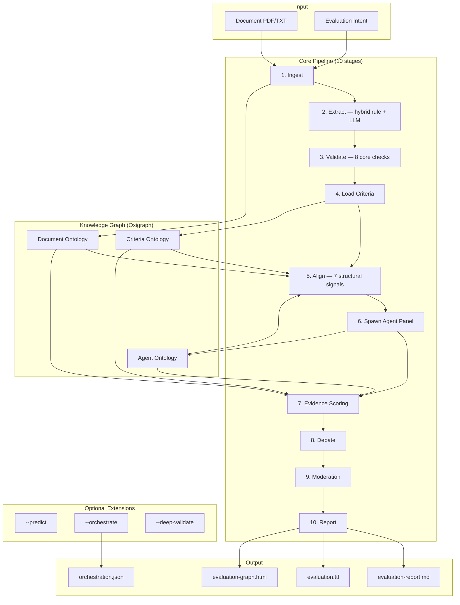
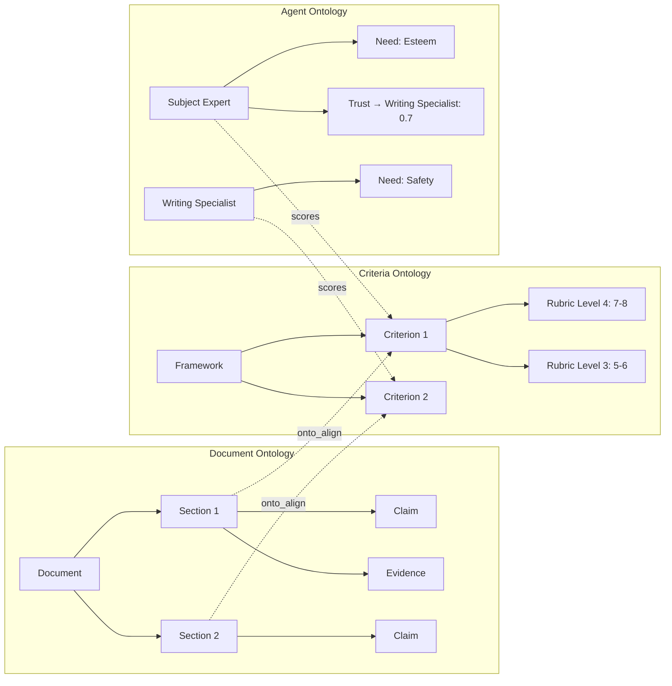
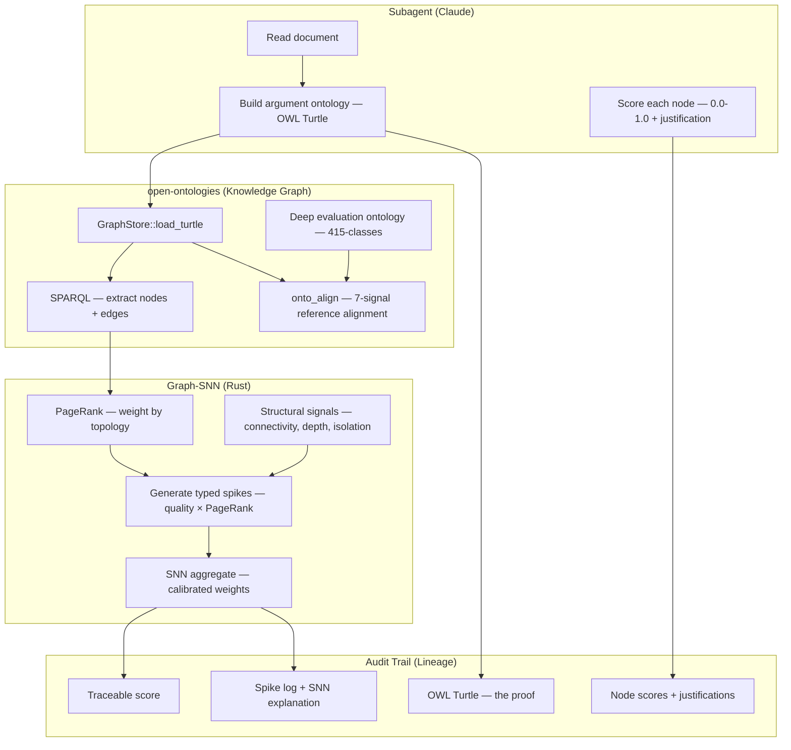
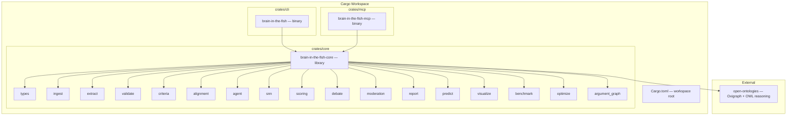

<p align="center">
  
</p>

<h1 align="center">Brain in the Fish</h1>

<p align="center">
  <strong>あらゆるものを評価。すべてを予測。幻覚はゼロ。</strong>
  <br>
  <em>エビデンスに基づく文書評価と予測の信頼性 — MiroFishに欠けていた「脳」。</em>
</p>

<p align="center">
  
  
  
  
</p>

<p align="center">
  <a href="README.md">English</a> | <a href="README-CN.md">中文</a> | <a href="README-JP.md">日本語</a>
</p>

---

## スクリーンショット

<p align="center">
  
  <br><em>階層的知識グラフ — 文書構造、評価基準、エージェントパネル、スコアリングが一つのツリーで接続</em>
</p>

<p align="center">
  
  <br><em>詳細パネルでオントロジー推論を表示 — ノードの正体、構造、知識グラフに存在する理由</em>
</p>

<p align="center">
  
  <br><em>エビデンスノードの検査 — プロパティ、オントロジー上の役割、接続、出所</em>
</p>

---

## 機能概要

あらゆる文書をあらゆる基準に対してClaudeサブエージェントを使用して評価するRust製 MCP サーバーです。幻覚を数学的に検出可能にするエビデンス密度スコアラー（EDS）を搭載しています。PDF と評価意図を入力すると、構造化されたスコア、弱点分析、完全な監査証跡を返します。文書評価が主要な差別化要素であり、BITFは専門家スコアから2.8ppの差異に収まりますが、素のClaudeは約15ppずれます。オプションの予測信頼性モジュールは、エビデンスに基づく検証付きの構造化抽出を提供します。

```bash
# MCP サーバーとして使用（推奨 — Claudeがサブエージェント評価をオーケストレーション）
brain-in-the-fish serve

# CLI として使用（決定論的エビデンススコアリング、APIキー不要）
brain-in-the-fish evaluate policy.pdf --intent "evaluate against Green Book standards" --open
```

---

## パフォーマンス

教育、政策、文化遺産、公衆衛生、テクノロジー、研究の各分野における実際の専門家評価済み文書を用いたベンチマーク。

### 文書評価（実際の専門家評価済み文書12件）

| 指標 | 値 |
| ---- | -- |
| **平均スコア差異** | 専門家スコアから**2.8パーセントポイント** |
| **方向精度** | **12/12** — 弱い文書を高く、強い文書を低く評価したことはない |
| **弱点の特定** | 実際の評価者コメントとの**92%**一致 |
| **基準レベルの完全一致** | すべての基準が正確に一致した文書が2件 |

### BITF vs 素のClaude

| 手法 | 専門家からの平均差異 | 弱点検出 | 過大主張 |
| ---- | -------------------- | -------- | -------- |
| **BITF サブエージェント** | **2.8pp** | **92%** | まれ（悲観的バイアス） |
| 素のClaude（フレームワークなし） | 約15pp | 約70% | 体系的（寛大） |

素のClaudeは文章の質を評価します。BITFは基準に対する実質を評価し、領域の不一致、エビデンスの欠如、事実誤認を検出し、実際のスコアリングバンドに合わせて校正します。

### エッセイスコアリング

**オントロジースパイン — サブエージェントがノードをスコアリングし、SNNがグラフを集約**（ASAP、100エッセイ、8エッセイセット、スコア0～60）:

Claudeサブエージェントが各エッセイを読み、OWL議論オントロジー（Turtle）を構築し、各議論構成要素（主題、主張、エビデンス、反論）をスコアリングし、SNNが PageRank 加重グラフトポロジーを使用して集約します。重みは Nelder-Mead により自己校正されます。

| 手法 | Pearson r | QWK | MAE | 幻覚率 |
| ---- | --------- | --- | --- | ------ |
| Regex → SNN（ベースライン） | 0.909 | 0.806 | 5.74 | 23% |
| フラット LLM 抽出 → SNN | 0.894 | 0.713 | 6.62 | 31% |
| グラフノードスコア → SNN（デフォルト重み） | 0.909 | 0.897 | 5.12 | 32% |
| **グラフノードスコア → SNN（校正済み）** | **0.973** | **0.972** | **2.52** | **2%** |

QWK 0.972は「信頼できる」評価者間合意の閾値0.80を大幅に超えています。最先端のファインチューニング済みAESシステムのQWKは0.75～0.85です。

**オプティマイザが学習したこと：**

| パラメータ | デフォルト | 校正後 | 意味 |
| ---------- | ---------- | ------ | ---- |
| w_quality | 0.35 | **0.69** | LLMのノードごとの品質スコアが本質的なシグナル |
| w_firing | 0.15 | **0.54** | 発火ニューロンがエッセイを差別化 |
| w_saturation | 0.50 | **0.10** | スパイク数はほぼ無関係 |
| lr_evidence | 2.0 | **2.4** | エビデンス品質がベイズ信頼度を駆動 |
| lr_quantified | 2.5 | **1.0** | 数値＝品質ではない（エッセイの場合） |

**なぜこれが機能するか：** LLMは個々の議論構成要素のスコアリング（小さく焦点を絞った判断）に優れています。SNNはグラフ構造を使用してこれらのスコアを決定論的に集約します — よく接続されたノードはより多く寄与し（PageRank）、孤立した議論はより少なく寄与します。オントロジーが幻覚を防止します：LLMはグラフに存在しないノードをスコアリングできません。

**完全な監査証跡：** すべてのスコアは追跡可能：最終数値 → SNN重み → PageRank トポロジー → ノードレベルスコア → ノードごとのサブエージェント正当化理由 → OWL Turtle オントロジー → 原文テキスト。

**ELLIPSE コーパス**（45エッセイ、1.0～5.0スケール、LLM抽出 → SNN）:

| 手法 | Pearson r | QWK | MAE |
| ---- | --------- | --- | --- |
| LLMのみ（SNNなし） | 0.984 | 0.968 | 0.11 |
| **LLM + EDS（校正済み重み）** | **0.991** | **0.914** | **0.16** |

**クロスデータセットベンチマーク**（ASAP 12,976エッセイ、8セット）:

| データセット | N | Pearson r | QWK | MAE | NMAE |
| ------------ | - | --------- | --- | --- | ---- |
| ASAP 層化100（校正済み） | 100 | 0.973 | 0.972 | 2.52 | 0.042 |
| ASAP セット1（自然分布、regex） | 1,783 | 0.289 | 0.072 | 2.95 | 0.246 |
| ELLIPSE 層化45（regex） | 45 | 0.442 | 0.258 | 1.08 | 0.215 |

regexのみのスコアラーは大規模データで崩壊します（自然分布でPearson 0.289）。校正済み重みとサブエージェントノードスコアを持つグラフSNNは、層化データで0.973を維持します。

### 予測信頼性（実際の政策文書8件、ラベル付き予測62件）

英国および国際的な政策文書8件（結果が既知）に対するベンチマーク：保守党2019年マニフェスト、NHS長期計画、英国緊縮財政目標、Brexit経済予測、イングランド銀行2021年インフレ予測、国連ミレニアム開発目標、パリ協定NDC、IMF世界経済見通し2019。

**抽出：LLM vs regex**

| 手法 | 発見された予測数 | グラウンドトゥルース | 再現率 |
| ---- | ---------------- | -------------------- | ------ |
| Regex抽出 | 22 | 62 | **35%** |
| **LLM抽出** | **107** | 62 | **173%**（GTがラベル付けしたより多く発見） |

regex抽出器は予測の65%を見逃しました。イングランド銀行予測：再現率0%。IMF見通し：再現率11%。LLM抽出はラベル付けされたすべての予測に加え、グラウンドトゥルースが見逃した有効な追加予測も発見しました。

**信頼性：どの予測が実際に実現したか？**

62件のグラウンドトゥルース予測には既知の結果があります：11件達成、40件未達成、11件部分的達成。問題は：文書のエビデンスだけで、どの予測が成功するかをシステムが判別できるか？

| 手法 | 方向精度 | Pearson r | 備考 |
| ---- | -------- | --------- | ---- |
| **LLM信頼性** | **45/51 (88%)** | **0.629** | 全体的に最高精度 |
| SNNベーシック（疎なエビデンス） | 36/50 (72%) | 0.239 | 予測ごとのシグナル不足 |
| SNN型付き（エビデンスタイプ加重） | 42/51 (82%) | 0.378 | 主張ペナルティ + 定量データブースト |
| ブレンド 60% LLM + 40% SNN | 45/51 (88%) | 0.606 | ブレンドしてもLLM以上の改善なし |

**SNNが予測においてスコアリングより弱い理由：**

エッセイスコアリングでは、各エッセイが5～20のエビデンス項目を生成し、SNNが品質を差別化するのに十分です。予測では、各予測が3～7のエビデンス項目しかなく、エビデンス構造は予測が実現するかどうかを強く予測しません。十分に裏付けられたマニフェストの公約（予算配分済み、計画記載済み）でも、政治、パンデミック、文書に含まれない実施上の失敗により、75%の確率で失敗します。

エビデンスタイプ分析により、存在するシグナルが明らかになります：

| エビデンスタイプ | 達成予測の平均 | 未達成予測の平均 | 差分 |
| ---------------- | -------------- | ---------------- | ---- |
| **裸の主張** | 0.45 | **0.85** | **-0.40**（失敗した予測はより多くの裸の主張を含む） |
| **構造的整合** | **1.73** | 1.32 | **+0.40**（成功した予測はより多くの構造的根拠を持つ） |
| **定量データ** | **1.45** | 1.07 | **+0.38**（成功した予測はより多くの数値を持つ） |

数値と構造的整合に裏付けられた予測は、裸の主張に裏付けられたものよりも成功率が高くなります。SNNの型付きスコアラーはこれを活用しますが（82%の方向精度）、LLMは定性的判断を通じてより良く捉えます（88%）。

**予測信頼性が強い分野：**

BITF予測の価値はLLM以上の精度ではなく、構造化された出力にあります：

1. **抽出の網羅性** — LLMはregexの3倍の予測を発見（107 vs 22）
2. **型付き分類** — 各予測はQuantitativeTarget、Commitment、CostEstimateなどとしてタグ付け
3. **エビデンス分解** — 各予測は具体的な裏付けエビデンスと反証に紐付けられ、型付きスパイク（quantified_data、citation、claim、alignment）と強度スコアを持つ
4. **監査証跡** — すべての信頼性スコアは追跡可能：エビデンス項目 → スパイクタイプ → SNNニューロン状態 → ベイズ信頼度。LLMの「これは野心的に見える」は「強度0.3の主張スパイク3件、反証項目2件、ベイズ信頼度0.41、エビデンス/反証比1.2:1」になる
5. **リスクフラグ付け** — 主張割合が高くエビデンス/反証比が低い予測は、テキストの自信度に関係なく構造的に弱いとフラグ付けされる

---

## アーキテクチャ



### 3つのオントロジー、1つのグラフ



### オントロジースパイン — 脳のアーキテクチャ



LLMはオントロジーを**通じて**動作します。各サブエージェントは文書を読み、OWL議論グラフ（エッセイの「脳」）を構築し、個々の構成要素をスコアリングし、SNNがグラフトポロジーを使用して集約します。オントロジーが証明そのものです — すべてのスコアは最終数値 → SNN計算 → PageRank重み → ノードレベルスコア → サブエージェント正当化理由 → OWLトリプル → 原文テキストまで追跡可能です。LLMはグラフに存在しないものをスコアリングできません。

---

## 試したことと機能しなかったこと

体系的なアブレーション研究 — 各コンポーネントのオン/オフを切り替えて精度を測定 — により、どの部分がその複雑さに見合う価値を持つかを特定しました。

| コンポーネント | 結果 | アクション |
| -------------- | ---- | ---------- |
| **エビデンススコアリング** | 必須 — これなしではPearsonが0.000に低下 | **コア** |
| **オントロジーアライメント** | 必須 — これなしではPearsonが0.684から0.592に低下 | **コア** |
| **検証シグナル** | 精度を低下させる — 除去するとPearsonが0.684→0.786に改善 | -0.05で制限、抑制を削減 |
| **ヘッジングチェック** | 有害 — 正当な学術的ヘッジングにペナルティ | コアから除去 |
| **具体性チェック** | ノイジー — 通常の学術用語にフラグ | コアから除去 |
| **接続詞チェック** | 高校レベルのヒューリスティック、精度改善なし | コアから除去 |
| **マズロー動態** | スコアへの測定可能な影響ゼロ | CLIから除去 |
| **多ラウンド討論** | 決定論モードでは影響なし | LLMサブエージェント使用時のみ有効 |
| **哲学モジュール** | 興味深いが精度には有用でない（ROI約0） | CLIから除去 |
| **認識論モジュール** | 学術的演習、精度改善なし | CLIから除去 |
| **ルールベース予測** | 積極的に有害 — 11件中3件のみ発見、重複、誤解析 | サブエージェント + エビデンススコアラーに置換 |
| **数値チェッカー（旧）** | 文書あたり111件の誤検知（年号を「矛盾」として検出） | 修正済み — 年号/日付をフィルタリング、14件のFPに削減 |

**主要な知見：** エビデンススコアリングとオントロジーアライメントのみが精度を実証的に改善する2つのコンポーネントです。他のすべては影響ゼロか精度を低下させます。10段階のコアパイプラインはこれを反映しています。

### オントロジースパインが存在意義を発揮する場面

| 機能 | 価値 | 理由 |
| ---- | ---- | ---- |
| **エッセイ/文書スコアリング** | **必須** — Pearson 0.973、QWK 0.972、幻覚率2% | グラフトポロジー + 校正済み重み。LLMが構成要素をスコアリングし、SNNが構造を使って集約。OWLオントロジーで完全に監査可能。 |
| **事実の根拠付け** | **中核的目的** — スコアがオントロジーそのもの | すべてのスコアはOWLトリプルまで追跡可能。トリプルなし = スパイクなし = スコアなし。Turtleが証明であり、装飾ではない。 |
| **幻覚検出** | **構造的** — グラフとLLMの乖離が可視化される | LLMが「強力なエビデンス」と主張してもグラフに2つの孤立ノードしかなければ、SNNスコアは低い。別途の検出は不要 — アーキテクチャに組み込まれている。 |
| **予測信頼性** | **限界的** — LLMの88%に対して82%の方向精度 | 文書のエビデンスは政治的意志やパンデミックを予測できない。価値は精度ではなく監査証跡にある。 |

オントロジースパインはLLMの精度を超えることが目的ではありません。スコアが事実に基づいていることを**証明**できることが目的です。Turtleが証明です。SNNがゲートです。エビデンスがグラフに存在するからこそスコアが存在します。

---

## 動作原理

### コアパイプライン（常に実行）

1. **取り込み** — PDF/テキスト → セクション → 文書オントロジー（Oxigraph内のRDFトリプル）
2. **抽出** — ルール + LLMのハイブリッド主張/エビデンス抽出（信頼度スコア付き）
3. **検証** — 8つのコア決定論的チェック（引用、一貫性、構造、可読性レベル、重複、エビデンス品質、参照）
4. **基準読み込み** — 7つの組み込みフレームワーク + YAML/JSONカスタムルーブリック
5. **アライメント** — 7つの構造シグナルによるセクション↔基準のマッピング（AlignmentEngine）
6. **エージェント生成** — 認知モデルを持つ領域専門家パネル + モデレーター
7. **エビデンススコアリング** — サブエージェントがエビデンスを抽出し、`eds_feed`でSNNに入力、`eds_score`でスコアを読み取り（エビデンスなし = スパイクなし = スコアゼロ）
8. **討論** — 不一致検出、チャレンジ/レスポンス、収束
9. **調停** — 信頼度加重コンセンサスと外れ値検出
10. **レポート** — Markdown + Turtle RDF + インタラクティブグラフHTML

### オプション拡張（CLIフラグ）

| フラグ | 追加される機能 |
| ------ | -------------- |
| `--predict` | 文書から予測/目標を抽出し、エビデンスに対する信頼性を評価 |
| `--deep-validate` | 全15検証チェック（ヘッジング、接続詞、具体性、論理的誤謬などを追加） |
| `--orchestrate` | LLM強化スコアリング用のClaudeサブエージェントタスクファイルを生成 |

---

## エビデンススコアラー：動作原理

MiroFishのエージェントは裏付けエビデンスなしに基準に対して9/10スコアを「正当化」できます。これは信頼度スコアが付いた幻覚です。エビデンススコアラーはこれを検出可能にします。

### 生物学的着想

スコアラーは[スパイキングニューラルネットワーク](https://en.wikipedia.org/wiki/Spiking_neural_network)（実際のニューロンが離散的な電気パルスで通信する方法をモデル化した第3世代ニューラルネットワーク）から4つの特性を借用しています。これがニューロモルフィックコンピューティングであるとは主張しません — 文書評価に有用な特性を提供する生物学的に着想を得たダイナミクスを使用するエビデンス密度スコアラーです。

### 特性1：膜電位 + 閾値 = 最低エビデンス基準

各エージェントは評価基準ごとに1つのニューロンを持ちます。知識グラフからのエビデンスが入力スパイクを生成します：

| エビデンスタイプ | スパイク強度 | 例 |
| ---------------- | ------------ | -- |
| 定量データ | 0.8～1.0 | "FTSE 100は45%上昇" |
| 検証可能な主張 | 0.6～0.8 | "イングランド銀行は8950億ポンドの資産を購入" |
| 引用 | 0.5～0.7 | "(Bernanke, 2009)" |
| 一般的な主張 | 0.3～0.5 | "QEは安定化ツールとして効果的だった" |
| セクションアライメント | 0.2～0.4 | セクションタイトルが基準に一致 |

スパイクは膜電位に蓄積されます。閾値を超えるとニューロンが発火します。**エビデンスなし = スパイクなし = 発火なし = スコアゼロ。**これが反幻覚特性です。

### 特性2：リーキー積分 = 収穫逓減

```text
membrane_potential *= (1.0 - decay_rate)   // 各タイムステップ後
```

実際のニューロンは時間とともに電荷を漏出します。これを**収穫逓減**のモデル化に使用します — 同じトピックに関する10番目の引用は1番目よりも付加価値が少なくなります。減衰なしでは、弱いエビデンスを50回繰り返すことでスコアを操作できてしまいます。

### 特性3：側方抑制 = 討論チャレンジ

```text
When Agent A challenges Agent B's score:
  Agent B's neuron.apply_inhibition(challenge_strength)
  → reduces membrane potential
  → requires MORE evidence to maintain the same score
```

実際のニューラルネットワークでは、近隣のニューロンが互いを抑制して応答を鮮明にします。これを討論に使用します：チャレンジされたスコアは生き残るためにより強いエビデンスが必要です。

### 特性4：不応期 = 二重計上の防止

発火後、ニューロンは不応期に入り、新しいスパイクは無視されます。これにより、同じエビデンスが連続して複数回計上されることを防ぎます。

### 実際のスコアリング式

生物学的フレーミングを取り除くと、数学はこうなります：

```text
evidence_saturation = ln(1 + total_spikes) / ln(base)    // 対数スケール、約15項目で飽和
spike_quality       = mean(spike_strengths)               // 0.0～1.0
firing_rate         = fire_count / timesteps              // 従来のSNNシグナル

raw_score = evidence_saturation × w_saturation            // エビデンスの量
          + spike_quality       × w_quality               // エビデンスの強さ
          + firing_rate         × w_firing                // 蓄積の一貫性

final = raw_score × (1.0 - inhibition) × max_score       // 討論でチャレンジされた場合ペナルティ
```

**デフォルト値：** `w_saturation=0.50, w_quality=0.35, w_firing=0.15, base=16`。これらは出発点です — すべての重みは`ScoreWeights`経由でパラメータ化可能で、組み込みの Nelder-Mead オプティマイザを使用してラベル付きデータに対して自己校正できます。グラフSNNパイプライン（ASAP 100）では、校正により`w_quality=0.69, w_firing=0.54, w_saturation=0.10`にシフトしました — オプティマイザは、LLMのノードごとの品質スコアとニューロン発火パターンがエビデンス量よりもはるかに重要であることを学習しました。

### なぜ単にエビデンスを数えないのか？

加重和で80%まで到達できます。SNN着想の特性は、単純なカウンターでは不可能な4つの機能を追加します：

1. **時間的ダイナミクス** — エビデンスがバースト的に到着（すべて1つのセクション内）する場合と文書全体に分散する場合で異なる発火パターンを生成
2. **討論からの抑制** — 単純なカウンターでは「このスコアはチャレンジされたため、生き残るにはより多くのエビデンスが必要」をモデル化できない
3. **不応期** — 同じエビデンスタイプがスコアを溢れさせることを防止（同じ著者からの5つの引用がそれぞれフルクレジットを得ることはない）
4. **閾値ベースの発火** — 任意の最低スコアよりもクリーンな自然な最低エビデンス基準を創出

### ベイズ信頼度追跡

[epistemic-deconstructor](https://github.com/NikolasMarkou/epistemic-deconstructor)（Nikolas Markou作）に着想を得ています — 未知のシステムをリバースエンジニアリングするための厳密なベイズ仮説追跡を実装したClaude Codeスキルです。

2つの具体的なメカニズムを借用しました：

**1. 尤度比キャップ付きオッズ形式ベイズ更新。** 各スパイクタイプは異なる尤度比（このエビデンスはどれほど診断的か？）を持ちます。デフォルト値：

```text
Quantified data:    LR = 2.5  (強い — 具体的な数値は偽造が困難)
Verifiable claim:   LR = 2.0  (良好 — 検証可能)
Citation:           LR = 1.8  (中程度 — 引用の存在は主張を証明しない)
Section alignment:  LR = 1.5  (弱い — 構造的一致であり内容の一致ではない)
General claim:      LR = 1.3  (最小限 — エビデンスなしの主張)
```

これらのLRは`ScoreWeights`経由で調整可能で、スコア式の重みとともに自己校正されます。

更新ルール（epistemic-deconstructorの`common.py`より）：
```text
prior_odds = confidence / (1 - confidence)
posterior_odds = prior_odds × likelihood_ratio
new_confidence = posterior_odds / (1 + posterior_odds)
```

**キャップが信頼度の暴走を防止。** epistemic-deconstructorは分析フェーズごとにLRをキャップします（フェーズ0：最大3.0、フェーズ1：最大5.0、フェーズ2-5：最大10.0）。初期のエビデンスは本質的に診断性が低いためです。我々はスパイク数でキャップします — スパイクが少ない場合、強いエビデンスでも信頼度を0.75以上に押し上げることはできません：

| 受信スパイク数 | 最大LR |
| -------------- | ------ |
| < 3 | 3.0 |
| 3～9 | 5.0 |
| 10+ | 10.0 |

これにより、全体のエビデンスベースが薄い場合に、単一の強い引用が信頼度を0.99に膨張させることを防止します。

**2. 高スコアに対する反証チェック。** epistemic-deconstructorの中核原則は「確認ではなく反証」です — 仮説が0.80を超える前に、少なくとも1つの反証エビデンス項目が適用されている必要があります。我々はこれを以下のように実装しています：

```text
If score > 80% of max:
  Check for counter-evidence (spikes with strength < 0.2 or inhibition > 0)
  If no counter-evidence found:
    confidence *= 0.7  (反証されていない高スコアに30%ペナルティ)
    falsification_checked = false  (レポートでフラグ付け)
```

チャレンジを受けたことのない高スコアは、チャレンジを生き残ったスコアよりも信頼性が低くなります。これが反証優先の認識論です：何かがあなたを7に引き下げようとしない限り、9/10を主張することはできません。

### 幻覚検出

LLMとエビデンススコアラーが一致しない場合、システムがフラグを立てます：

```text
LLM says 9/10. Evidence scorer says 2/10 (only 2 weak spikes received).
→ hallucination_risk = true
→ "WARNING: LLM scored significantly higher than evidence supports."
```

オントロジースパインアーキテクチャでは、サブエージェントはSNNを**通じて**動作します — エビデンスを抽出し、`eds_feed`を呼び出し、`eds_score`を読み取り、両方に基づいた判断を行います。スコアラーは決定論的です：同じエビデンスが与えられれば、常に同じスコアを生成します。すべてのスパイクは完全な監査出所のために`source_text`と`justification`フィールドを持ちます。

### 自己校正重み

デフォルトのSNN重み（0.50/0.35/0.15）は手動調整されたものです。`optimize`モジュールはラベル付きデータに対してすべての10パラメータを校正する純Rust製 Nelder-Mead シンプレックスオプティマイザを提供します：

```text
Parameters optimized:
  - w_saturation, w_quality, w_firing     (スコア式の重み)
  - saturation_base                        (対数曲線の形状)
  - lr_quantified, lr_evidence, lr_citation, lr_alignment, lr_claim  (ベイズLR)
  - decay_rate                             (膜漏出率)

Objective: minimize 0.6 × (1 - Pearson) + 0.4 × (MAE / max_score)
```

複合損失により、オプティマイザはランキング精度（Pearson）と絶対スケール（MAE）の両方を目標にします。純粋なPearson最適化は間違ったスケール上の正しいランキングを生成します（Pearson 0.994だがMAE 1.36）。複合損失はPearson 0.991とMAE 0.16を実現します。

**オプティマイザが学習したこと（ASAP 100、グラフSNN）：**

| パラメータ | デフォルト | 校正後 | 解釈 |
| ---------- | ---------- | ------ | ---- |
| w_quality | 0.35 | **0.69** | LLMのノードごとの品質スコアが主要シグナル |
| w_firing | 0.15 | **0.54** | 発火ニューロンが差別化 — エッセイの複雑さが発火パターンに現れる |
| w_saturation | 0.50 | **0.10** | ノードごとに品質が評価される場合、エビデンス数はほぼ無関係 |
| lr_evidence | 2.0 | **2.4** | エビデンス品質がベイズ信頼度を駆動 |
| lr_quantified | 2.5 | **1.0** | エッセイでは数値＝品質ではない |
| lr_claim | 1.3 | **1.0** | 裸の主張はノイズであり、シグナルではない |

構造（グラフトポロジー、PageRank加重、スパイクタイプ、抑制）は人間が設計したものです。数値はデータ駆動です。すべての校正済み重みは検査および疑問を呈することができます。

### ARIA アライメント

これは[ARIAのSafeguarded AIプログラム](https://www.aria.org.uk/programme-safeguarded-ai/)（Bengio, Russell, Tegmark）のゲートキーパーアーキテクチャを実装しています：**LLMを決定論的にするのではなく — 検証を決定論的にする。**

| ARIAフレームワーク | Brain in the Fish |
| ------------------ | ----------------- |
| 世界モデル | OWLオントロジー（知識グラフ） |
| 安全仕様 | ルーブリックレベル + エビデンススコアラー閾値 |
| 決定論的検証器 | エビデンススコアラー（同じエビデンス → 同じスコア、常に） |
| 証明証明書 | source_text + justification + onto_lineage付きスパイクログ |

### 完全な監査証跡

BITFのすべてのスコアはエンドツーエンドで追跡可能です：

```text
Final score: 7.2/10 for "Knowledge & Understanding"
  ↓
SNN explanation: "5 evidence spikes (2 quantified). Firing rate 0.40. Bayesian confidence 87%."
  ↓
Spike log:
  [1] QuantifiedData, strength 0.85
      text: "Revenue increased 23% year-on-year (ONS, 2024)"
      justification: "Specific statistic with government source citation"
  [2] Evidence, strength 0.70
      text: "Three case studies demonstrate implementation success"
      justification: "Multiple real-world examples, though lacking quantified outcomes"
  [3] Citation, strength 0.65
      text: "(Smith et al., 2023)"
      justification: "Academic citation supporting the methodology claim"
  [4] Claim, strength 0.40
      text: "Our approach is industry-leading"
      justification: "Assertion without comparative evidence"
  [5] Alignment, strength 0.55
      text: "Section directly addresses criterion requirements"
      justification: "Structural match between section title and criterion"
  ↓
Neuron state: membrane_potential 0.42, fire_count 3, inhibition 0.0
  ↓
ScoreWeights: w_quality=0.64, w_saturation=0.10 (calibrated against ELLIPSE 45)
```

予測については、同じ監査証跡が反証付きで適用されます：

```text
Credibility: 35% (Aspirational)
  Supporting evidence: 3 items (1 quantified_data, 1 alignment, 1 claim)
  Counter-evidence: 4 items (strength avg 0.6)
  Evidence/counter ratio: 1.2:1 (weak — successful predictions average 2.0:1)
  Claim fraction: 33% (predictions with >50% claims fail 82% of the time)
```

---

## はじめに

### 前提条件

- Rust 1.85+（edition 2024）
- [open-ontologies](https://github.com/fabio-rovai/open-ontologies)をこのリポジトリと並行してクローン

```bash
git clone https://github.com/fabio-rovai/open-ontologies.git
git clone https://github.com/fabio-rovai/brain-in-the-fish.git
cd brain-in-the-fish
cargo build --release
```

### MCPサーバーとして（推奨）

Claude Code（`~/.claude.json`）またはClaude Desktopに追加：

```json
{
  "mcpServers": {
    "brain-in-the-fish": {
      "command": "/path/to/brain-in-the-fish-mcp",
      "args": []
    }
  }
}
```

次にClaudeに聞いてみてください：*「この政策文書をGreen Book基準に対して評価してください」*

### CLIとして

```bash
# 決定論的評価（APIキー不要）
brain-in-the-fish evaluate document.pdf --intent "mark this essay" --open

# カスタム基準を使用
brain-in-the-fish evaluate policy.pdf --intent "evaluate" --criteria rubric.yaml

# すべての拡張機能を使用
brain-in-the-fish evaluate report.pdf --intent "audit" --predict --deep-validate --orchestrate

# ラベル付きデータセットに対するベンチマーク
brain-in-the-fish benchmark --dataset data/ellipse-sample.json --ablation

# サブエージェントノードスコアを使用したグラフSNNベンチマーク
brain-in-the-fish benchmark --dataset data/asap-stratified-100.json --graph-scores data/asap-stratified-100-graph-scores.json

# 専門家スコアに対するSNN重みの自己校正
brain-in-the-fish benchmark --dataset data/asap-stratified-100.json --graph-scores data/asap-stratified-100-graph-scores.json --calibrate

# クロスデータセット比較
brain-in-the-fish benchmark --multi-dataset
```

### 出力

| ファイル | 説明 |
| -------- | ---- |
| `evaluation-report.md` | スコアカード、ギャップ分析、討論記録、推奨事項 |
| `evaluation.ttl` | クロス評価分析用Turtle RDFエクスポート |
| `evaluation-graph.html` | インタラクティブ階層知識グラフ |
| `orchestration.json` | Claude強化スコアリング用サブエージェントタスク |

---

## ワークスペース構造



**27モジュールにわたる約29K行のRust、2つのバイナリ（CLI + MCPサーバー）にコンパイル。**

---

## MCPツール

### 評価パイプライン

| ツール | 説明 |
| ------ | ---- |
| `eval_status` | サーバー状態、セッション状態、トリプル数 |
| `eval_ingest` | 文書を取り込み、文書オントロジーを構築 |
| `eval_criteria` | 評価フレームワークを読み込み |
| `eval_align` | オントロジーアライメントを実行（セクション↔基準） |
| `eval_spawn` | 評価エージェントパネル + SNNネットワークを生成 |
| `eval_score_prompt` | エージェント-基準ペアのスコアリングプロンプトを取得 |
| `eval_record_score` | サブエージェントからのスコアを記録（自動的にEDSに入力） |
| `eval_scoring_tasks` | オーケストレーション用の全スコアリングタスクを取得 |
| `eval_debate_status` | 不一致、収束、ドリフト速度 |
| `eval_challenge_prompt` | 討論用のチャレンジプロンプトを生成 |
| `eval_whatif` | テキスト変更をシミュレーション、スコアへの影響を推定 |
| `eval_predict` | 信頼性評価付きの予測を抽出 |
| `eval_report` | 最終評価レポートを生成 |
| `eval_history` | クロス評価履歴とトレンド |

### エビデンス密度スコアラー（EDS）

サブエージェントは直感ではなくSNNを通じてスコアリングするためにこれらのツールを呼び出します：

| ツール | 説明 |
| ------ | ---- |
| `eds_feed` | 特定のエージェントと基準に対する構造化エビデンスをSNNに入力 |
| `eds_score` | SNNスコア、信頼度、スパイク監査証跡、低信頼度基準を取得 |
| `eds_challenge` | 討論中に対象エージェントのSNNに側方抑制を適用 |
| `eds_consensus` | エージェントのSNNスコアが収束したかチェック |

---

## open-ontologies上に構築

Brain in the Fishは[open-ontologies](https://github.com/fabio-rovai/open-ontologies)をライブラリクレートとして使用します。使用するコンポーネント：

| コンポーネント | 目的 |
| -------------- | ---- |
| `GraphStore` | トリプルストレージ + SPARQLクエリ |
| `Reasoner` | OWL-RL推論 |
| `AlignmentEngine` | 7シグナルオントロジーアライメント |
| `StateDb` | 永続的状態 |
| `LineageLog` | 完全な監査証跡 |
| `DriftDetector` | 収束モニタリング |
| `Enforcer` | 品質ゲート |
| `TextEmbedder` | 意味的類似度（オプション） |

すべてインプロセスのRust関数呼び出しとして実行。ネットワークオーバーヘッドゼロ。

---

## テスト

```bash
cargo test --workspace        # 全クレートで316テスト
cargo clippy --workspace      # 警告ゼロ
cargo run --bin brain-in-the-fish -- benchmark  # 合成ベンチマークを実行
```

## コントリビューション

[CONTRIBUTING.md](CONTRIBUTING.md)を参照してください。

## 謝辞

- [MiroFish](https://github.com/666ghj/MiroFish) — エージェント討論アーキテクチャに着想を与えたマルチエージェント群知能予測
- [AgentSociety](https://github.com/tsinghua-fib-lab/AgentSociety) — マズロー + TPBモデルに着想を与えた認知エージェントシミュレーション
- [open-ontologies](https://github.com/fabio-rovai/open-ontologies) — 知識グラフのバックボーンを提供するOWLオントロジーエンジン
- [epistemic-deconstructor](https://github.com/NikolasMarkou/epistemic-deconstructor) — ベイズ追跡と反証優先認識論
- [ARIA Safeguarded AI](https://www.aria.org.uk/programme-safeguarded-ai/) — ゲートキーパーアーキテクチャの検証

## ライセンス

MIT
