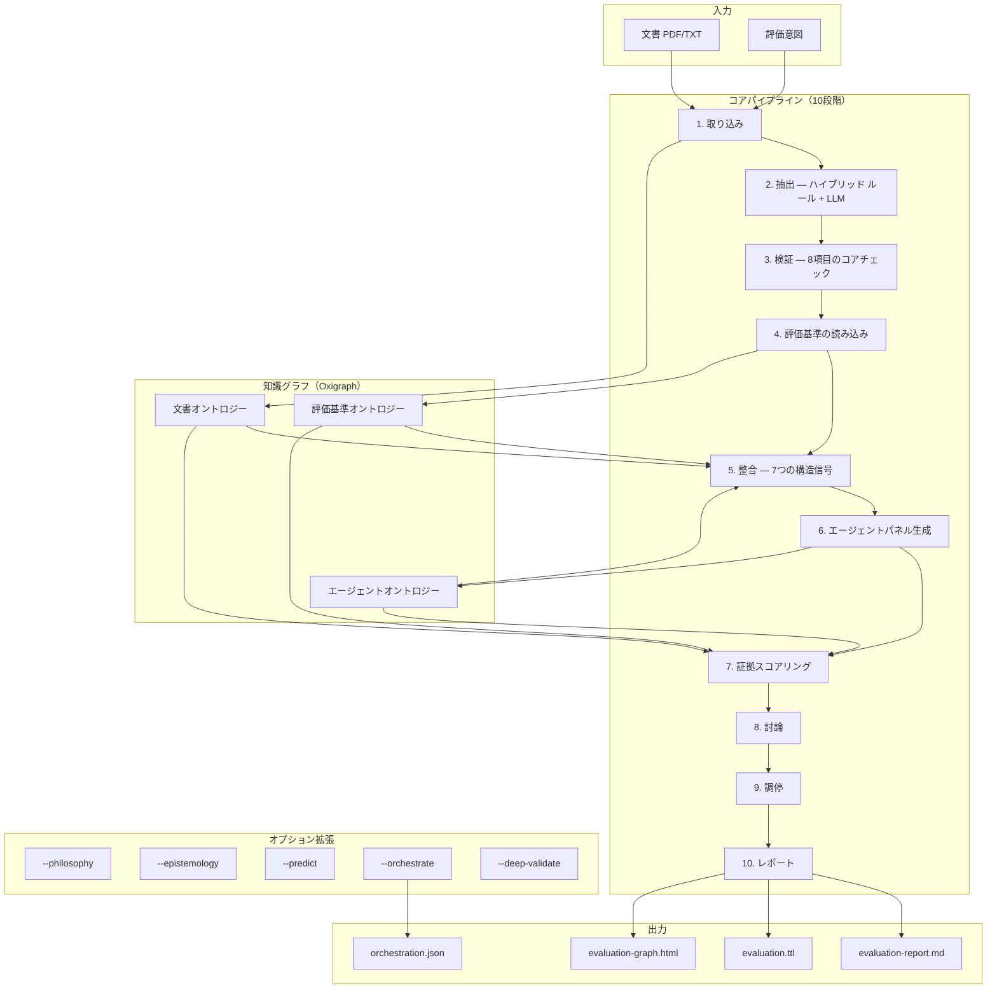
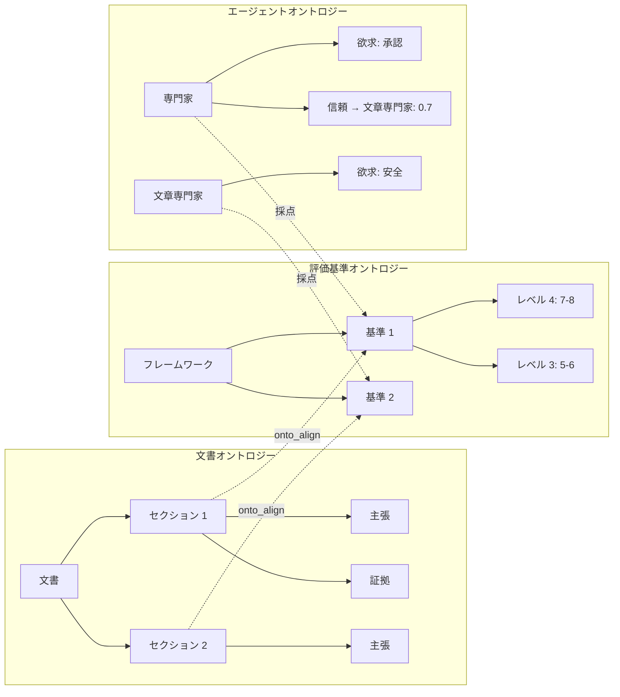
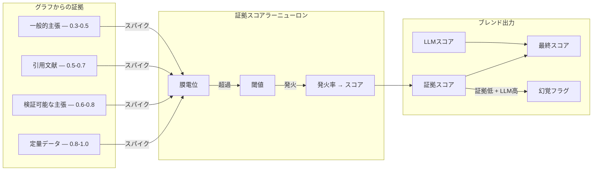
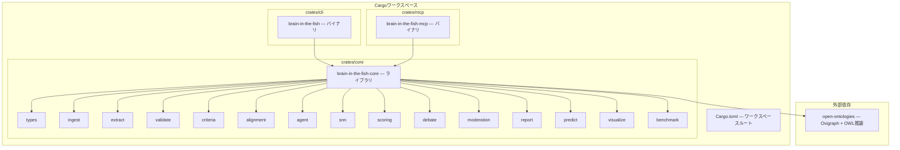

<p align="center">
  
</p>

<h1 align="center">Brain in the Fish</h1>

<p align="center">
  <strong>すべてを評価する。すべてを予測する。幻覚はゼロ。</strong>
  <br>
  <em>証拠検証による文書評価と予測信頼性 — MiroFishに欠けていた頭脳。</em>
</p>

<p align="center">
  
  
  
  
</p>

<p align="center">
  <a href="README.md">English</a> | <a href="README-CN.md">中文</a> | <a href="README-JP.md">日本語</a>
</p>

---

## スクリーンショット

<p align="center">
  
  <br><em>階層的知識グラフ — 文書構造、評価基準、エージェントパネル、採点が1つのツリーで接続</em>
</p>

<p align="center">
  
  <br><em>詳細パネルでオントロジー推論を表示 — ノードの正体、構造、知識グラフに存在する理由</em>
</p>

<p align="center">
  
  <br><em>証拠ノードの検査 — プロパティ、オントロジーの役割、接続、来歴</em>
</p>

---

## 概要

Rust製のMCPサーバーで、Claudeサブエージェントを使用してあらゆる文書をあらゆる基準で評価します。証拠密度スコアラー（EDS）により、幻覚を数学的に検出可能にします。PDFと評価意図を入力すると、構造化されたスコア、弱点分析、完全な監査証跡を返します。文書評価がコアの差別化要因：BITFは専門家スコアから2.8ppの偏差に対し、素のClaudeは約15pp。オプションの予測信頼性モジュールはSNN検証付きの構造化抽出を提供します。

```bash
# MCPサーバーとして（推奨 — Claudeがサブエージェント評価を調整）
brain-in-the-fish serve

# CLIとして（決定論的証拠スコアリング、APIキー不要）
brain-in-the-fish evaluate policy.pdf --intent "グリーンブック基準で評価" --open
```

---

## パフォーマンス

教育、政策、文化遺産、公衆衛生、技術、研究の各分野にわたる実際の専門家評価文書でベンチマーク。

### 文書評価精度（12件の専門家評価済み文書）

| 指標 | 値 |
| ---- | -- |
| **平均スコア偏差** | 専門家スコアから **2.8パーセントポイント** |
| **方向精度** | **12/12** — 弱い文書を高評価、強い文書を低評価にしたことはない |
| **弱点識別率** | 実際の評価者コメントと **92%** 一致 |
| **完全基準一致** | 2件の文書ですべての基準が完全に一致 |

### BITF vs 素のClaude

| 手法 | 専門家との平均偏差 | 弱点検出率 | 過大評価 |
| ---- | ---------------- | --------- | ------- |
| **BITFサブエージェント** | **2.8pp** | **92%** | まれ（保守的バイアス） |
| 素のClaude（フレームワークなし） | ~15pp | ~70% | 系統的（甘い） |

素のClaudeは文章の質を評価する。BITFは基準に対する実質を評価する — ドメインミスマッチ、証拠の欠如、事実誤認を検出し、実際の採点バンドに校正する。

### エッセイ採点（ELLIPSEコーパス、45編、1.0–5.0スケール）

| 手法 | Pearson r | QWK | MAE |
| ---- | --------- | --- | --- |
| EDSのみ（決定論的） | 0.442 | 0.258 | 1.08 |
| 素のClaude | 0.937 | — | 0.39 |
| **BITFサブエージェント** | **0.955** | **0.902** | **0.32** |

QWK 0.902は「信頼性のある」評価者間一致の0.80閾値を超えている。最先端のファインチューニングAESシステムのQWKは0.75–0.85。

### 予測信頼性（5件の英国政策目標、既知の結果）

| 手法 | 正しい方向予測数 |
| ---- | -------------- |
| BITFサブエージェント | 5/5 |
| 素のClaude | 5/5 |
| BITFルールベース | 1/5 |

サブエージェント予測は素のClaudeと同等のパフォーマンス（両方5/5）。このモジュールの価値は構造化抽出（予測タイプ、タイムフレーム、証拠マッピング）+ SNN検証 + 監査証跡にあり、ベースモデルを超える精度向上ではありません。ルールベースのフォールバックは有害と判明した後に置換されました。

---

## アーキテクチャ



### 3つのオントロジー、1つのグラフ



### 証拠検証レイヤー



---

## アブレーション実験：試したこと、うまくいかなかったこと

系統的アブレーション研究 — 各コンポーネントのオン/オフを切り替え、精度を測定 — により、どの部分がその複雑さに見合うかを特定。

| コンポーネント | 結果 | 対応 |
| ------------ | ---- | ---- |
| **証拠スコアリング** | 不可欠 — 除去するとPearsonが0.000に低下 | **コア** |
| **オントロジー整合** | 不可欠 — 除去するとPearsonが0.684→0.592に低下 | **コア** |
| **検証信号** | 精度を損なう — 除去するとPearson 0.684→0.786に改善 | 信号強度を制限 |
| **ヘッジング検出** | 有害 — 正当な学術的ヘッジングを罰する | コアから除外 |
| **具体性チェック** | ノイズ — 通常の学術用語をフラグする | コアから除外 |
| **転換語チェック** | 高校レベルのヒューリスティック、精度向上なし | コアから除外 |
| **マズロー動態** | 測定可能な影響ゼロ | オプション (`--epistemology`) |
| **多ラウンド討論** | 決定論的モードでは影響なし | LLMサブエージェントモードでのみ有効 |
| **哲学モジュール** | 興味深いが実用価値なし（316行、ROI ≈ 0） | オプション (`--philosophy`) |
| **認識論モジュール** | 学術的演習、精度向上なし | オプション (`--epistemology`) |
| **ルールベース予測** | 積極的に有害 — 3/11検出、重複、解析エラー | サブエージェント + 証拠スコアラー に置換 |
| **数値不整合（旧版）** | 文書あたり111の誤検出（年号を「不整合」と判定） | 修正 — 年号/日付をフィルタ、14件に削減 |

**核心的洞察：** 証拠スコアリングとオントロジー整合のみが精度を証明可能に向上させる。それ以外は影響ゼロか有害。10段階コアパイプラインはこれを反映。

---

## 仕組み

### コアパイプライン（常時実行）

1. **取り込み** — PDF/テキスト → セクション → 文書オントロジー（OxigraphのRDFトリプル）
2. **抽出** — ハイブリッド ルール + LLM による主張/証拠抽出（信頼度スコア付き）
3. **検証** — 8項目のコア決定論的チェック（引用、整合性、構造、読解レベル、重複、証拠品質、参考文献形式）
4. **評価基準の読み込み** — 7つの組み込みフレームワーク + YAML/JSONカスタムルーブリック
5. **整合** — 7つの構造信号によるセクション↔基準のマッピング（AlignmentEngine）
6. **エージェント生成** — ドメイン専門家パネル + モデレーター（認知モデル付き）
7. **証拠スコアリング** — 証拠ベースの決定論的採点（証拠なし = スコアゼロ）
8. **討論** — 不一致検出、チャレンジ/レスポンス、収束
9. **調停** — 信頼加重コンセンサス、外れ値検出
10. **レポート** — Markdown + Turtle RDF + インタラクティブグラフHTML

### オプション拡張（CLIフラグ）

| フラグ | 機能 |
| ----- | ---- |
| `--predict` | 文書中の予測/目標を抽出し、証拠に基づく信頼性を評価 |
| `--philosophy` | カント主義、功利主義、徳倫理学分析 |
| `--epistemology` | 経験的/規範的/証言的基盤に基づく正当化された信念 |
| `--deep-validate` | 全15項目の検証チェック |
| `--orchestrate` | Claudeサブエージェントタスクファイルを生成 |

---

## 反幻覚：証拠検証レイヤー

MiroFishのエージェントは、裏付け証拠のない基準に9/10のスコアを「正当化」できる。これは信頼度付きの幻覚である。

証拠スコアラーはこれを検出可能にする。各エージェントの各基準にニューロンが1つ。オントロジーからの証拠がスパイクを生成。証拠なし = スパイクなし = 発火なし = スコアゼロ。LLMが9/10と言い証拠スコアラーが2/10と言うとき、システムはフラグを立てる：

```text
LLMスコア 9/10。証拠スコアラー 2/10（弱いスパイク2つのみ受信）。
→ hallucination_risk = true
→ "警告：LLMスコアが証拠の裏付けを大幅に超えています。"
```

最終スコアは両方をブレンド：`最終 = eds × eds重み + llm × llm重み`。証拠が豊富なら証拠スコアラーが支配。スコアラーは決定論的：同じ証拠は常に同じスコアを生成する。少なければLLMが補完 — ただし幻覚フラグが発動。

### ARIAとの整合

[ARIA安全保障AIプログラム](https://www.aria.org.uk/programme-safeguarded-ai/)（Bengio、Russell、Tegmark）のゲートキーパーアーキテクチャを実装：**LLMを決定論的にするのではなく — 検証を決定論的にする。**

| ARIAフレームワーク | Brain in the Fish |
| ---------------- | ----------------- |
| 世界モデル | OWLオントロジー（知識グラフ） |
| 安全仕様 | ルーブリックレベル + 証拠スコアラー閾値 |
| 決定論的検証器 | 証拠スコアラー（同じ証拠 → 同じスコア） |
| 証明証書 | スパイクログ + onto_lineage |

---

## クイックスタート

### 前提条件

- Rust 1.85+（edition 2024）
- [open-ontologies](https://github.com/fabio-rovai/open-ontologies) を本リポジトリの隣にクローン

```bash
git clone https://github.com/fabio-rovai/open-ontologies.git
git clone https://github.com/fabio-rovai/brain-in-the-fish.git
cd brain-in-the-fish
cargo build --release
```

### MCPサーバーとして（推奨）

Claude Code (`~/.claude.json`) または Claude Desktopに追加：

```json
{
  "mcpServers": {
    "brain-in-the-fish": {
      "command": "/path/to/brain-in-the-fish-mcp",
      "args": []
    }
  }
}
```

Claudeに質問：*「この政策文書をグリーンブック基準で評価してください」*

### CLIとして

```bash
# 決定論的評価（APIキー不要）
brain-in-the-fish evaluate document.pdf --intent "このエッセイを採点" --open

# カスタム基準を使用
brain-in-the-fish evaluate policy.pdf --intent "評価" --criteria rubric.yaml

# 全拡張を有効化
brain-in-the-fish evaluate report.pdf --intent "監査" --predict --deep-validate --orchestrate

# ベンチマーク
brain-in-the-fish benchmark --dataset data/ellipse-sample.json --ablation
```

### 出力

| ファイル | 説明 |
| ------- | ---- |
| `evaluation-report.md` | スコアカード、ギャップ分析、討論記録、改善提案 |
| `evaluation.ttl` | Turtle RDFエクスポート（クロス評価分析用） |
| `evaluation-graph.html` | インタラクティブ階層知識グラフ |
| `orchestration.json` | Claude強化採点用サブエージェントタスク |

---

## ワークスペース構造



**約20K行のRustコード、25モジュール、2つのバイナリ（CLI + MCPサーバー）にコンパイル。**

---

## MCPツール

| ツール | 説明 |
| ----- | ---- |
| `eval_status` | サーバーステータス、セッション状態、トリプル数 |
| `eval_ingest` | 文書を取り込み、文書オントロジーを構築 |
| `eval_criteria` | 評価フレームワークを読み込み |
| `eval_align` | オントロジー整合を実行（セクション ↔ 基準） |
| `eval_spawn` | 評価エージェントパネルを生成 |
| `eval_score_prompt` | 特定のエージェント-基準ペアの採点プロンプトを取得 |
| `eval_record_score` | サブエージェントのスコアを記録 |
| `eval_scoring_tasks` | オーケストレーション用の全採点タスクを取得 |
| `eval_debate_status` | 不一致、収束、ドリフト速度 |
| `eval_challenge_prompt` | 討論チャレンジプロンプトを生成 |
| `eval_whatif` | テキスト変更をシミュレートし、スコアへの影響を推定 |
| `eval_predict` | 予測を抽出し信頼性を評価 |
| `eval_report` | 最終評価レポートを生成 |

---

## open-ontologiesをベースに構築

Brain in the Fishはライブラリcrateとして[open-ontologies](https://github.com/fabio-rovai/open-ontologies)を使用。使用コンポーネント：

| コンポーネント | 用途 |
| ------------ | ---- |
| `GraphStore` | トリプルストレージ + SPARQLクエリ |
| `Reasoner` | OWL-RL推論 |
| `AlignmentEngine` | 7信号オントロジー整合 |
| `StateDb` | 永続状態 |
| `LineageLog` | 完全監査証跡 |
| `DriftDetector` | 収束モニタリング |
| `Enforcer` | 品質ゲート |
| `TextEmbedder` | セマンティック類似度（オプション） |

すべてプロセス内Rust関数呼び出し。ネットワークオーバーヘッドゼロ。

---

## テスト

```bash
cargo test --workspace        # 全crateで260テスト
cargo clippy --workspace      # 警告ゼロ
cargo run --bin brain-in-the-fish -- benchmark  # 合成ベンチマーク実行
```

## コントリビューション

[CONTRIBUTING.md](CONTRIBUTING.md)を参照。

## 謝辞

- [MiroFish](https://github.com/666ghj/MiroFish) — エージェント討論アーキテクチャに着想を与えたマルチエージェント群知能予測エンジン
- [AgentSociety](https://github.com/tsinghua-fib-lab/AgentSociety) — マズロー + TPBモデルに着想を与えた認知エージェントシミュレーション
- [open-ontologies](https://github.com/fabio-rovai/open-ontologies) — 知識グラフのバックボーンを提供するOWLオントロジーエンジン
- [epistemic-deconstructor](https://github.com/NikolasMarkou/epistemic-deconstructor) — ベイズ追跡と反証優先認識論
- [ARIA Safeguarded AI](https://www.aria.org.uk/programme-safeguarded-ai/) — ゲートキーパーアーキテクチャの検証

## ライセンス

MIT
