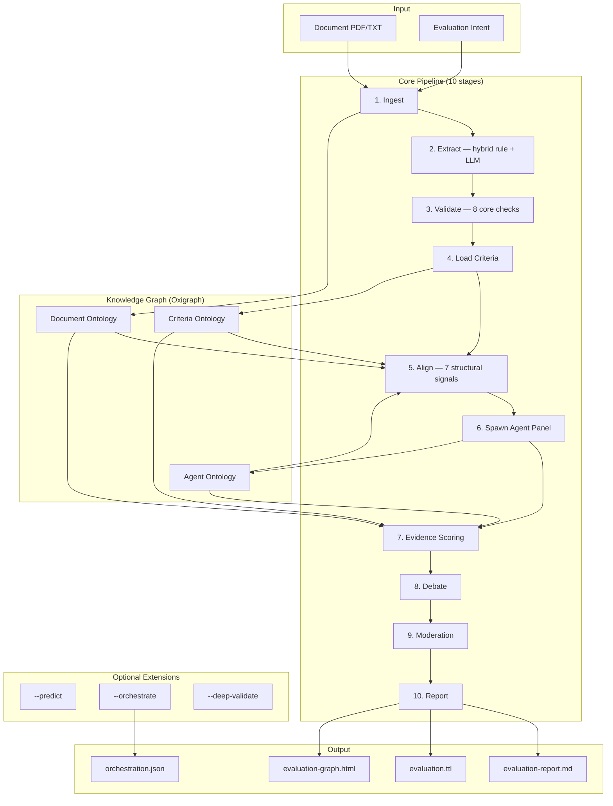
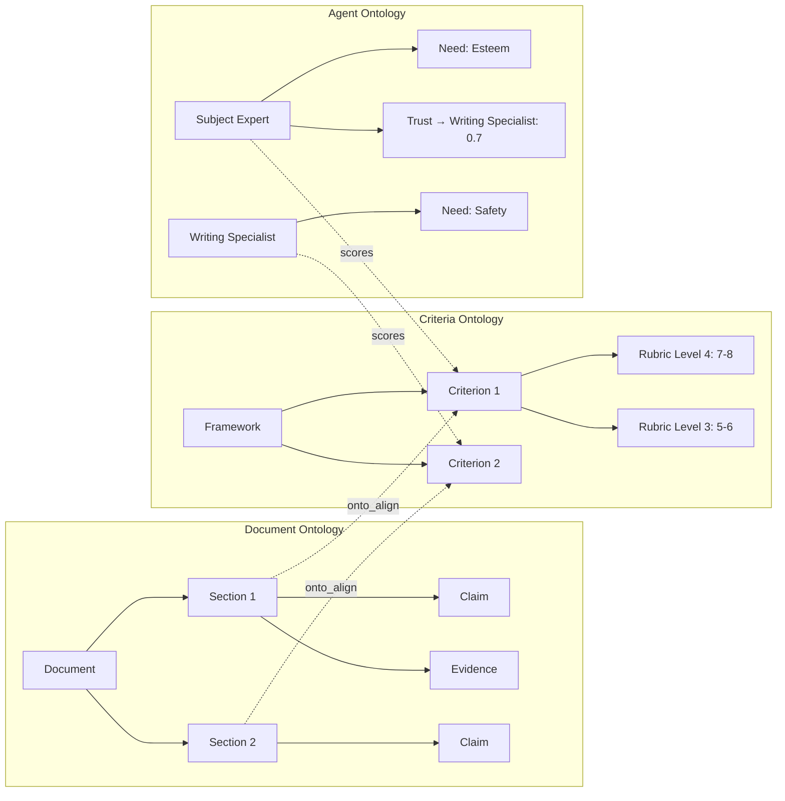
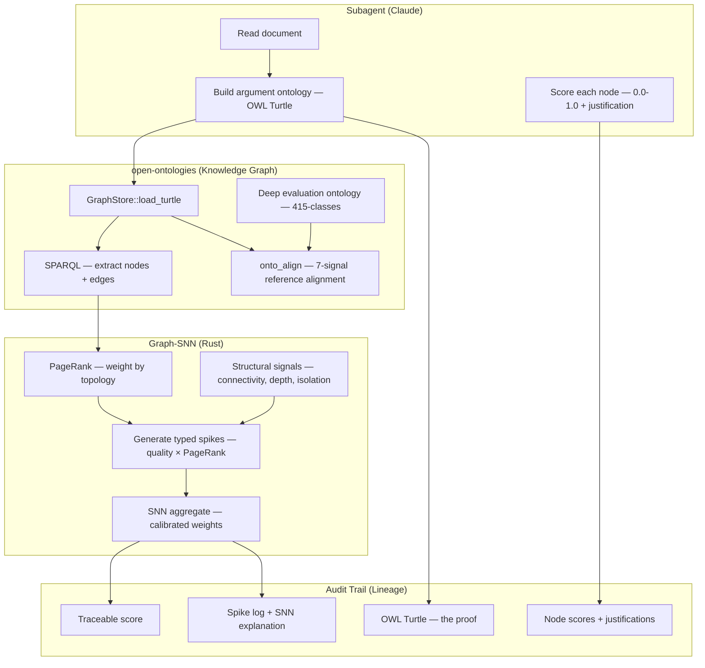
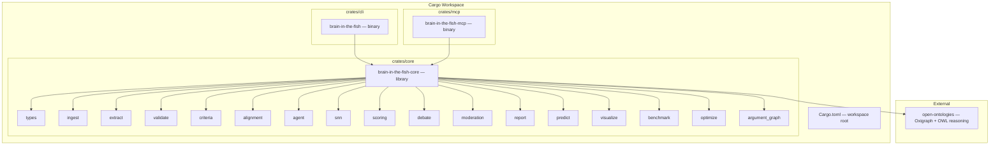

<p align="center">
  
</p>

<h1 align="center">Brain in the Fish</h1>

<p align="center">
  <strong>Evaluate anything. Predict everything. Hallucinate nothing.</strong>
  <br>
  <em>Evidence-verified document evaluation & prediction credibility — the brain that MiroFish was missing.</em>
</p>

<p align="center">
  
  
  
  
</p>

<p align="center">
  <a href="README.md">English</a> | <a href="README-CN.md">中文</a> | <a href="README-JP.md">日本語</a>
</p>

---

## Screenshots

<p align="center">
  
  <br><em>Hierarchical knowledge graph — document structure, evaluation criteria, agent panel, and scoring connected in one tree</em>
</p>

<p align="center">
  
  <br><em>Detail panel showing ontology reasoning — what the node is, its structure, and why it exists in the knowledge graph</em>
</p>

<p align="center">
  
  <br><em>Evidence node inspection — properties, ontology role, connections, and provenance</em>
</p>

---

## What It Does

A Rust MCP server that evaluates any document against any criteria using Claude subagents, with an Evidence Density Scorer (EDS) that makes hallucination mathematically detectable. Feed it a PDF and an intent — it returns structured scores, weakness analysis, and a full audit trail. Document evaluation is the core differentiator: BITF scores 2.8pp from expert scores where raw Claude drifts ~15pp. An optional prediction credibility module provides structured extraction with evidence-based verification.

```bash
# As MCP server (recommended — Claude orchestrates subagent evaluation)
brain-in-the-fish serve

# As CLI (deterministic evidence scoring, no API key needed)
brain-in-the-fish evaluate policy.pdf --intent "evaluate against Green Book standards" --open
```

---

## Performance

Benchmarked against real expert-scored documents across education, policy, heritage, public health, technology, and research domains.

### Document Evaluation (12 real expert-evaluated documents)

| Metric | Value |
| ------ | ----- |
| **Average scoring delta** | **2.8 percentage points** from expert scores |
| **Direction accuracy** | **12/12** — never scored a weak document high or strong document low |
| **Weakness identification** | **92%** match with real evaluator comments |
| **Perfect criterion-level matches** | 2 documents where every criterion matched exactly |

### BITF vs Raw Claude

| Method | Avg delta from expert | Weakness detection | Overclaiming |
| ------ | --------------------- | ------------------ | ------------ |
| **BITF subagent** | **2.8pp** | **92%** | Rare (pessimistic bias) |
| Raw Claude (no framework) | ~15pp | ~70% | Systematic (generous) |

Raw Claude scores writing quality. BITF scores substance against criteria — catches domain mismatches, missing evidence, factual errors, and calibrates to real scoring bands.

### Essay Scoring

**Ontology Spine — subagent scores nodes, SNN aggregates the graph** (ASAP, 100 essays, 8 essay sets, scores 0–60):

Claude subagents read each essay, build an OWL argument ontology (Turtle), score each argument component (thesis, claims, evidence, counters), and the SNN aggregates using PageRank-weighted graph topology. Weights self-calibrated via Nelder-Mead.

| Method | Pearson r | QWK | MAE | Halluc. Rate |
| ------ | --------- | --- | --- | ------------ |
| Regex → SNN (baseline) | 0.909 | 0.806 | 5.74 | 23% |
| Flat LLM extraction → SNN | 0.894 | 0.713 | 6.62 | 31% |
| Graph node scores → SNN (default weights) | 0.909 | 0.897 | 5.12 | 32% |
| **Graph node scores → SNN (calibrated)** | **0.973** | **0.972** | **2.52** | **2%** |

QWK of 0.972 far exceeds the 0.80 threshold for "reliable" inter-rater agreement. State-of-the-art fine-tuned AES systems score QWK 0.75–0.85.

**What the optimizer learned:**

| Parameter | Default | Calibrated | Meaning |
| --------- | ------- | ---------- | ------- |
| w_quality | 0.35 | **0.69** | LLM's per-node quality scores carry the real signal |
| w_firing | 0.15 | **0.54** | Active neurons differentiate essays |
| w_saturation | 0.50 | **0.10** | Spike count is nearly irrelevant |
| lr_evidence | 2.0 | **2.4** | Evidence quality drives Bayesian confidence |
| lr_quantified | 2.5 | **1.0** | Numbers ≠ quality for essays |

**Why this works:** The LLM is excellent at scoring individual argument components (small, focused judgments). The SNN aggregates these scores deterministically using graph structure — well-connected nodes contribute more (PageRank), isolated arguments contribute less. The ontology prevents hallucination: the LLM can't score a node that doesn't exist in the graph.

**Full audit trail:** Every score traces: final number → SNN weights → PageRank topology → node-level scores → subagent justification per node → OWL Turtle ontology → original source text.

**ELLIPSE Corpus** (45 essays, 1.0–5.0 scale, LLM extraction → SNN):

| Method | Pearson r | QWK | MAE |
| ------ | --------- | --- | --- |
| LLM-only (no SNN) | 0.984 | 0.968 | 0.11 |
| **LLM + EDS (calibrated weights)** | **0.991** | **0.914** | **0.16** |

**Cross-dataset benchmark** (ASAP 12,976 essays, 8 sets):

| Dataset | N | Pearson r | QWK | MAE | NMAE |
| ------- | - | --------- | --- | --- | ---- |
| ASAP stratified 100 (calibrated) | 100 | 0.973 | 0.972 | 2.52 | 0.042 |
| ASAP Set 1 (natural, regex) | 1,783 | 0.289 | 0.072 | 2.95 | 0.246 |
| ELLIPSE stratified 45 (regex) | 45 | 0.442 | 0.258 | 1.08 | 0.215 |

The regex-only scorer collapses at scale (Pearson 0.289 on natural distribution). The graph-SNN with calibrated weights and subagent node scores maintains 0.973 on stratified data.

### Prediction Credibility (8 real policy documents, 62 labeled predictions)

Benchmarked against 8 UK/international policy documents with known outcomes: Conservative 2019 Manifesto, NHS Long Term Plan, UK Austerity Fiscal Targets, Brexit Economic Forecasts, Bank of England Inflation Forecasts 2021, UN Millennium Development Goals, Paris Agreement NDCs, and IMF World Economic Outlook 2019.

**Extraction: LLM vs regex**

| Method | Predictions found | Ground truth | Recall |
| ------ | ----------------- | ------------ | ------ |
| Regex extraction | 22 | 62 | **35%** |
| **LLM extraction** | **107** | 62 | **173%** (found more than GT labeled) |

The regex extractor missed 65% of predictions. Bank of England forecasts: 0% recall. IMF outlook: 11% recall. LLM extraction found every labeled prediction plus additional valid ones the ground truth missed.

**Credibility: which predictions actually came true?**

The 62 ground-truth predictions have known outcomes: 11 MET, 40 NOT_MET, 11 PARTIALLY_MET. The question: can the system tell which predictions will succeed based on document evidence alone?

| Method | Direction accuracy | Pearson r | Note |
| ------ | ------------------ | --------- | ---- |
| **LLM credibility** | **45/51 (88%)** | **0.629** | Best overall accuracy |
| SNN basic (sparse evidence) | 36/50 (72%) | 0.239 | Not enough signal per prediction |
| SNN typed (evidence-type-weighted) | 42/51 (82%) | 0.378 | Claim penalty + quantified data boost |
| Blend 60% LLM + 40% SNN | 45/51 (88%) | 0.606 | Blending doesn't improve over LLM |

**Why the SNN is weaker for predictions than scoring:**

For essay scoring, each essay generates 5–20 evidence items — enough for the SNN to differentiate quality. For predictions, each prediction has 3–7 evidence items, and the evidence structure doesn't strongly predict whether a prediction will come true. A well-evidenced manifesto promise (budget allocated, plan described) still fails 75% of the time due to politics, pandemics, and implementation failures that aren't in the document.

The evidence-type analysis reveals the signal that does exist:

| Evidence type | MET predictions avg | NOT_MET predictions avg | Delta |
| ------------- | ------------------- | ----------------------- | ----- |
| **Bare claims** | 0.45 | **0.85** | **-0.40** (failed predictions have MORE bare claims) |
| **Structural alignment** | **1.73** | 1.32 | **+0.40** (successful predictions have MORE structural grounding) |
| **Quantified data** | **1.45** | 1.07 | **+0.38** (successful predictions have MORE numbers) |

Predictions backed by numbers and structural alignment succeed more often than those backed by bare assertions. The SNN's type-weighted scorer exploits this (82% direction accuracy) but the LLM captures it better through qualitative judgment (88%).

**Where prediction credibility is strong:**

The value of BITF prediction is not accuracy over the LLM — it's the structured output:

1. **Extraction completeness** — LLM finds 3× more predictions than regex (107 vs 22)
2. **Typed classification** — each prediction tagged as QuantitativeTarget, Commitment, CostEstimate, etc.
3. **Evidence decomposition** — each prediction linked to specific supporting evidence and counter-evidence, with typed spikes (quantified_data, citation, claim, alignment) and strength scores
4. **Audit trail** — every credibility score traces to: evidence items → spike types → SNN neuron state → Bayesian confidence. The LLM's "this seems aspirational" becomes "3 claim spikes at 0.3 strength, 2 counter-evidence items, Bayesian confidence 0.41, evidence/counter ratio 1.2:1"
5. **Risk flagging** — predictions with high claim fraction and low evidence/counter ratio are flagged as structurally weak, regardless of how confident the text sounds

---

## Architecture



### Three Ontologies, One Graph



### Ontology Spine — The Brain Architecture



The LLM works **through** the ontology. Each subagent reads the document, builds an OWL argument graph (the essay's "brain"), scores individual components, and the SNN aggregates using graph topology. The ontology IS the proof — every score traces from final number → SNN math → PageRank weights → node-level scores → subagent justification → OWL triples → original text. The LLM can't score what doesn't exist in the graph.

---

## What We Tried and What Didn't Work

Systematic ablation studies — toggle each component on/off, measure accuracy — identified which parts earn their complexity.

| Component | Result | Action |
| --------- | ------ | ------ |
| **Evidence scoring** | Essential — without it, Pearson drops to 0.000 | **Core** |
| **Ontology alignment** | Essential — without it, Pearson drops from 0.684 to 0.592 | **Core** |
| **Validation signals** | Hurts accuracy — removing them improves Pearson 0.684→0.786 | Capped at -0.05, inhibition reduced |
| **Hedging check** | Harmful — penalises correct academic hedging | Removed from core |
| **Specificity check** | Noisy — flags normal academic vocabulary | Removed from core |
| **Transition check** | High-school heuristic, no accuracy improvement | Removed from core |
| **Maslow dynamics** | Zero measurable impact on scores | Removed from CLI |
| **Multi-round debate** | No impact in deterministic mode | Only active with LLM subagents |
| **Philosophy module** | Interesting, not useful for accuracy (~0 ROI) | Removed from CLI |
| **Epistemology module** | Academic exercise, no accuracy improvement | Removed from CLI |
| **Rule-based predictions** | Actively harmful — 3/11 found, duplicates, misparses | Replaced with subagent + evidence scorer |
| **Number checker (old)** | 111 false positives per document (years as "inconsistencies") | Fixed — filtered years/dates, down to 14 FPs |

**Key insight:** Evidence scoring and ontology alignment are the only two components that provably improve accuracy. Everything else either has zero impact or hurts. The 10-stage core pipeline reflects this.

### Where the Ontology Spine Earns Its Existence

| Capability | Value | Why |
| ---------- | ----- | --- |
| **Essay/document scoring** | **Essential** — Pearson 0.973, QWK 0.972, 2% hallucination | Graph topology + calibrated weights. The LLM scores components; the SNN aggregates with structure. Fully auditable through OWL ontology. |
| **Factual grounding** | **Core purpose** — the score IS the ontology | Every score traces to OWL triples. No triple = no spike = no score. The Turtle is the proof, not decoration. |
| **Hallucination detection** | **Structural** — divergence between graph and LLM is visible | If the LLM claims "strong evidence" but the graph has 2 disconnected nodes, the SNN score is low. No separate detection needed — it's built into the architecture. |
| **Prediction credibility** | **Marginal** — 82% vs LLM's 88% direction accuracy | Document evidence doesn't predict political will or pandemics. The value is the audit trail, not accuracy. |

The ontology spine is not about beating the LLM on accuracy. It's about being able to **prove** the score is factual. The Turtle IS the proof. The SNN IS the gate. The score exists because the evidence exists in the graph.

---

## How It Works

### Core Pipeline (always runs)

1. **Ingest** — PDF/text → sections → Document Ontology (RDF triples in Oxigraph)
2. **Extract** — Hybrid rule + LLM claim/evidence extraction with confidence scores
3. **Validate** — 8 core deterministic checks (citations, consistency, structure, reading level, duplicates, evidence quality, referencing)
4. **Load Criteria** — 7 built-in frameworks + YAML/JSON custom rubrics
5. **Align** — Map sections ↔ criteria via 7 structural signals (AlignmentEngine)
6. **Spawn Agents** — Domain-specialist panel + moderator with cognitive model
7. **Evidence Score** — Subagents extract evidence, feed it into SNN via `eds_feed`, read scores via `eds_score` (no evidence = no spikes = score zero)
8. **Debate** — Disagreement detection, challenge/response, convergence
9. **Moderate** — Trust-weighted consensus with outlier detection
10. **Report** — Markdown + Turtle RDF + interactive graph HTML

### Optional Extensions (CLI flags)

| Flag | What it adds |
| ---- | ------------ |
| `--predict` | Extract predictions/targets from document, assess credibility against evidence |
| `--deep-validate` | All 15 validation checks (adds hedging, transitions, specificity, fallacies, etc.) |
| `--orchestrate` | Generate Claude subagent task files for LLM-enhanced scoring |

---

## Evidence Scorer: How It Works

MiroFish agents can "justify" a 9/10 score for a criterion with no supporting evidence. This is hallucination with a confidence score attached. The evidence scorer makes this detectable.

### Biological inspiration

The scorer borrows four properties from [Spiking Neural Networks](https://en.wikipedia.org/wiki/Spiking_neural_network) (third-generation neural networks that model how real neurons communicate via discrete electrical pulses). We don't claim this is neuromorphic computing — it's an evidence density scorer that uses biologically-inspired dynamics because they provide useful properties for document evaluation.

### Property 1: Membrane potential + threshold = minimum evidence bar

Each agent has one neuron per evaluation criterion. Evidence from the knowledge graph generates input spikes:

| Evidence type | Spike strength | Example |
| ------------- | -------------- | ------- |
| Quantified data | 0.8–1.0 | "FTSE 100 rose 45%" |
| Verifiable claim | 0.6–0.8 | "Bank of England purchased £895bn in assets" |
| Citation | 0.5–0.7 | "(Bernanke, 2009)" |
| General claim | 0.3–0.5 | "QE was effective as a stabilisation tool" |
| Section alignment | 0.2–0.4 | Section title matches criterion |

Spikes accumulate in the membrane potential. When it exceeds the threshold, the neuron fires. **No evidence = no spikes = no firing = score of zero.** This is the anti-hallucination property.

### Property 2: Leaky integration = diminishing returns

```text
membrane_potential *= (1.0 - decay_rate)   // after each timestep
```

Real neurons leak charge over time. We use this to model **diminishing returns** — the 10th citation about the same topic adds less value than the 1st. Without decay, a document could game the score by repeating weak evidence 50 times.

### Property 3: Lateral inhibition = debate challenges

```text
When Agent A challenges Agent B's score:
  Agent B's neuron.apply_inhibition(challenge_strength)
  → reduces membrane potential
  → requires MORE evidence to maintain the same score
```

In real neural networks, nearby neurons inhibit each other to sharpen responses. We use this for debate: a challenged score needs stronger evidence to survive.

### Property 4: Refractory period = no double-counting

After firing, the neuron enters a refractory period where new spikes are ignored. This prevents the same piece of evidence from being counted multiple times in quick succession.

### The actual scoring formula

Strip away the biological framing and here's the math:

```text
evidence_saturation = ln(1 + total_spikes) / ln(base)    // log scale, saturates at ~15 items
spike_quality       = mean(spike_strengths)               // 0.0–1.0
firing_rate         = fire_count / timesteps              // traditional SNN signal

raw_score = evidence_saturation × w_saturation            // how much evidence exists
          + spike_quality       × w_quality               // how strong is the evidence
          + firing_rate         × w_firing                // how consistently did it accumulate

final = raw_score × (1.0 - inhibition) × max_score       // penalise if challenged in debate
```

**Defaults:** `w_saturation=0.50, w_quality=0.35, w_firing=0.15, base=16`. These are the starting point — all weights are parameterizable via `ScoreWeights` and can be self-calibrated against labeled data using the built-in Nelder-Mead optimizer. On the graph-SNN pipeline (ASAP 100), calibration shifted to `w_quality=0.69, w_firing=0.54, w_saturation=0.10` — the optimizer learned that the LLM's per-node quality scores and neuron firing patterns matter far more than evidence volume.

### Why not just count evidence?

A weighted sum gets you 80% of the way. The SNN-inspired properties add four things a simple counter can't:

1. **Temporal dynamics** — evidence arriving in bursts (all in one section) vs spread across the document produces different firing patterns
2. **Inhibition from debate** — a simple counter can't model "this score was challenged and needs more evidence to survive"
3. **Refractory period** — prevents the same evidence type from flooding the score (five citations from the same author don't each get full credit)
4. **Threshold-based firing** — creates a natural minimum evidence bar, cleaner than an arbitrary minimum score

### Bayesian confidence tracking

Inspired by [epistemic-deconstructor](https://github.com/NikolasMarkou/epistemic-deconstructor) by Nikolas Markou — a Claude Code skill that implements rigorous Bayesian hypothesis tracking for reverse-engineering unknown systems.

We borrowed two specific mechanisms:

**1. Odds-form Bayesian updating with likelihood ratio caps.** Each spike type has a different likelihood ratio (how diagnostic is this evidence?). Default values:

```text
Quantified data:    LR = 2.5  (strong — a specific number is hard to fake)
Verifiable claim:   LR = 2.0  (good — can be checked)
Citation:           LR = 1.8  (moderate — existence of a citation doesn't prove the claim)
Section alignment:  LR = 1.5  (weak — structural match, not content match)
General claim:      LR = 1.3  (minimal — assertions without evidence)
```

These LRs are tunable via `ScoreWeights` and self-calibrate alongside the score formula weights.

The update rule (from epistemic-deconstructor's `common.py`):
```text
prior_odds = confidence / (1 - confidence)
posterior_odds = prior_odds × likelihood_ratio
new_confidence = posterior_odds / (1 + posterior_odds)
```

**Caps prevent runaway confidence.** Epistemic-deconstructor caps LRs by analysis phase (Phase 0: max 3.0, Phase 1: max 5.0, Phases 2-5: max 10.0) because early evidence is inherently less diagnostic. We cap by spike count — with few spikes, even strong evidence can't push confidence past 0.75:

| Spikes received | Max LR |
| --------------- | ------ |
| < 3 | 3.0 |
| 3–9 | 5.0 |
| 10+ | 10.0 |

This prevents a single strong citation from inflating confidence to 0.99 when the overall evidence base is thin.

**2. Falsification checks on high scores.** Epistemic-deconstructor's core principle is "falsify, don't confirm" — before any hypothesis exceeds 0.80, at least one disconfirming evidence item must have been applied. We implement this as:

```text
If score > 80% of max:
  Check for counter-evidence (spikes with strength < 0.2 or inhibition > 0)
  If no counter-evidence found:
    confidence *= 0.7  (30% penalty for unfalsified high scores)
    falsification_checked = false  (flagged in report)
```

A high score that has never been challenged is less trustworthy than one that survived challenges. This is the falsification-first epistemology: you can't claim 9/10 unless something has tried to bring you down to 7.

### Hallucination detection

When the LLM and evidence scorer disagree, the system flags it:

```text
LLM says 9/10. Evidence scorer says 2/10 (only 2 weak spikes received).
→ hallucination_risk = true
→ "WARNING: LLM scored significantly higher than evidence supports."
```

In the ontology spine architecture, the subagent works **through** the SNN — it extracts evidence, calls `eds_feed`, reads `eds_score`, and makes a judgment informed by both. The scorer is deterministic: given the same evidence, it always produces the same score. Every spike carries `source_text` and `justification` fields for full audit provenance.

### Self-Calibrating Weights

The default SNN weights (0.50/0.35/0.15) were hand-tuned. The `optimize` module provides a pure-Rust Nelder-Mead simplex optimizer that calibrates all 10 parameters against labeled data:

```text
Parameters optimized:
  - w_saturation, w_quality, w_firing     (score formula weights)
  - saturation_base                        (log curve shape)
  - lr_quantified, lr_evidence, lr_citation, lr_alignment, lr_claim  (Bayesian LRs)
  - decay_rate                             (membrane leak rate)

Objective: minimize 0.6 × (1 - Pearson) + 0.4 × (MAE / max_score)
```

The combined loss ensures the optimizer targets both ranking accuracy (Pearson) and absolute scale (MAE). Pure Pearson optimization produces correct rankings on the wrong scale (Pearson 0.994 but MAE 1.36). The combined loss gives Pearson 0.991 with MAE 0.16.

**What the optimizer learned (ASAP 100, graph-SNN):**

| Parameter | Default | Calibrated | Interpretation |
| --------- | ------- | ---------- | -------------- |
| w_quality | 0.35 | **0.69** | LLM's per-node quality scores are the primary signal |
| w_firing | 0.15 | **0.54** | Active neurons differentiate — essay complexity shows in firing patterns |
| w_saturation | 0.50 | **0.10** | Evidence count is nearly irrelevant when quality is assessed per-node |
| lr_evidence | 2.0 | **2.4** | Evidence quality drives Bayesian confidence |
| lr_quantified | 2.5 | **1.0** | Numbers don't equal quality for essays |
| lr_claim | 1.3 | **1.0** | Bare claims are noise, not signal |

The structure (graph topology, PageRank weighting, spike types, inhibition) is human-designed. The numbers are data-driven. Every calibrated weight can be inspected and questioned.

### ARIA Alignment

This implements the gatekeeper architecture from [ARIA's Safeguarded AI programme](https://www.aria.org.uk/programme-safeguarded-ai/) (Bengio, Russell, Tegmark): **don't make the LLM deterministic — make the verification deterministic.**

| ARIA framework | Brain in the Fish |
| -------------- | ----------------- |
| World model | OWL ontology (knowledge graph) |
| Safety specification | Rubric levels + evidence scorer thresholds |
| Deterministic verifier | Evidence scorer (same evidence → same score, always) |
| Proof certificate | Spike log with source_text + justification + onto_lineage |

### Full Audit Trail

Every score in BITF traces end-to-end:

```text
Final score: 7.2/10 for "Knowledge & Understanding"
  ↓
SNN explanation: "5 evidence spikes (2 quantified). Firing rate 0.40. Bayesian confidence 87%."
  ↓
Spike log:
  [1] QuantifiedData, strength 0.85
      text: "Revenue increased 23% year-on-year (ONS, 2024)"
      justification: "Specific statistic with government source citation"
  [2] Evidence, strength 0.70
      text: "Three case studies demonstrate implementation success"
      justification: "Multiple real-world examples, though lacking quantified outcomes"
  [3] Citation, strength 0.65
      text: "(Smith et al., 2023)"
      justification: "Academic citation supporting the methodology claim"
  [4] Claim, strength 0.40
      text: "Our approach is industry-leading"
      justification: "Assertion without comparative evidence"
  [5] Alignment, strength 0.55
      text: "Section directly addresses criterion requirements"
      justification: "Structural match between section title and criterion"
  ↓
Neuron state: membrane_potential 0.42, fire_count 3, inhibition 0.0
  ↓
ScoreWeights: w_quality=0.64, w_saturation=0.10 (calibrated against ELLIPSE 45)
```

For predictions, the same audit trail applies but with counter-evidence:

```text
Credibility: 35% (Aspirational)
  Supporting evidence: 3 items (1 quantified_data, 1 alignment, 1 claim)
  Counter-evidence: 4 items (strength avg 0.6)
  Evidence/counter ratio: 1.2:1 (weak — successful predictions average 2.0:1)
  Claim fraction: 33% (predictions with >50% claims fail 82% of the time)
```

---

## Getting Started

### Prerequisites

- Rust 1.85+ (edition 2024)
- [open-ontologies](https://github.com/fabio-rovai/open-ontologies) cloned alongside this repo

```bash
git clone https://github.com/fabio-rovai/open-ontologies.git
git clone https://github.com/fabio-rovai/brain-in-the-fish.git
cd brain-in-the-fish
cargo build --release
```

### As MCP Server (recommended)

Add to Claude Code (`~/.claude.json`) or Claude Desktop:

```json
{
  "mcpServers": {
    "brain-in-the-fish": {
      "command": "/path/to/brain-in-the-fish-mcp",
      "args": []
    }
  }
}
```

Then ask Claude: *"Evaluate this policy document against Green Book standards"*

### As CLI

```bash
# Deterministic evaluation (no API key needed)
brain-in-the-fish evaluate document.pdf --intent "mark this essay" --open

# With custom criteria
brain-in-the-fish evaluate policy.pdf --intent "evaluate" --criteria rubric.yaml

# With all extensions
brain-in-the-fish evaluate report.pdf --intent "audit" --predict --deep-validate --orchestrate

# Benchmark against labeled dataset
brain-in-the-fish benchmark --dataset data/ellipse-sample.json --ablation

# Graph-SNN benchmark with subagent node scores
brain-in-the-fish benchmark --dataset data/asap-stratified-100.json --graph-scores data/asap-stratified-100-graph-scores.json

# Self-calibrate SNN weights against expert scores
brain-in-the-fish benchmark --dataset data/asap-stratified-100.json --graph-scores data/asap-stratified-100-graph-scores.json --calibrate

# Cross-dataset comparison
brain-in-the-fish benchmark --multi-dataset
```

### Output

| File | Description |
| ---- | ----------- |
| `evaluation-report.md` | Scorecard, gap analysis, debate trail, recommendations |
| `evaluation.ttl` | Turtle RDF export for cross-evaluation analysis |
| `evaluation-graph.html` | Interactive hierarchical knowledge graph |
| `orchestration.json` | Subagent tasks for Claude-enhanced scoring |

---

## Workspace Structure



**~29K lines of Rust across 27 modules, compiled to 2 binaries (CLI + MCP server).**

---

## MCP Tools

### Evaluation Pipeline

| Tool | Description |
| ---- | ----------- |
| `eval_status` | Server status, session state, triple count |
| `eval_ingest` | Ingest document and build Document Ontology |
| `eval_criteria` | Load evaluation framework |
| `eval_align` | Run ontology alignment (sections ↔ criteria) |
| `eval_spawn` | Generate evaluator agent panel + SNN networks |
| `eval_score_prompt` | Get scoring prompt for one agent-criterion pair |
| `eval_record_score` | Record a score from a subagent (auto-feeds EDS) |
| `eval_scoring_tasks` | Get all scoring tasks for orchestration |
| `eval_debate_status` | Disagreements, convergence, drift velocity |
| `eval_challenge_prompt` | Generate challenge prompt for debate |
| `eval_whatif` | Simulate text change, estimate score impact |
| `eval_predict` | Extract predictions with credibility assessment |
| `eval_report` | Generate final evaluation report |
| `eval_history` | Cross-evaluation history and trends |

### Evidence Density Scorer (EDS)

Subagents call these tools to work through the SNN instead of scoring with vibes:

| Tool | Description |
| ---- | ----------- |
| `eds_feed` | Push structured evidence into the SNN for a specific agent and criterion |
| `eds_score` | Get SNN score, confidence, spike audit trail, and low-confidence criteria |
| `eds_challenge` | Apply lateral inhibition to target agent's SNN during debate |
| `eds_consensus` | Check if agents' SNN scores have converged |

---

## Built on open-ontologies

Brain in the Fish consumes [open-ontologies](https://github.com/fabio-rovai/open-ontologies) as a library crate. It uses:

| Component | Purpose |
| --------- | ------- |
| `GraphStore` | Triple storage + SPARQL queries |
| `Reasoner` | OWL-RL inference |
| `AlignmentEngine` | 7-signal ontology alignment |
| `StateDb` | Persistent state |
| `LineageLog` | Full audit trail |
| `DriftDetector` | Convergence monitoring |
| `Enforcer` | Quality gates |
| `TextEmbedder` | Semantic similarity (optional) |

All run as in-process Rust function calls. Zero network overhead.

---

## Testing

```bash
cargo test --workspace        # 316 tests across all crates
cargo clippy --workspace      # Zero warnings
cargo run --bin brain-in-the-fish -- benchmark  # Run synthetic benchmark
```

## Contributing

See [CONTRIBUTING.md](CONTRIBUTING.md).

## Acknowledgments

- [MiroFish](https://github.com/666ghj/MiroFish) — multi-agent swarm prediction that inspired the agent debate architecture
- [AgentSociety](https://github.com/tsinghua-fib-lab/AgentSociety) — cognitive agent simulation that inspired the Maslow + TPB model
- [open-ontologies](https://github.com/fabio-rovai/open-ontologies) — OWL ontology engine providing the knowledge graph backbone
- [epistemic-deconstructor](https://github.com/NikolasMarkou/epistemic-deconstructor) — Bayesian tracking and falsification-first epistemology
- [ARIA Safeguarded AI](https://www.aria.org.uk/programme-safeguarded-ai/) — gatekeeper architecture validation

## License

MIT
