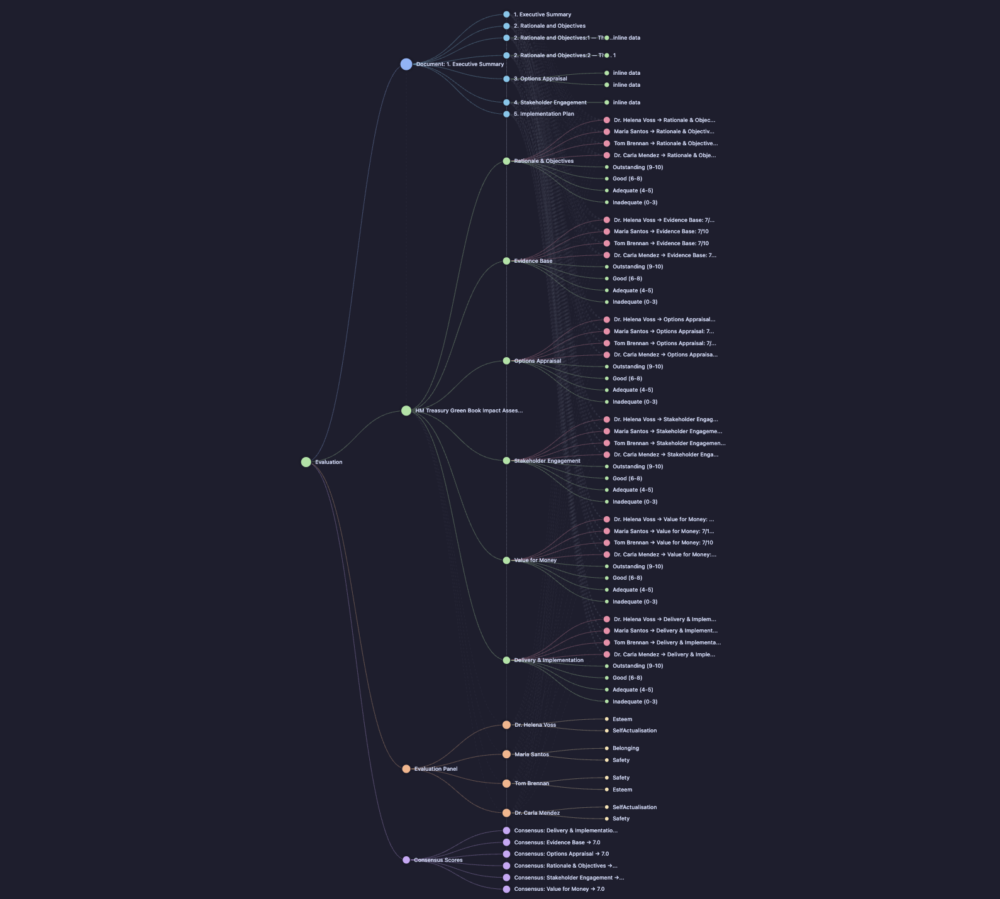
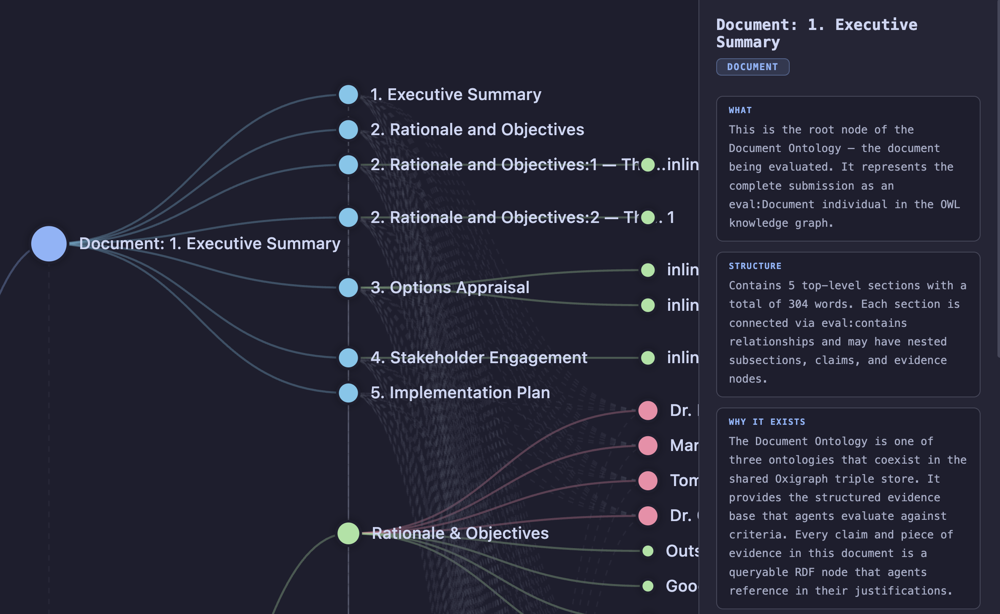
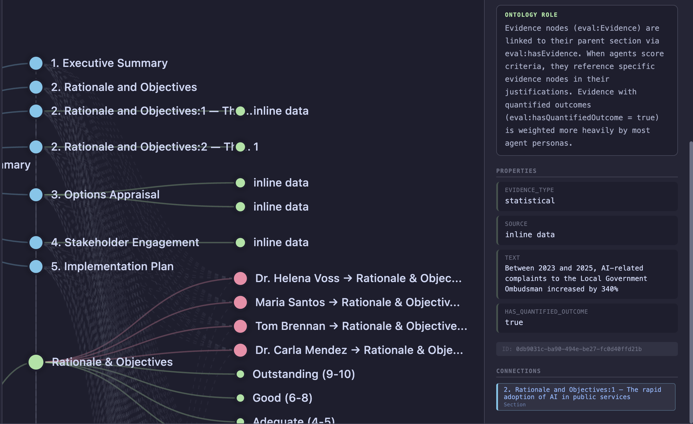

<p align="center">
  
</p>

<h1 align="center">Brain in the Fish</h1>

<p align="center">
  <strong>Universal document evaluation & prediction credibility MCP server — SNN anti-hallucination verification + OWL ontology backbone + Bayesian calibration. The brain that MiroFish was missing.</strong>
</p>

<p align="center">
  
  
  
  
</p>

<p align="center">
  <a href="README.md">English</a> | <a href="README-CN.md">中文</a>
</p>

---

## Screenshots

<p align="center">
  
  <br><em>Hierarchical knowledge graph — document structure, evaluation criteria, agent panel, and scoring connected in one tree</em>
</p>

<p align="center">
  
  <br><em>Detail panel showing ontology reasoning — what the node is, its structure, and why it exists in the knowledge graph</em>
</p>

<p align="center">
  
  <br><em>Evidence node inspection — properties, ontology role, connections, and provenance</em>
</p>

---

## The Problem

Two prior systems attempted multi-agent document evaluation. Both fell short.

**MiroFish** gave fish a swarm -- agents debate a document and converge on a prediction. But MiroFish agents are stateless LLM prompts. They have no memory between rounds, no structured cognition, and no formal link between what they read and what they score. Prediction from an LLM swarm is fundamentally hallucination-prone: agents invent plausible-sounding justifications without grounding them in the document's actual content. When MiroFish's agents predict 'this policy will reduce complaints by 50%,' there is no evidence check — the prediction is as credible as the LLM's temperature setting.

**AgentSociety** gave agents a mind -- Maslow needs, Theory of Planned Behaviour, trust dynamics. But the cognitive model lives in Python dictionaries. It is opaque to reasoning, not queryable by SPARQL, not diffable between debate rounds, and not interoperable with any external knowledge system. The mind exists, but nobody can examine it.

Both systems share a deeper flaw: there is no structured, auditable mapping between a question asked and the evidence found. Scores appear, but the chain from document content to criterion to agent judgement is implicit and unreproducible.

## The Fix

Brain in the Fish gives the mind a skeleton -- a structured, queryable, diffable OWL ontology substrate that agents don't just use but exist within.

**Three ontologies, one graph.** Document, Criteria, and Agent ontologies all live as OWL triples in a shared Oxigraph store (via [open-ontologies](https://github.com/fabio-rovai/open-ontologies)). Every section, claim, criterion, rubric level, agent belief, Maslow need, and trust weight is a first-class RDF node.

**Evaluation over prediction.** MiroFish predicts what a score should be. Brain in the Fish evaluates what the document actually contains against explicit criteria. Evaluation is fundamentally more reliable than prediction because the evidence IS the document -- it is concrete, present, and verifiable. The system does not guess; it maps, scores, and justifies.

**Agent cognition IS the ontology.** Each evaluator agent's Maslow needs, trust relationships, and domain expertise are OWL individuals. When an agent's trust in a colleague changes after a debate challenge, that change is a triple update -- queryable, diffable, and auditable.

**Ontology alignment maps document to criteria.** `onto_align` produces a mathematical mapping between document sections and evaluation criteria. Gaps are identified before scoring begins. No criterion goes unanswered silently.

**Prediction credibility, not prediction.** MiroFish predicts futures. Brain in the Fish assesses whether predictions within a document are credible. It extracts every forecast, target, commitment, and cost estimate, then checks each against the document's evidence base. 'Reduce complaints by 50%' gets a credibility score based on what evidence supports that number — not based on what an LLM thinks will happen.

**Versioned debate.** Each debate round produces new score triples. `onto_diff` between rounds reveals exactly which agents moved, by how much, and why. Drift velocity measures convergence. The entire deliberation is reproducible from the graph state.

## Comparison

| Feature | MiroFish | AgentSociety | Brain in the Fish |
|---------|----------|--------------|-------------------|
| Agent cognition | Stateless LLM prompts | Maslow + TPB in Python dicts | Maslow + TPB as OWL individuals in Oxigraph |
| Evidence basis | LLM generates justifications | LLM generates justifications | Document content mapped to criteria via ontology alignment |
| Debate tracking | Round counter, text logs | Round counter, JSON state | Versioned RDF triples with `onto_diff` and drift velocity |
| Reproducibility | Non-deterministic | Non-deterministic | Deterministic graph state per round, SPARQL-queryable |
| Cross-evaluation learning | None | None | Turtle export enables cross-session analysis |
| Fact-checking / validation | None | None | 15 deterministic checks (citations, consistency, fallacies, specificity, etc.) |
| Epistemological grounding | None | None | Justified beliefs with empirical, normative, and testimonial bases |
| Philosophical frameworks | None | None | Kantian, utilitarian, and virtue ethics analysis |
| Prediction handling | Agents hallucinate futures | Not addressed | Extracts predictions from document, assesses credibility against evidence |
| Belief dynamics | None | Maslow needs in Python dicts | Maslow needs update from findings, ontology-grounded |
| Runtime dependencies | Python + multiple LLM APIs | Python + LLM APIs | Single Rust binary, Oxigraph embedded |
| Deploy complexity | Multi-service Python stack | Multi-service Python stack | `cargo build` produces one binary |

## How It Works

The evaluation pipeline runs in 20 stages:

1. **Ingest** -- Extract text from PDF (or plain text), split into sections by heading detection, build the Document Ontology as RDF triples in Oxigraph.

2. **Enrich** -- Split sections into paragraphs, extract claims and evidence via regex pattern matching.

3. **Predict** -- Extract quantitative targets, cost estimates, timelines, comparisons, and commitments. Assess each prediction's credibility against the document's own evidence base. Flag unsupported forecasts.

4. **Validate** -- Run 15 deterministic checks: citations, word count, consistency, structure, reading level, duplicates, evidence quality, fallacies, hedging, topic sentences, counter-arguments, transitions, specificity, referencing, and argument flow. Each check produces validation signals that feed into the SNN.

5. **OWL-RL Reasoning** -- Infer new triples from the knowledge graph using OWL-RL entailment rules.

6. **Load Criteria** -- Select or generate an evaluation framework (7 built-in frameworks + YAML/JSON file parsing). Each criterion, rubric level, and weight becomes an OWL individual in the Criteria Ontology.

7. **Discover Sector Guidelines** -- Detect the evaluation domain and load sector-specific guidelines with provenance tracking.

8. **Align** -- Map document sections to criteria using 7 structural signals via AlignmentEngine. Identify gaps where no document content addresses a criterion.

9. **Spawn Agent Panel** -- Spawn 7 domain-specialist agents plus a moderator. Each agent's cognitive model (Maslow needs, trust weights, domain expertise) is loaded as the Agent Ontology.

10. **SNN Scoring** -- Deterministic, evidence-grounded scoring via spiking neural networks. Anti-hallucination: no evidence in the graph means no spikes means score of zero. Validation signals feed in as spikes (positive findings) or inhibition (negative findings).

11. **Belief Dynamics** -- Update agent Maslow needs based on evaluation findings.

12. **Epistemology** -- Construct justified beliefs with empirical, normative, and testimonial bases.

13. **Philosophical Analysis** -- Apply Kantian, utilitarian, and virtue ethics lenses to evaluation findings.

14. **Debate** -- Challenger agents construct evidence-based arguments. Deterministic convergence with trust evolution. Each round produces new score triples.

15. **Moderation** -- Trust-weighted consensus with outlier detection and moderated results.

16. **Report** -- Generate structured Markdown report, Turtle RDF export, interactive graph HTML, and orchestration JSON.

17. **Enforce** -- Quality gate with custom rules via the Enforcer.

18. **Lineage** -- Full audit trail via onto_lineage, tracking every transformation from ingest to final score.

19. **Cross-evaluation Memory** -- Historical comparison across evaluation sessions.

20. **Orchestration Output** -- Generate subagent tasks for Claude-enhanced scoring via the orchestrator.

## Anti-Hallucination: SNN Verification Layer

MiroFish's core weakness is that agent scores are LLM outputs — plausible text with no mathematical grounding. An agent can "justify" a 9/10 score for a criterion that has no supporting evidence in the document. This is hallucination with a confidence score attached.

Brain in the Fish solves this with a **Spiking Neural Network (SNN)** verification layer that sits between the ontology evidence and the LLM scoring. The SNN is deterministic: given the same evidence, it always produces the same score. The LLM is stochastic: it provides qualitative judgment. Combined, they make hallucination detectable.

### How the SNN works

Each evaluator agent has a neural network with one **neuron per criterion**. Evidence from the document ontology generates **input spikes**. Validation signals from the 15-check validation pipeline also feed into the SNN: positive findings (good evidence quality, strong citations) generate excitatory spikes, while negative findings (logical fallacies, excessive hedging, vague language) generate inhibitory signals that reduce membrane potential.

| Evidence type | Spike strength | Example |
| ------------- | -------------- | ------- |
| Quantified data | 0.8-1.0 | "FTSE 100 rose 45%" |
| Verifiable claim | 0.6-0.8 | "Bank of England purchased £895bn in assets" |
| Citation | 0.5-0.7 | "(Bernanke, 2009)" |
| General claim | 0.3-0.5 | "QE was effective as a stabilisation tool" |
| Section alignment | 0.2-0.4 | Section title matches criterion |

Neurons use **leaky integrate-and-fire** dynamics:

- Spikes accumulate in the membrane potential
- Potential decays over time (leak)
- When potential exceeds **threshold** (derived from rubric) → neuron fires
- Firing rate maps to score
- No evidence in the graph = no spikes = no firing = score of zero

### Blended scoring: SNN + LLM

The final score blends both layers, weighted by SNN confidence:

```text
final_score = snn_score × snn_weight + llm_score × llm_weight
```

When SNN confidence is high (abundant evidence), the SNN dominates. When low (sparse evidence), the LLM fills in — but a **hallucination flag** is raised if the LLM scores significantly higher than the evidence supports.

```text
LLM says 9/10. SNN says 2/10 (only 2 weak spikes received).
→ hallucination_risk = true
→ "WARNING: LLM scored significantly higher than evidence supports."
```

### Debate as lateral inhibition

During debate rounds, challenges from other agents apply **lateral inhibition** to the target agent's neurons. This reduces the membrane potential, requiring more evidence to maintain a high score. Trust weights modulate spike transmission between agents — highly trusted challengers produce stronger inhibitory signals.

### Theoretical grounding: ARIA Safeguarded AI

This architecture aligns with [ARIA's £59M Safeguarded AI programme](https://www.aria.org.uk/programme-safeguarded-ai/) (led by davidad, co-authored with Yoshua Bengio, Stuart Russell, and Max Tegmark). Their thesis in ["Towards Guaranteed Safe AI"](https://arxiv.org/abs/2405.06624): **don't make the LLM deterministic — make the verification deterministic.**

| ARIA framework | Brain in the Fish |
| -------------- | ----------------- |
| World model (formal description of reality) | Ontology (OWL knowledge graph) |
| Safety specification (acceptable outputs) | Rubric levels + SNN thresholds |
| Deterministic verifier (proof checker) | SNN (same spikes → same score, always) |
| Proof certificate (reasoning trace) | Spike log + onto_lineage (auditable evidence path) |

The LLM generates qualitative judgment. The SNN provides a deterministic, auditable verification gate. The ontology provides the formal world model. Together, they implement ARIA's "gatekeeper" architecture for document evaluation.

## Getting Started

### Prerequisites

- Rust 1.85+ (edition 2024)
- [open-ontologies](https://github.com/fabio-rovai/open-ontologies) cloned alongside this repo

```bash
git clone https://github.com/fabio-rovai/open-ontologies.git
git clone https://github.com/fabio-rovai/brain-in-the-fish.git
cd brain-in-the-fish
cargo build --release
```

### Connect to Claude

Brain in the Fish is an MCP server. Add it to your Claude Code or Claude Desktop configuration:

**Claude Code (~/.claude.json):**

```json
{
  "mcpServers": {
    "brain-in-the-fish": {
      "command": "/path/to/brain-in-the-fish",
      "args": ["serve"]
    }
  }
}
```

**Claude Desktop (claude_desktop_config.json):**

```json
{
  "mcpServers": {
    "brain-in-the-fish": {
      "command": "/path/to/brain-in-the-fish",
      "args": ["serve"]
    }
  }
}
```

Then ask Claude:

> "Evaluate this policy document against Green Book standards"

Claude will orchestrate the evaluation by dispatching subagents that call the eval_* MCP tools. Each subagent scores as a specialist persona. The SNN verification layer validates every score against evidence in the knowledge graph.

### Standalone mode (no Claude)

For deterministic-only evaluation without LLM judgment:

```bash
brain-in-the-fish evaluate document.pdf --intent "mark this essay for A-level"
```

This runs the SNN scoring pipeline — evidence-grounded, deterministic, no API key needed. Output includes the Markdown report, Turtle RDF export, interactive graph, and orchestration tasks that Claude can pick up later.

### Verify

```bash
cargo test
```

## Usage

### As MCP server (recommended)

```bash
# Start the MCP server
brain-in-the-fish serve

# Claude handles the rest — just ask:
# "Evaluate this essay for A-level economics"
# "Review this contract for GDPR compliance"
# "Assess this NHS clinical governance report"
# "Audit this survey methodology"
```

### As CLI tool (deterministic mode)

```bash
# Evaluate with SNN scoring (no LLM needed)
brain-in-the-fish evaluate essay.pdf --intent "mark this economics essay"

# With custom criteria
brain-in-the-fish evaluate policy.pdf --intent "evaluate against Green Book" --criteria rubric.yaml

# Output to specific directory
brain-in-the-fish evaluate report.pdf --intent "audit this clinical report" --output ./results
```

### Output files

| File | Description |
|------|-------------|
| `evaluation-report.md` | Full scorecard, gap analysis, debate trail, recommendations |
| `evaluation.ttl` | Turtle RDF export for cross-evaluation analysis |
| `evaluation-graph.html` | Interactive hierarchical knowledge graph |
| `orchestration.json` | Subagent tasks for Claude-enhanced scoring |

## Universal Evaluation

The system does not know what it is evaluating until you tell it. The same engine handles any document type by adapting its three ontologies to the domain.

| Use Case | Document Ontology | Criteria Ontology | Agent Panel |
|----------|-------------------|-------------------|-------------|
| Mark a student essay | Paragraphs, arguments, citations, thesis | Marking rubric, grade boundaries, learning outcomes | Subject expert, writing specialist, critical thinking assessor |
| Assess a policy document | Objectives, measures, impact projections | Green Book appraisal, impact criteria, stakeholder needs | Policy analyst, stakeholder representative, implementation expert |
| Review a contract | Clauses, obligations, terms, definitions | Legal checklist, risk criteria, regulatory requirements | Legal reviewer, compliance officer, commercial analyst |
| Analyse survey results | Response themes, methodology, demographics | Research questions, validity criteria | Statistician, research designer, ethics reviewer |
| Score a tender bid | Sections, claims, evidence, case studies | ITT criteria, weights, pass/fail thresholds | Procurement lead, domain expert, social value champion, finance assessor |

## Sectors

Brain in the Fish evaluates documents across any domain. The engine adapts its criteria ontology, agent panel, and scoring rubrics to the sector automatically based on the evaluation intent.

| Sector | Document Types | Frameworks & Standards |
|--------|---------------|----------------------|
| **Education** | Essays, coursework, dissertations, exam scripts | AQA, Ofsted, Bloom's Taxonomy, QAA |
| **Healthcare** | Clinical governance reports, patient safety audits, care plans | CQC, NICE guidelines, NHS England |
| **Government** | Policy documents, impact assessments, business cases | Green Book, Magenta Book, Civil Service competencies |
| **Legal** | Contracts, compliance reports, terms and conditions | GDPR, Consumer Rights Act, regulatory checklists |
| **Research** | Survey methodology, ethics applications, peer review | ESRC framework, research council criteria |
| **Procurement** | Tender bids, proposals, ITT responses | PPN, Social Value Act, framework-specific criteria |
| **Generic** | Any document against any criteria you define | Custom rubrics, weighted scoring, pass/fail thresholds |

## Architecture

All modules compile into a single binary. No microservices, no Python, no network calls to the ontology engine.

| Module | Purpose | Lines |
|--------|---------|-------|
| `types` | Core evaluation domain types (Document, Criteria, Agent, Score, Session) | 289 |
| `ingest` | PDF text extraction, section splitting, Document Ontology RDF generation | 557 |
| `criteria` | Evaluation framework loading (7 built-in + YAML/JSON), Criteria Ontology RDF generation | 1,360 |
| `agent` | Agent cognitive model (Maslow + trust), Agent Ontology RDF, panel spawning | 840 |
| `scoring` | SPARQL queries, score recording, scoring prompt generation for subagents | 1,278 |
| `debate` | Disagreement detection, challenge prompts, drift velocity, convergence | 875 |
| `moderation` | Trust-weighted consensus, outlier detection, overall result calculation | 678 |
| `report` | Markdown report generation, Turtle RDF session export | 713 |
| `server` | MCP server with 12 eval_* tools (rmcp, stdio + HTTP transport) | 905 |
| `main` | CLI entry point (clap), evaluate and serve subcommands, full pipeline orchestration | 737 |
| `snn` | Spiking neural network scoring — deterministic evidence-grounded verification | 752 |
| `llm` | Claude API client for subagent-enhanced scoring (optional) | 320 |
| `alignment` | Ontology alignment between document sections and evaluation criteria (7 structural signals) | 843 |
| `research` | Research pipeline for evidence gathering and synthesis | 493 |
| `memory` | Agent memory persistence across evaluation rounds | 315 |
| `visualize` | Evaluation visualization, interactive graph HTML, chart generation | 2,520 |
| `validate` | 15 deterministic document validation checks feeding SNN spikes/inhibition | 2,147 |
| `batch` | Batch evaluation of multiple documents | 602 |
| `belief_dynamics` | Maslow needs update from evaluation findings | 166 |
| `epistemology` | Justified beliefs with empirical, normative, and testimonial bases | 347 |
| `philosophy` | Kantian, utilitarian, and virtue ethics analysis | 316 |
| `orchestrator` | Subagent task generation for Claude-enhanced scoring | 292 |
| `semantic` | Semantic similarity via embeddings (TextEmbedder + VecStore) | 154 |
| `lib` | Module declarations | 22 |

**Total: ~17,520 lines of Rust across 24 modules.**

## MCP Tools

The MCP server exposes 12 tools for orchestrating evaluations programmatically:

| Tool | Description |
|------|-------------|
| `eval_status` | Server status, version, session state, triple count |
| `eval_ingest` | Ingest a PDF and build the Document Ontology |
| `eval_criteria` | Load an evaluation framework (generic, academic, policy, clinical, legal) |
| `eval_align` | Run ontology alignment between document sections and criteria |
| `eval_spawn` | Generate an evaluator agent panel from the intent |
| `eval_score_prompt` | Generate a scoring prompt for a specific agent-criterion pair |
| `eval_record_score` | Record a score from an agent into the graph store |
| `eval_debate_status` | Disagreements, drift velocity, and convergence for the active round |
| `eval_challenge_prompt` | Generate a challenge prompt for one agent to challenge another |
| `eval_scoring_tasks` | Generate all scoring tasks for the agent panel as orchestrator-dispatchable prompts |
| `eval_whatif` | Simulate a text change and estimate how it would affect scores |
| `eval_report` | Generate the full evaluation report with moderation and consensus |

## Built on open-ontologies

Brain in the Fish is not a fork of [open-ontologies](https://github.com/fabio-rovai/open-ontologies). It is a dependent crate that consumes open-ontologies as a library.

```toml
open-ontologies = { path = "../open-ontologies", features = ["embeddings"] }
```

It uses `GraphStore` for triple storage and SPARQL queries, `Reasoner` for OWL-RL inference, `AlignmentEngine` for ontology alignment, `StateDb` for persistent state, `LineageLog` for full audit trails, `DriftDetector` for convergence monitoring, and `Enforcer` for quality gates -- plus optionally `TextEmbedder` and `VecStore` for semantic similarity. All run as in-process Rust function calls. Zero network overhead. No serialisation boundaries. The ontology engine runs in the same address space as the evaluation logic.

## Validation

The validation pipeline runs 15 deterministic checks on every document before scoring begins. Each check produces signals that feed into the SNN as spikes (positive) or inhibition (negative).

| Check | Description |
| ----- | ----------- |
| Citation recency | Flags citations older than 10 years and missing citations in long sections |
| Citation format | Detects malformed parenthetical references |
| Word count | Checks section lengths against rubric requirements |
| Number consistency | Finds contradictory numbers cited across different sections |
| Structure compliance | Verifies required sections (introduction, conclusion, etc.) are present |
| Reading level | Flesch-Kincaid grade level assessment for audience appropriateness |
| Duplicate content | Detects repeated passages across sections |
| Evidence quality | Measures evidence-to-claim ratio and proportion of quantified evidence |
| Logical fallacies | Pattern-matches common fallacies (ad populum, slippery slope, straw man) |
| Hedging balance | Flags excessive hedging language that weakens assertions |
| Topic sentences | Checks that paragraphs open with clear topic sentences |
| Counter-arguments | Detects engagement with opposing viewpoints |
| Transition quality | Checks for effective transitions between sections |
| Specificity | Flags vague generalisations and rewards precise, data-backed language |
| Referencing consistency | Detects mixed citation styles (Harvard vs numeric) |
| Argument flow | Checks that later sections build on evidence from earlier ones |

## Testing

239 tests covering all 24 modules: ingestion, criteria loading, agent spawning, scoring, debate mechanics, moderation, report generation, SNN verification, alignment, validation, belief dynamics, epistemology, philosophy, orchestration, batch processing, and MCP server tools.

```bash
cargo test
```

## Contributing

See [CONTRIBUTING.md](CONTRIBUTING.md) for guidelines.

## Acknowledgments

- [MiroFish](https://github.com/666ghj/MiroFish) — the multi-agent swarm prediction engine that inspired this project's agent debate architecture
- [AgentSociety](https://github.com/tsinghua-fib-lab/AgentSociety) — Tsinghua's cognitive agent simulation that inspired the Maslow + Theory of Planned Behaviour model
- [open-ontologies](https://github.com/fabio-rovai/open-ontologies) — the OWL ontology engine that provides the knowledge graph backbone
- [epistemic-deconstructor](https://github.com/NikolasMarkou/epistemic-deconstructor) — Nikolas Markou's Bayesian hypothesis tracking and falsification-first epistemology, which inspired the calibrated confidence scoring with LR caps and falsification checks
- [ARIA Safeguarded AI](https://www.aria.org.uk/programme-safeguarded-ai/) — the £59M programme whose gatekeeper architecture (world model + deterministic verifier + proof certificate) validated the SNN + ontology verification approach

## License

MIT
