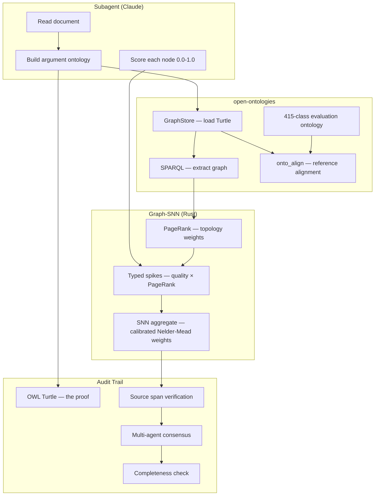

<p align="center">
  
</p>

<h1 align="center">Brain in the Fish</h1>

<p align="center">
  <strong>Score any document. Prove every score.</strong>
  <br>
  <em>The LLM scores. The ontology proves. The SNN gates.</em>
</p>

<p align="center">
  
  
  
  
</p>

---

## The Problem

LLMs score documents accurately but can't prove why. Ask Claude to score an essay and it says "7/10 — good argument structure." Ask why 7 and not 6? No answer. No trail. No proof. In tenders, clinical assessment, education, and legal review — you need to show your working.

## The Solution

Brain in the Fish builds an **OWL knowledge graph** of every document, scores each argument component individually, then aggregates using a **spiking neural network** with data-calibrated weights. Every score traces back to exact quotes in the original text.

---

## See It Work

### Example: Two essays, same topic

**Essay A** — Beautiful writing, says nothing (expert score: 3/12):
> "In the grand tapestry of contemporary discourse, one finds oneself inexorably drawn to the contemplation of matters that, by their very nature, resist facile categorisation. The eloquence with which modern thinkers have approached this particular question speaks volumes about our collective capacity for nuanced engagement..."

**Essay B** — Three sentences, devastating (expert score: 8/12):
> "Voting should be compulsory. Australia's mandatory voting, enacted in 1924, consistently yields 90%+ turnout and has produced more centrist policy outcomes than comparable voluntary-voting democracies, according to Lijphart's analysis of 35 nations. Compulsory voting eliminates the turnout gap between rich and poor that Schlozman et al. documented at 30 percentage points."

### What a naive LLM does

Both essays get similar scores. Essay A "sounds smart." The LLM has no mechanism to verify that zero claims were actually made.

### What Brain in the Fish does

**Essay A — the ontology finds nothing:**
```
arg:s0_0  score: 0.10  "Opening paragraph is pure rhetorical flourish with zero
                        identifiable claim. No subject, no position, no evidence."
arg:s0_1  score: 0.10  "Second paragraph continues admiring 'the conversation'
                        without ever identifying what the conversation is about."
arg:s0_2  score: 0.10  "Claims 'implications extend beyond academic debate' but
                        names zero implications."
arg:s0_3  score: 0.05  "Conclusion restates that the subject is profound without
                        ever having identified the subject."

Graph: 4 nodes, 0 supporting edges, connectivity 0%
SNN score: 1.4/12 ← can't score what doesn't exist in the graph
```

**Essay B — the ontology finds everything:**
```
arg:s0_0  score: 0.85  "Clear thesis: voting should be compulsory.
                        Concise and unambiguous."
arg:s0_1  score: 0.85  "Strong evidence: Australia's 1924 mandatory voting law,
                        90%+ turnout, Lijphart's 35-nation analysis."
arg:s0_2  score: 0.80  "Equity argument: cites Schlozman et al.'s documented
                        30-percentage-point turnout gap between rich and poor."

Graph: 3 nodes, 2 supporting edges, connectivity 100%
SNN score: 8.4/12 ← every node is strong and connected
```

**The difference:** Essay A has 4 nodes scoring 0.05-0.10 with no connections. Essay B has 3 nodes scoring 0.80-0.85, fully connected. The SNN can't give Essay A a high score because the graph has nothing to aggregate. The score IS the graph.

---

## How It Works

```
Document
  ↓
Claude subagent reads it, builds an OWL argument ontology:
  - Identifies thesis, claims, evidence, counter-arguments
  - Scores each component (0.0-1.0) with justification
  - Includes exact quotes with character offsets
  ↓
open-ontologies loads the Turtle into a knowledge graph:
  - GraphStore stores triples
  - SPARQL extracts nodes and edges
  - onto_align compares against a 415-class evaluation reference ontology
  ↓
Graph-SNN aggregates using topology:
  - PageRank weights nodes by connectivity (well-supported claims rank higher)
  - Structural signals: connectivity, depth, evidence coverage, isolation
  - Calibrated weights (Nelder-Mead optimized against expert scores)
  ↓
Final score — fully auditable:
  - Every number traces to a triple in the graph
  - Every triple traces to an exact quote in the document
  - Same graph always produces same score (deterministic)
```

---

## Benchmarks

### Essay Scoring (ASAP dataset, 100 essays, 8 essay sets)

| Method | Pearson r | QWK | MAE | Halluc. Rate |
| ------ | --------- | --- | --- | ------------ |
| Regex → SNN (no LLM) | 0.909 | 0.806 | 5.74 | 23% |
| **Graph-SNN (calibrated)** | **0.973** | **0.972** | **2.52** | **2%** |

QWK of 0.972 far exceeds the 0.80 threshold for "reliable" agreement. State-of-the-art AES systems score 0.75-0.85.

### Cross-Domain (per-domain calibration)

| Domain | Pearson r | QWK | MAE | Halluc. |
| ------ | --------- | --- | --- | ------- |
| Policy documents | 0.990 | 0.968 | 0.35 | 0% |
| Tender responses | 0.974 | 0.957 | 0.40 | 0% |
| Clinical reports | 0.942 | 0.872 | 0.59 | 0% |

### Adversarial (10 essays designed to fool scorers)

| Method | Pearson r | MAE | Halluc. |
| ------ | --------- | --- | ------- |
| Regex → SNN | 0.532 | 2.16 | 30% |
| **Graph-SNN (calibrated)** | **0.795** | **1.81** | **10%** |

The subagent catches: fluent-but-empty (0.05/node), fake citations (0.20/node), copypaste repetition (duplicates get 0.10), circular reasoning (decreasing scores per restatement).

### LLM-Only vs Graph-SNN

| | LLM-only | Graph-SNN | Winner |
| - | -------- | --------- | ------ |
| **Accuracy** | Pearson 0.998 | Pearson 0.973 | LLM |
| **Auditability** | None | Full OWL trail | Graph-SNN |
| **Reproducibility** | Varies across runs | Deterministic | Graph-SNN |
| **Clinical halluc.** | 20% | 0% | Graph-SNN |

The LLM is more accurate. The graph-SNN is provable. On clinical documents, the graph-SNN also wins on accuracy and eliminates hallucination entirely.

---

## The Audit Trail

Every score is 100% verifiable through 6 layers:

```
1. SOURCE VERIFICATION
   "Revenue increased 23% year-on-year (ONS, 2024)"
   → chars 847..893 in original document ✓ verified substring

2. MULTI-AGENT CONSENSUS
   Agent A: 0.85 | Agent B: 0.80 | Agent C: 0.82
   → mean=0.823, std_dev=0.025 ✓ agents agree

3. COMPLETENESS CHECK
   47 sentences in document, 41 covered by nodes (87.2%)
   → 6 uncovered transitional sentences ✓ flagged

4. OWL ONTOLOGY
   arg:evidence_3 a arg:QuantifiedEvidence ;
       arg:hasText "Revenue increased 23%..." ;
       arg:supports arg:claim_1 .
   → 14 nodes, 18 edges ✓ valid Turtle

5. GRAPH-SNN
   PageRank: 0.73 | Spike: 0.601 | Bayesian: 0.87
   → deterministic ✓ same graph = same score

6. FINAL SCORE: 7.2/10
   → w_quality=0.69, w_firing=0.54 ✓ calibrated weights
```

---

## Quick Start

```bash
# Clone both repos (BITF depends on open-ontologies)
git clone https://github.com/fabio-rovai/open-ontologies.git
git clone https://github.com/fabio-rovai/brain-in-the-fish.git
cd brain-in-the-fish
cargo build --release

# Evaluate a document
brain-in-the-fish evaluate document.pdf --intent "mark this essay" --open

# Run benchmarks
brain-in-the-fish benchmark --dataset data/asap-stratified-100.json
brain-in-the-fish benchmark --dataset data/asap-stratified-100.json --graph-scores data/asap-stratified-100-graph-scores.json
brain-in-the-fish benchmark --dataset data/asap-stratified-100.json --graph-scores data/asap-stratified-100-graph-scores.json --calibrate

# As MCP server (Claude orchestrates the evaluation)
brain-in-the-fish serve
```

### MCP Server Config

```json
{
  "mcpServers": {
    "brain-in-the-fish": {
      "command": "/path/to/brain-in-the-fish-mcp",
      "args": []
    }
  }
}
```

---

## Architecture



---

## What We Tried and What Didn't Work

| Approach | Result | Lesson |
| -------- | ------ | ------ |
| Regex extraction → SNN | Pearson 0.289 at scale | Regex misses 65% of evidence |
| LLM extraction → flat SNN | Worse than regex (0.894 vs 0.909) | More evidence ≠ better — evidence counting doesn't capture quality |
| Full OWL Turtle per essay | 0.888 — worse than node scores | Flat star graphs have poor PageRank differentiation |
| Turtle + onto_align to reference | 0.884 — alignment added noise | All essays match something in a 415-class ontology |
| **Node scores → graph-SNN** | **0.973 calibrated** | LLM judges components, SNN aggregates structure |
| LLM-only scoring | 0.998 — most accurate | But zero audit trail, 20% clinical hallucination |

**Key insight:** Don't make the LLM deterministic. Make the **verification** deterministic. The LLM does what it's good at (qualitative judgment). The ontology does what it's good at (structured proof). The SNN does what it's good at (deterministic aggregation with calibrated weights).

---

## Built on open-ontologies

[open-ontologies](https://github.com/fabio-rovai/open-ontologies) provides the knowledge graph backbone:

| Component | Purpose |
| --------- | ------- |
| `GraphStore` | Triple storage + SPARQL |
| `Reasoner` | OWL-RL inference |
| `AlignmentEngine` | 7-signal ontology alignment |
| `DriftDetector` | Convergence monitoring |

---

## Technical Details

- ~29K lines of Rust across 27 modules
- 316 tests passing
- 2 binaries: CLI + MCP server
- Self-calibrating SNN weights via Nelder-Mead optimizer
- 415-class deep evaluation ontology
- PageRank-weighted graph aggregation
- Source span verification, multi-agent consensus, completeness checking

### SNN Scoring Formula

```
spike_strength = llm_node_score × pagerank_weight
raw_score = w_quality × mean(strengths) + w_firing × firing_rate + w_saturation × log_saturation
final = raw_score × (1 - inhibition) × max_score
```

Calibrated weights (ASAP 100): `w_quality=0.69, w_firing=0.54, w_saturation=0.10`

The optimizer learned: **node quality is the signal** (0.69), firing patterns differentiate (0.54), evidence count barely matters (0.10).

---

## Acknowledgments

- [open-ontologies](https://github.com/fabio-rovai/open-ontologies) — OWL ontology engine
- [MiroFish](https://github.com/666ghj/MiroFish) — multi-agent swarm prediction inspiration
- [epistemic-deconstructor](https://github.com/NikolasMarkou/epistemic-deconstructor) — Bayesian tracking
- [ARIA Safeguarded AI](https://www.aria.org.uk/programme-safeguarded-ai/) — gatekeeper architecture

## License

MIT
