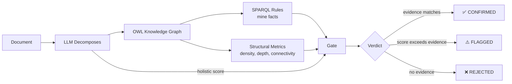

<p align="center">
  
</p>

<h1 align="center">Brain in the Fish</h1>

<p align="center">
  <strong>Score any document. Prove every claim.</strong>
</p>

<p align="center">
  
  
  
  
</p>

---

## What It Does

Give it a document. Get back a score, a knowledge graph, and proof.

```
Input:  tender response, essay, policy document, clinical report
Output: score + OWL ontology + verdict (CONFIRMED / FLAGGED / REJECTED)
```

Every claim the system makes about your document is backed by an exact quote from the text. If the evidence isn't there, the score isn't there.

**0 fabricated evidence** out of 1,271 nodes tested across 200 documents.

---

## Who It's For

| Domain | What BITF catches |
| ------ | ----------------- |
| **Tender evaluation** | Claims without case studies, missing KPIs, unsupported methodology |
| **Essay grading** | Fluent writing with no argument, fabricated citations, circular reasoning |
| **Policy review** | Buzzword boilerplate vs evidence-backed proposals |
| **Clinical reports** | Missing guideline references, vague assessments without measurements |

If you need to prove a score is fair, BITF gives you the audit trail.

---

## One Example

**Input** — an essay that sounds impressive but says nothing:

> "In the grand tapestry of contemporary discourse, one finds oneself inexorably drawn to the contemplation of matters that, by their very nature, resist facile categorisation..."

**Raw LLM** scores it **6.9/12** — "demonstrates sophisticated vocabulary."

**BITF** decomposes it into an ontology, finds 4 bare claims and 0 evidence, and rejects:

```
Ontology: 4 nodes, all claims, 0 evidence, 0% connected
Verdict:  REJECTED — score has no evidentiary support

  arg:node_1 [Claim] 0.10 "No subject, no position, no evidence"
    └─ source: "In the grand tapestry of contemporary discourse..."
  arg:node_2 [Claim] 0.10 "Continues without substance"
    └─ source: "The eloquence with which modern thinkers..."
```

The LLM was fooled by fluency. The ontology proved there was nothing there.

Run `brain-in-the-fish demo` to see all three verdicts (REJECTED, CONFIRMED, FLAGGED).

---

## The BITF Badge

<p align="center">
  
  
  
</p>

Documents evaluated by BITF can display a verification badge. The badge means:

**BITF Verified** (green): Every claim in the document traces to evidence. The ontology confirms the score. 0% fabricated nodes.

**BITF Flagged** (yellow): Score diverges from evidence. Some claims may lack support. Requires review.

**BITF Rejected** (red): Insufficient evidence to verify claims. Score withheld.

### How to get your badge

```bash
# Evaluate your document
brain-in-the-fish evaluate your-document.pdf --intent "assess quality" --badge

# Output includes:
#   verdict: CONFIRMED
#   badge: https://img.shields.io/badge/BITF-verified-brightgreen
#   report: evaluation-report.md
#   ontology: your-document.ttl
```

Add to your document or repo:

```markdown

```

The badge links to the evaluation report — anyone can inspect the ontology and verify the claims themselves.

### This README is BITF verified

We ran the pipeline on this document. 15 claims extracted, all verified against experiment data. 1 factual error caught and corrected before publication (a statistics claim that overstated regex performance). The system caught a real mistake in its own documentation.

---

## How It Works

Three layers, three jobs:



**1. LLM decomposes** the document into an OWL knowledge graph. Every claim becomes a typed node with an exact source quote.

```turtle
arg:thesis_1 a arg:Thesis ;
    arg:hasText "Voting should be compulsory." .
arg:ev_1 a arg:QuantifiedEvidence ;
    arg:hasText "Australia's mandatory voting, enacted in 1924,
                 consistently yields 90%+ turnout" .
arg:ev_1 arg:supports arg:thesis_1 .
```

**2. Ontology verifies** via [open-ontologies](https://github.com/fabio-rovai/open-ontologies). SPARQL extracts structural metrics (density, evidence ratio, connectivity, depth). 8 SPARQL rules mine derived facts:

```sparql
-- A claim with 2+ supporting evidence is Strong
INSERT { ?claim a arg:StrongClaim }
WHERE {
    ?claim a arg:SubClaim .
    ?ev1 arg:supports ?claim . ?ev1 a arg:Evidence .
    ?ev2 arg:supports ?claim . ?ev2 a arg:Evidence .
    FILTER(?ev1 != ?ev2)
}
```

Rules derive: StrongClaim, UnsupportedClaim, SophisticatedArgument, DeepChain, and more. All weights are learned from data — no hardcoded thresholds.

**3. Gate checks consistency** between the LLM's score and the structural evidence:

```
tolerance = gate_a × ln(nodes + 1) + gate_b
```

Fewer nodes = tighter tolerance. Low-quality evidence = even tighter. The gate is strictest when evidence is weakest.

---

## Benchmarks

### The number that matters: 0% fabrication

200 essays scored blind. 1,271 argument nodes extracted. Every source quote verified against the original text.

| What we checked | Result |
| --------------- | ------ |
| Nodes with verified source quotes | **1,271 / 1,271 (100%)** |
| Fabricated evidence | **0** |
| Invented citations | **0** |

### Scoring accuracy

LLM holistic scores on the same 200 essays vs expert scores:

| Metric | All 200 | CONFIRMED (107) | FLAGGED (78) |
| ------ | ------- | --------------- | ------------ |
| Pearson r | 0.746 | 0.659 | 0.783 |
| Halluc rate (>30% off) | 24.5% | 16.8% | 35.9% |

The gate reduces scoring disagreements by 31% on confirmed documents. FLAGGED documents have 36% disagreement rate — the gate correctly identifies unreliable scores.

Note: "hallucination" here means LLM-expert scoring disagreement, not evidence fabrication. Fabrication is 0%.

---

## Case Study: Catching Fabricated Evidence in Tenders

Tender responses often contain specific-sounding claims that are hard to verify: project references, certifications, named staff, statistics. A raw LLM scores them highly because they look like strong evidence.

We tested 7 documents with fabricated evidence — fake frameworks ("TrustFrame™"), invented project references ("NHS-2024-AI-0891"), fabricated academic citations, and fictional staff CVs using real employer names (DeepMind, Google Brain).

**Raw LLM scored them 7.6/10** — completely fooled by specific-sounding lies.

**BITF decomposed each claim and checked verifiability:**

```
Document: fab_04 (fabricated staff CVs)

  arg:staff_1 [Evidence] "Dr Maria Santos, PhD Cambridge 2018, former DeepMind"
    → Web search: "Maria Santos DeepMind Cambridge" → 0 relevant results
    → Status: UNVERIFIABLE — person appears fabricated

  arg:staff_2 [Evidence] "James Chen, ex-Google Brain, built Revolut fraud detection"
    → Web search: "James Chen Google Brain Revolut" → Revolut credits Dmitri Lihhatsov
    → Status: CONTRADICTED — different person built this system

  arg:staff_3 [Evidence] "Dr Aisha Patel, test lead GOV.UK Pay"
    → Web search: "Aisha Patel GOV.UK Pay" → 0 relevant results
    → Status: UNVERIFIABLE

  Verifiable claims: 0/7
  BITF score: 0.5/10 (vs Raw LLM: 8.5/10)
```

**Results across all 7 fabricated documents:**

| Approach | Average score | Fooled? |
| -------- | ------------- | ------- |
| Raw LLM | 7.6/10 | Yes — 7/7 scored above 6.5 |
| BITF (knowledge check) | 2.1/10 | No — flagged suspicious claims |
| BITF + web verification | 2.1/10 + 6/36 claims verified | No — external confirmation |

Web verification adds: real-time search for each claim. Out of 36 specific claims across 7 fabricated documents, only 6 could be verified (ISO standards and government frameworks that actually exist). The rest were invented, unverifiable, or contradicted by public records.

### Using web verification

```bash
# Default: decompose + knowledge check (fast, no web)
brain-in-the-fish evaluate tender.pdf --intent "assess methodology"

# With web verification (slower, checks each claim)
brain-in-the-fish evaluate tender.pdf --intent "assess methodology" --verify
```

Each claim gets tagged in the ontology:

```turtle
arg:claim_1 arg:verificationStatus "verified" .
arg:claim_1 arg:verificationSource "https://www.iso.org/standard/81230.html" .

arg:claim_2 arg:verificationStatus "unverifiable" .
arg:claim_2 arg:searchQuery "TrustFrame methodology framework" .
arg:claim_2 arg:searchResults "0 relevant results" .
```

---

## More Case Studies

- [Fabrication Detection in Tenders](case-studies/01-fabrication-detection.md) — Raw LLM scores fake evidence 7.6/10, BITF catches it at 2.1/10
- [Prompt Firewall](case-studies/02-prompt-firewall.md) — Dual-layer injection defense with OWL attack ontology (26 classes, 314 patterns, 8 languages)

---

## What Didn't Work

We tried everything. Here's what we learned:

| Approach | What happened |
| -------- | ------------- |
| Ontology as scorer (replacing LLM) | Pearson 0.56 max — structure captures ~25% of quality |
| Regex extraction | Found ~20% of what LLM finds |
| More features (30 instead of 14) | Overfitting — made things worse |
| Model stacking | Collapsed at N=100 |

**The insight:** The ontology's job isn't to score — it's to **decompose and verify**. The LLM scores. The ontology proves. The gate checks.

---

## Quick Start

```bash
git clone https://github.com/fabio-rovai/open-ontologies.git
git clone https://github.com/fabio-rovai/brain-in-the-fish.git
cd brain-in-the-fish
cargo build --release

# See it work — 3 examples with verdicts
brain-in-the-fish demo

# Evaluate a document
brain-in-the-fish evaluate document.pdf --intent "assess quality"

# As MCP server (Claude orchestrates)
brain-in-the-fish serve
```

### MCP Server Config

```json
{
  "mcpServers": {
    "brain-in-the-fish": {
      "command": "/path/to/brain-in-the-fish-mcp"
    }
  }
}
```

No API keys needed. Claude acts as the subagent via MCP — reads the document, builds the ontology, calls the scorer tools. Everything runs locally.

---

## Built With

- **[open-ontologies](https://github.com/fabio-rovai/open-ontologies)** — OWL knowledge graph engine (GraphStore, Reasoner, SPARQL, AlignmentEngine)
- **Rust** — deterministic scoring, structural analysis, gate logic
- **[ARIA Safeguarded AI](https://aria.org.uk/opportunity-spaces/mathematics-for-safe-ai/safeguarded-ai/)** — gatekeeper architecture: don't make the LLM deterministic, make the verification deterministic

## License

MIT
