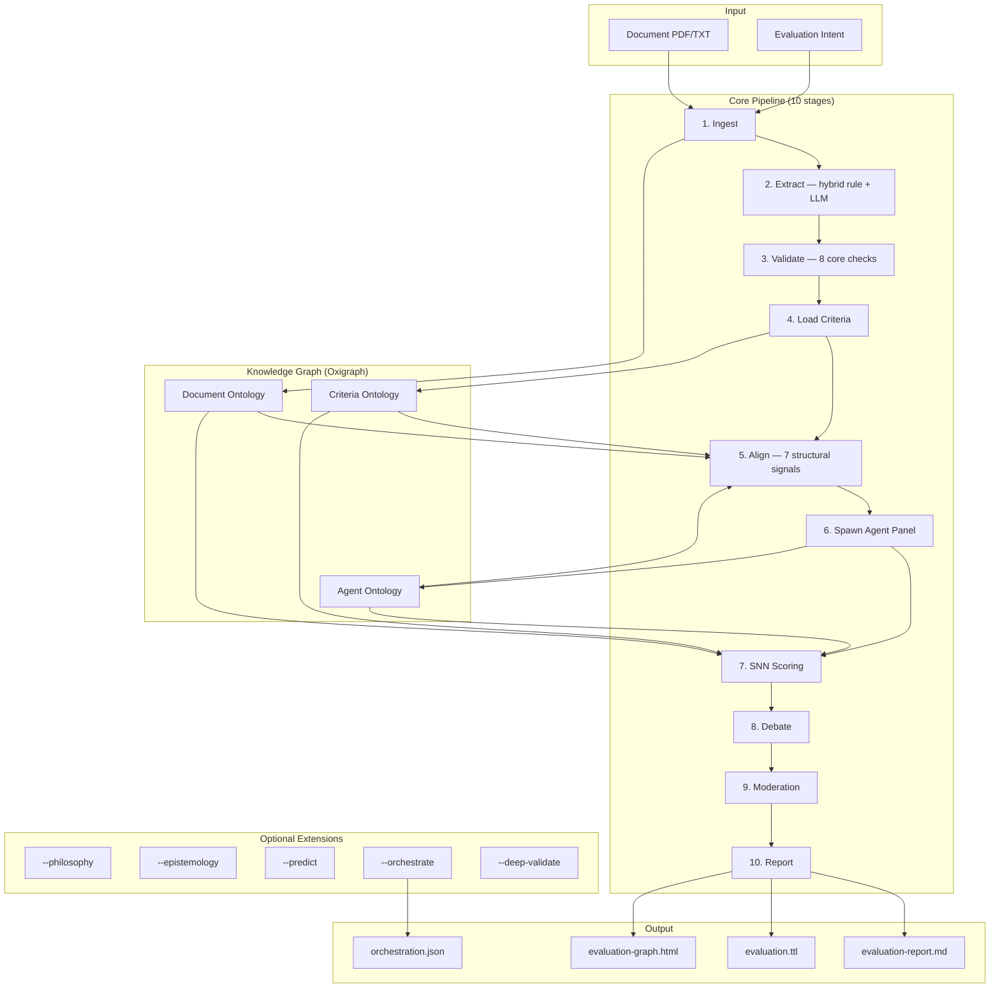
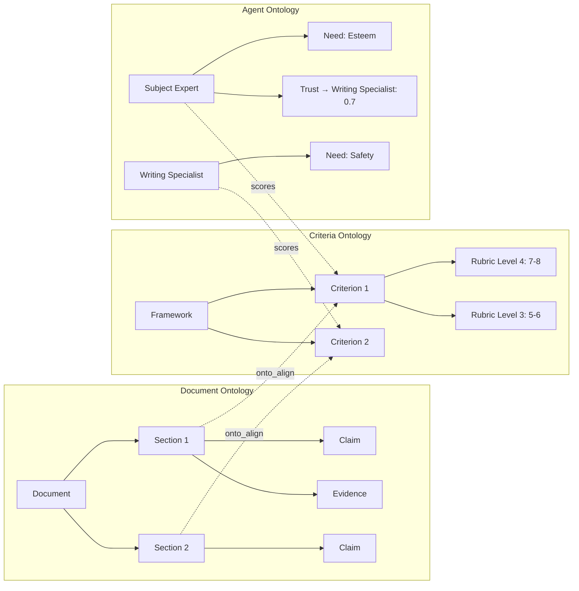
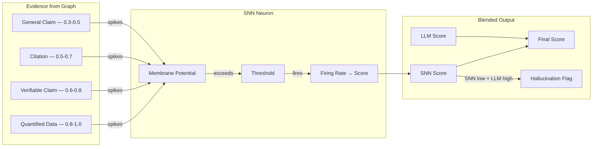
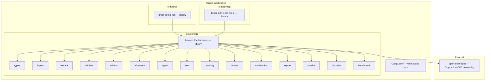

<p align="center">
  
</p>

<h1 align="center">Brain in the Fish</h1>

<p align="center">
  <strong>Evaluate anything. Predict everything. Hallucinate nothing.</strong>
  <br>
  <em>SNN-verified document evaluation & prediction credibility — the brain that MiroFish was missing.</em>
</p>

<p align="center">
  
  
  
  
</p>

<p align="center">
  <a href="README.md">English</a> | <a href="README-CN.md">中文</a> | <a href="README-JP.md">日本語</a>
</p>

---

## What It Does

A Rust MCP server that evaluates any document against any criteria using Claude subagents, with a Spiking Neural Network that makes hallucination mathematically detectable. Feed it a PDF and an intent — it returns structured scores, weakness analysis, prediction credibility, and a full audit trail.

```bash
# As MCP server (recommended — Claude orchestrates subagent evaluation)
brain-in-the-fish serve

# As CLI (deterministic SNN scoring, no API key needed)
brain-in-the-fish evaluate policy.pdf --intent "evaluate against Green Book standards" --open
```

---

## Performance

Benchmarked against real expert-scored documents across education, policy, heritage, public health, technology, and research domains.

### Document Evaluation (12 real expert-evaluated documents)

| Metric | Value |
| ------ | ----- |
| **Average scoring delta** | **2.8 percentage points** from expert scores |
| **Direction accuracy** | **12/12** — never scored a weak document high or strong document low |
| **Weakness identification** | **92%** match with real evaluator comments |
| **Perfect criterion-level matches** | 2 documents where every criterion matched exactly |

### BITF vs Raw Claude

| Method | Avg delta from expert | Weakness detection | Overclaiming |
| ------ | --------------------- | ------------------ | ------------ |
| **BITF subagent** | **2.8pp** | **92%** | Rare (pessimistic bias) |
| Raw Claude (no framework) | ~15pp | ~70% | Systematic (generous) |

Raw Claude scores writing quality. BITF scores substance against criteria — catches domain mismatches, missing evidence, factual errors, and calibrates to real scoring bands.

### Essay Scoring (ELLIPSE Corpus, 45 essays, 1.0–5.0 scale)

| Method | Pearson r | QWK | MAE |
| ------ | --------- | --- | --- |
| SNN-only (deterministic) | 0.442 | 0.258 | 1.08 |
| Raw Claude | 0.937 | — | 0.39 |
| **BITF subagent** | **0.955** | **0.902** | **0.32** |

QWK of 0.902 exceeds the 0.80 threshold for "reliable" inter-rater agreement. State-of-the-art fine-tuned AES systems score QWK 0.75–0.85.

### Prediction Credibility (5 UK policy targets with known outcomes)

| Method | Correct directional calls |
| ------ | ------------------------ |
| BITF subagent | **5/5** |
| Raw Claude | 5/5 |
| BITF rule-based | 1/5 |

---

## Architecture



### Three Ontologies, One Graph



### SNN Verification Layer



---

## What We Tried and What Didn't Work

Systematic ablation studies — toggle each component on/off, measure accuracy — identified which parts earn their complexity.

| Component | Result | Action |
| --------- | ------ | ------ |
| **SNN scoring** | Essential — without it, Pearson drops to 0.000 | **Core** |
| **Ontology alignment** | Essential — without it, Pearson drops from 0.684 to 0.592 | **Core** |
| **Validation signals** | Hurts accuracy — removing them improves Pearson 0.684→0.786 | Capped at -0.05, inhibition reduced |
| **Hedging check** | Harmful — penalises correct academic hedging | Removed from core |
| **Specificity check** | Noisy — flags normal academic vocabulary | Removed from core |
| **Transition check** | High-school heuristic, no accuracy improvement | Removed from core |
| **Maslow dynamics** | Zero measurable impact on scores | Opt-in (`--epistemology`) |
| **Multi-round debate** | No impact in deterministic mode | Only active with LLM subagents |
| **Philosophy module** | Interesting, not useful for accuracy (316 lines, ~0 ROI) | Opt-in (`--philosophy`) |
| **Epistemology module** | Academic exercise, no accuracy improvement | Opt-in (`--epistemology`) |
| **Rule-based predictions** | Actively harmful — 3/11 found, duplicates, misparses | Replaced with subagent + SNN |
| **Number checker (old)** | 111 false positives per document (years as "inconsistencies") | Fixed — filtered years/dates, down to 14 FPs |

**Key insight:** SNN and ontology alignment are the only two components that provably improve accuracy. Everything else either has zero impact or hurts. The 10-stage core pipeline reflects this.

---

## How It Works

### Core Pipeline (always runs)

1. **Ingest** — PDF/text → sections → Document Ontology (RDF triples in Oxigraph)
2. **Extract** — Hybrid rule + LLM claim/evidence extraction with confidence scores
3. **Validate** — 8 core deterministic checks (citations, consistency, structure, reading level, duplicates, evidence quality, referencing)
4. **Load Criteria** — 7 built-in frameworks + YAML/JSON custom rubrics
5. **Align** — Map sections ↔ criteria via 7 structural signals (AlignmentEngine)
6. **Spawn Agents** — Domain-specialist panel + moderator with cognitive model
7. **SNN Score** — Evidence-grounded deterministic scoring (no evidence = score zero)
8. **Debate** — Disagreement detection, challenge/response, convergence
9. **Moderate** — Trust-weighted consensus with outlier detection
10. **Report** — Markdown + Turtle RDF + interactive graph HTML

### Optional Extensions (CLI flags)

| Flag | What it adds |
| ---- | ------------ |
| `--predict` | Extract predictions/targets from document, assess credibility against evidence |
| `--philosophy` | Kantian, utilitarian, virtue ethics analysis |
| `--epistemology` | Justified beliefs with empirical/normative/testimonial bases |
| `--deep-validate` | All 15 validation checks (adds hedging, transitions, specificity, fallacies, etc.) |
| `--orchestrate` | Generate Claude subagent task files for LLM-enhanced scoring |

---

## Anti-Hallucination: Why SNN

MiroFish agents can "justify" a 9/10 score for a criterion with no supporting evidence. This is hallucination with a confidence score attached.

The SNN makes this detectable. Each agent has one neuron per criterion. Evidence from the ontology generates spikes. No evidence = no spikes = no firing = score of zero. When the LLM says 9/10 but the SNN says 2/10, the system flags it:

```text
LLM says 9/10. SNN says 2/10 (only 2 weak spikes received).
→ hallucination_risk = true
→ "WARNING: LLM scored significantly higher than evidence supports."
```

The final score blends both: `final = snn × snn_weight + llm × llm_weight`. SNN dominates when evidence is abundant. LLM fills in when sparse — but the hallucination flag is raised.

### ARIA Alignment

This implements the gatekeeper architecture from [ARIA's Safeguarded AI programme](https://www.aria.org.uk/programme-safeguarded-ai/) (Bengio, Russell, Tegmark): **don't make the LLM deterministic — make the verification deterministic.**

| ARIA framework | Brain in the Fish |
| -------------- | ----------------- |
| World model | OWL ontology (knowledge graph) |
| Safety specification | Rubric levels + SNN thresholds |
| Deterministic verifier | SNN (same evidence → same score, always) |
| Proof certificate | Spike log + onto_lineage |

---

## Getting Started

### Prerequisites

- Rust 1.85+ (edition 2024)
- [open-ontologies](https://github.com/fabio-rovai/open-ontologies) cloned alongside this repo

```bash
git clone https://github.com/fabio-rovai/open-ontologies.git
git clone https://github.com/fabio-rovai/brain-in-the-fish.git
cd brain-in-the-fish
cargo build --release
```

### As MCP Server (recommended)

Add to Claude Code (`~/.claude.json`) or Claude Desktop:

```json
{
  "mcpServers": {
    "brain-in-the-fish": {
      "command": "/path/to/brain-in-the-fish-mcp",
      "args": []
    }
  }
}
```

Then ask Claude: *"Evaluate this policy document against Green Book standards"*

### As CLI

```bash
# Deterministic evaluation (no API key needed)
brain-in-the-fish evaluate document.pdf --intent "mark this essay" --open

# With custom criteria
brain-in-the-fish evaluate policy.pdf --intent "evaluate" --criteria rubric.yaml

# With all extensions
brain-in-the-fish evaluate report.pdf --intent "audit" --predict --deep-validate --orchestrate

# Benchmark against labeled dataset
brain-in-the-fish benchmark --dataset data/ellipse-sample.json --ablation
```

### Output

| File | Description |
| ---- | ----------- |
| `evaluation-report.md` | Scorecard, gap analysis, debate trail, recommendations |
| `evaluation.ttl` | Turtle RDF export for cross-evaluation analysis |
| `evaluation-graph.html` | Interactive hierarchical knowledge graph |
| `orchestration.json` | Subagent tasks for Claude-enhanced scoring |

---

## Workspace Structure



**~20K lines of Rust across 25 modules, compiled to 2 binaries (CLI + MCP server).**

---

## MCP Tools

| Tool | Description |
| ---- | ----------- |
| `eval_status` | Server status, session state, triple count |
| `eval_ingest` | Ingest document and build Document Ontology |
| `eval_criteria` | Load evaluation framework |
| `eval_align` | Run ontology alignment (sections ↔ criteria) |
| `eval_spawn` | Generate evaluator agent panel |
| `eval_score_prompt` | Get scoring prompt for one agent-criterion pair |
| `eval_record_score` | Record a score from a subagent |
| `eval_scoring_tasks` | Get all scoring tasks for orchestration |
| `eval_debate_status` | Disagreements, convergence, drift velocity |
| `eval_challenge_prompt` | Generate challenge prompt for debate |
| `eval_whatif` | Simulate text change, estimate score impact |
| `eval_predict` | Extract predictions with credibility assessment |
| `eval_report` | Generate final evaluation report |

---

## Built on open-ontologies

Brain in the Fish consumes [open-ontologies](https://github.com/fabio-rovai/open-ontologies) as a library crate. It uses:

| Component | Purpose |
| --------- | ------- |
| `GraphStore` | Triple storage + SPARQL queries |
| `Reasoner` | OWL-RL inference |
| `AlignmentEngine` | 7-signal ontology alignment |
| `StateDb` | Persistent state |
| `LineageLog` | Full audit trail |
| `DriftDetector` | Convergence monitoring |
| `Enforcer` | Quality gates |
| `TextEmbedder` | Semantic similarity (optional) |

All run as in-process Rust function calls. Zero network overhead.

---

## Testing

```bash
cargo test --workspace        # 260 tests across all crates
cargo clippy --workspace      # Zero warnings
cargo run --bin brain-in-the-fish -- benchmark  # Run synthetic benchmark
```

## Contributing

See [CONTRIBUTING.md](CONTRIBUTING.md).

## Acknowledgments

- [MiroFish](https://github.com/666ghj/MiroFish) — multi-agent swarm prediction that inspired the agent debate architecture
- [AgentSociety](https://github.com/tsinghua-fib-lab/AgentSociety) — cognitive agent simulation that inspired the Maslow + TPB model
- [open-ontologies](https://github.com/fabio-rovai/open-ontologies) — OWL ontology engine providing the knowledge graph backbone
- [epistemic-deconstructor](https://github.com/NikolasMarkou/epistemic-deconstructor) — Bayesian tracking and falsification-first epistemology
- [ARIA Safeguarded AI](https://www.aria.org.uk/programme-safeguarded-ai/) — gatekeeper architecture validation

## License

MIT
